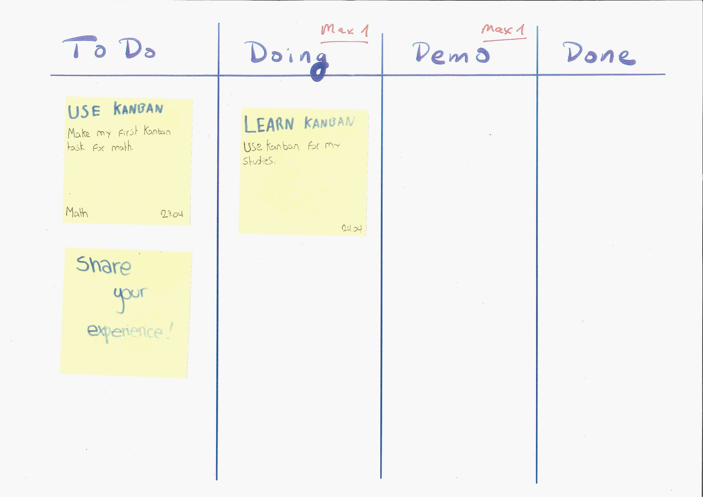
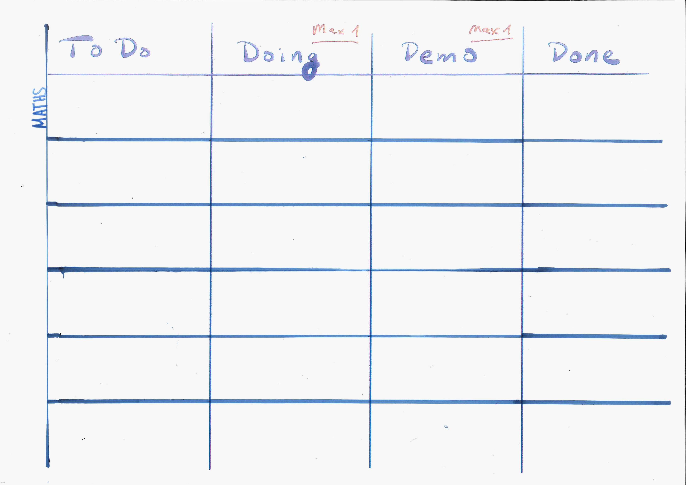
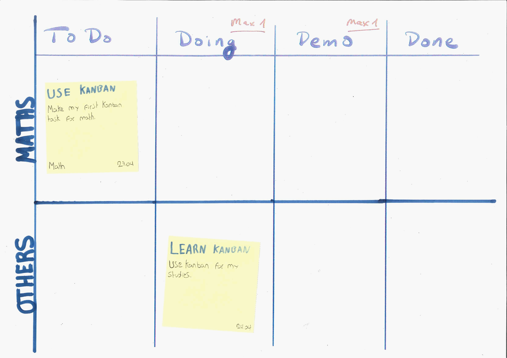

## Intro

Kanban is a visual way to track your tasks and your progress.  Many people find this helpful way to to show yourself, your parents and teachers what work needs to be done.  Ideally, this is done on a large screen, sheet of paper, or whiteboard - so that it is obvious and easily seen as a reminder.

## Status Tracking

The simplest `statuses` would be: **To-Do, Doing, Done**

<!-- <see example image> -->

Some teacher often require a draft `Review` before final submissions, engineers use a similar column `Review` or `Demo`.  Generally, this is a good idea to check your work with peers, parents or your teacher before handing in your work -- so we suggest a `Review` column before done. So now the statuses would be:

**To-Do, Doing, Review, Done**

<!-- <see example image> -->

## Swim-lanes (tracking multiple classes / projects)

Ideally when using this technique you keep the number of simultaneous tasks **(WIP)** to a minimum

> The number of simultaneous tasks is called `work-in-progress` or abbreviated as `WIP`

Education, unfortunately, expects a lot of simultaneous tasks within a variety of classes.  To address this we can use `swim-lanes` to track our priorities with a jumble of independent projects (classes).  For example: we might have swim-lanes for: English, Mathematics, Science, ...

Ideally, we will try only allow **ONE task** in your `doing` and `review` boxes for each swim-lane / class.  _(This is called a WIP Limit of 1)._

## Tasks

Tasks Cards should have critical reminder information on them. Refrain from putting extra information on the card, the card should be clean and simple to read - it is a reminder of work to do NOT a full description of the assignment.

Here is the critical information I include on a personal Kanban card.
- **Title** - Big bold text (upper left corner)
- **Description** - a very short reminder of what to do - ideally in 4 to 5 words
- **Class** - in case of confusion, I write the class / swim-lane (lower left corner)
- **Due Date** - Big bold Text (lower right corner)
- **Start Date** - use this to schedule small tasks of a large project - which can be used to slowly make progress on a large task (I call this smallifying).  This is a very important skill to ensure continued progress on large projects in a timely way.  I put this just above the `Due Date`

<see example image of a variety of tasks on a post-it with assignment below include a large task smallified>

Here is an example of a Kanban in use with tasks:

## Usage

I like to use A3 paper and small post-it notes to add tasks.  Here is our recommended blank Kanban - where you can write in your classes.  Put your most important classes (in the IB these would be your **High Level** courses) at the top. Use a timebox on long tasks that need to move forward, but are too big to do in one work session -- this is especially important when you have multiple tasks that need to be accomplished on a give day.

> **Timebox** - is a time limit that you won't exceed for a given tasks in order to keep all tasks on schedule.  We suggest 25 to 35 minute timeboxes with small 5 minute breaks between tasks.  Every 4 timeboxes take a longer 15 minute break. This is called the pomodoro technique for full details.



To best use a Kanban board, you should follow the following ritual:

1) **Prioritize your work** -- when you sit down to work, spend the first 5 minutes reviewing the Kanban board:
  - First assess what in the _priority_ classes needs to be done in order meet assignment deadlines _(for long tasks set a **timebox** so you make progress but can keep all your other tasks moving too)_
  - Second assess what needs to be started in _priority_ classes to stay on track with larger projects. If you already have a task in that classes `doing` box then schedule that task to be done ASAP so that you can start the next task.  _This is important_ a common Kanban saying is:_ **START FINISHING TASKS, stop starting unfinished tasks!**

2) **Do your work** -- respect your priorities and your timeboxes!

3) **UPDATE YOUR KANBAN** - End five to ten minutes before your time is up (set an alarm if needed) and **update** your tasks to their new status boxes.  If you couldn't meet your goals for a task put a smaller colorful post-it on it - as an ALERT.

4) **Address the needs of problem tasks** -- for all tasks with an ALERT: write emails to get help, or make notes on research needed to do make progress on problem tasks.

5) **REFLECT** -- Assess what is going well and consider if doing more that will help you be more successful and assess what is hindering you and what you can do differently to get you work done with less stress.  You reflections should result in actions (experiments for a week or so) to help you move more effectively toward your goals.  If your experiment doesn't help, they after the test period try a new experiment.

> **NOTE:**
> **Dead person** activities are actions that even a dead person can successfully do.  For example, waiting for someone else to help, not checking twitter in homework time, etc.
> **Live person** activities are action that only live people can successfully accomplish. For example, ask a peer for help, research on the Internet for ideas, go to a help session, replace random twitter checks with Pomodoro Technique (and allow twitter in the 5 minute breaks), etc.

## References

##### Kanban
- https://www.personalkanban.com/
- https://moduscooperandi.com/books-and-classes

#### Pomodoro
- https://francescocirillo.com/pages/pomodoro-technique
- https://www.youtube.com/watch?v=VFW3Ld7JO0w

#### Helpful Books

**Kanban - Task Management**
- Real-World Kanban: Do Less, Accomplish More with Lean Thinking, by Mattias Skarin.
- Kanban in Action, by Marcus Hammarberg and Joakim Sundén.
- Kanban: Successful Evolutionary Change for Your Technology Business, by David J. Anderson.
- Personal Kanban: Mapping Work - Navigating Life, by Tonianne DeMaria Barry and Jim Benson.
- Kanban and Scrum: Making the Most of Both, by Mattias Skarin and Henrik Kniberg.

**Pomodoro - Time Management**
- Pomodoro Technique Illustrated, by Staffan Noteberg.
- The Pomodoro Technique: Work smarter, not harder, by Francesco Cirillo.

**Effective Reflections, Experiments & Problem Solving**
- The 5 Elements of Effective Thinking, by Edward B. Burger and Michael Starbird.
- the shibumi strategy: a powerful way to create MEANINGFUL CHANGE, by Matthew E. May.

**Effective Goal Setting & Changes - with small easy steps**
- Little Bets: How Breakthrough Ideas Emerge from Small Discoveries, by Peter Sims.
- One Small Step Can Change Your Life: The Kaizen Way Paperback, by Robert Maurer Ph.D.
- The Spirit of Kaizen: Creating Lasting Excellence One Small Step at a Time: Creating Lasting Excellence One Small Step at a Time, by Robert Maurer Ph.D.
