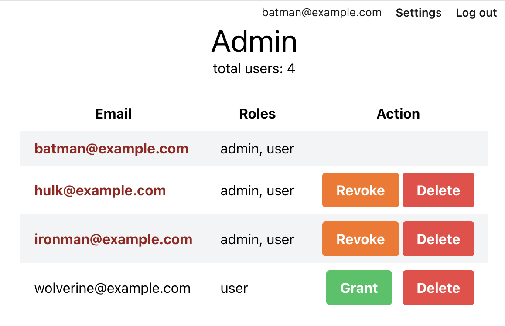

In this article I will explore a simple authorization technique, restricting access to pages - for both static and live pages.

## Getting started

check / install newest erlang & elixir
```bash
# ERLANG First
# see available versions
asdf list all erlang
# see installed versions
asdf list erlang
# asdf install desired version
asdf install erlang 26.2.2
asdf local erlang 26.2.2

# Elixir (OTP must match erlang version)
asdf list all elixir
asdf list elixir
asdf install elixir 1.16.1-otp-26
#                              ^^ match erlang version
asdf local elixir 1.16.1-otp-26
```

ensure postgresql (or sqlite3)
```
https://www.sqlite.org/download.html
https://postgresapp.com/de/downloads.html
```

create project
```bash
mix archive.install hex phx_new
mix phx.new authorize
cd authorize
git init
git add .
git commit -m "initial commit"
```

you can find the repo at: https://github/btihen_code/phoenix_authorize

## Binary IDs

if you prefer UUID keys to serial IDs then you can easily do that with the following changes.  _This can be very helpful if you need to sync with external frontend or other external apps_

update `config/config.ex` from:
```elixir
# config/config.ex
config :authorize,
  ecto_repos: [Authorize.Repo],
  generators: [timestamp_type: :utc_datetime]
```

to:

```elixir
# config/config.ex
config :authorize,
  ecto_repos: [Authorize.Repo],
  generators: [timestamp_type: :utc_datetime, binary_id: true]
```

now lets create the database:
```bash
mix ecto.create
iex -S mix phx.server
```

## using phx.gen.auth

To help keep our code better organized all out user access / authentication code will be in the 'Access' namespace using `--web Access`

```bash
mix phx.gen.auth Accounts User users --web Access
mix deps.get
mix ecto.migrate
# start phoenix and create a user
iex -S mix phx.server
```

Now you should be logged in. Let's see if the binary ID worked (using the iex cli)

```elixir
import Ecto.Query
alias Authorize.Repo
alias Authorize.Accounts
alias Authorize.Accounts.User

# from Context file
Accounts.get_user_by_email("nyima@example.com")

# one user
Repo.get_by(User, email: email)

# all users
Repo.all(User)
```

we can see we have a uuid for an id and it works cool.

```bash
git add .
git commit -m "added users and authorization"
```

### create a seeds file


### organize user into core data

I like to organize the code into areas that is associated with usage - so, in this case, I will move users into 'core' - this is for code & data shared by all aspects of the application:

```bash
# create the core lib folder
mkdir lib/authorize/core/
# create the core test folder
mkdir test/authorize/core
mkdir test/support/fixtures/core

# move your lib code into the new area
mv lib/authorize/account* lib/authorize/core/.
# move the test and support code into 'core'
mv test/authorize/accounts* test/authorize/core/.
mv test/support/fixtures/accounts* test/support/fixtures/core/.
```
replace every `Authorize.Accounts` with `Authorize.Core.Accounts`

Lets make sure everything works
```bash
mix test

iex -S mix phx.server
# make a new user and login and logout

git add .
git commit -m "add users to the 'core'"
```

Now the file structure should look like:

```bash
$ tree -I _build -I deps
.
├── README.md
├── assets
├── config
├── lib
│   ├── authorize
│   │   ├── admin
│   │   │   └── auth.ex
│   │   ├── application.ex
│   │   ├── core
│   │   │   ├── accounts
│   │   │   │   ├── user.ex
│   │   │   │   ├── user_notifier.ex
│   │   │   │   └── user_token.ex
│   │   │   └── accounts.ex
│   │   ├── mailer.ex
│   │   └── repo.ex
│   ├── authorize.ex
│   ├── authorize_web
│   │   ├── access
│   │   │   └── user_auth.ex
│   │   ├── components
│   │   │   ├── core_components.ex
│   │   │   ├── layouts
│   │   │   │   ├── app.html.heex
│   │   │   │   └── root.html.heex
│   │   │   └── layouts.ex
│   │   ├── controllers
│   │   │   ├── access
│   │   │   │   └── user_session_controller.ex
│   │   │   ├── error_html.ex
│   │   │   ├── error_json.ex
│   │   │   ├── page_controller.ex
│   │   │   ├── page_html
│   │   │   │   └── home.html.heex
│   │   │   └── page_html.ex
│   │   ├── endpoint.ex
│   │   ├── gettext.ex
│   │   ├── live
│   │   │   └── access
│   │   │       ├── user_confirmation_instructions_live.ex
│   │   │       ├── user_confirmation_live.ex
│   │   │       ├── user_forgot_password_live.ex
│   │   │       ├── user_login_live.ex
│   │   │       ├── user_registration_live.ex
│   │   │       ├── user_reset_password_live.ex
│   │   │       └── user_settings_live.ex
│   │   ├── router.ex
│   │   └── telemetry.ex
│   └── authorize_web.ex
├── mix.exs
├── mix.lock
├── priv
└── test
    ├── authorize
    │   └── core
    │       └── accounts_test.exs
    ├── authorize_web
    │   ├── access
    │   │   └── user_auth_test.exs
    │   ├── controllers
    │   │   ├── access
    │   │   │   └── user_session_controller_test.exs
    │   │   ├── error_html_test.exs
    │   │   ├── error_json_test.exs
    │   │   └── page_controller_test.exs
    │   └── live
    │       └── access
    │           ├── user_confirmation_instructions_live_test.exs
    │           ├── user_confirmation_live_test.exs
    │           ├── user_forgot_password_live_test.exs
    │           ├── user_login_live_test.exs
    │           ├── user_registration_live_test.exs
    │           ├── user_reset_password_live_test.exs
    │           └── user_settings_live_test.exs
    ├── support
    │   ├── conn_case.ex
    │   ├── data_case.ex
    │   └── fixtures
    │       └── core
    │           └── accounts_fixtures.ex
    └── test_helper.exs
```

## System Emails

you can find (in Dev) any emails that would have been sent for user confirmation or password reminders, etc. at:

`http://localhost:4000/dev/mailbox`

Here you can read and test the messages - without them being sent to `real` people.


## Authorization and Admin Panel

Let's make an Admin Panel - where we control who has access to what areas of code.

### User Migration

We will start by adding a 'roles' field (an array of roles).  We will start with 'user' and 'admin' - maybe more later.  So we start with the migration, which will look like:

```elixir
mix ecto.gen.migration add_roles_to_user

# priv/repo/migrations/20240224134441_add_roles_to_user.exs
defmodule Vitali.Repo.Migrations.AddRolesToUser do
  use Ecto.Migration

  def change do
    alter table("users") do
      add :roles, {:array, :string}, default: ["user"], null: false
    end
  end
end

mix ecto.migrate
```

Now our existing user (& all new users) should have the roles: `["user"]` let's check in iex:

```elixir
iex -S mix phx.server

alias Authorize.Core.Accounts

# from Context file
Accounts.get_user_by_email("nyima@example.com")


#Authorize.Core.Accounts.User<
  __meta__: #Ecto.Schema.Metadata<:loaded, "users">,
  id: "1349f6b9-e3f1-4d7a-813b-d1f1aa49fbe3",
  email: "c",
  confirmed_at: nil,
  inserted_at: ~U[2024-02-24 10:31:40Z],
  updated_at: ~U[2024-02-24 10:31:40Z],
  ...
>
```

hmm - not what I expected - I was hoping to see the roles - lets check the DB to see if the migration worked:

```bash
$ psql -d authorize_dev

# list record vertically
authorize_dev=# \x

# show users
authorize_dev=# select * from users;
-[ RECORD 1 ]---+-------------------------------------------------------------
id              | 1349f6b9-e3f1-4d7a-813b-d1f1aa49fbe3
email           | nyima@example.com
hashed_password | $2b$12$nHO8KooIVj7CIjEKWm5CsOXlp0ruIdHmZvUV2VvP6rLivFR24b4/C
confirmed_at    |
inserted_at     | 2024-02-24 10:31:40
updated_at      | 2024-02-24 10:31:40
roles           | {user}

# exit psql
\q
```

excellent we have the new roles and the default is `["user"]` (in elixir) as you can seen in postgres land it is stored as `{user}`.

### Update User schema

So the problem is on the elixir side - we forgot to update the user `schema` after the migration change. We need to add our new field (column) using:
`field :roles, {:array, :string}, default: ["user"]`

```elixir
# lib/authorize/core/accounts/user.ex
defmodule Authorize.Core.Accounts.User do
  use Ecto.Schema
  import Ecto.Changeset
  @primary_key {:id, :binary_id, autogenerate: true}
  @foreign_key_type :binary_id
  schema "users" do
    field :email, :string
    field :password, :string, virtual: true, redact: true
    field :hashed_password, :string, redact: true
    field :confirmed_at, :naive_datetime
    # add the roles using the following;
    field :roles, {:array, :string}, default: ["user"]

    timestamps(type: :utc_datetime)
  end
  # ...
  # changesets (to update later)
  # ...
end
```

now let's see if User in Phoenix/Elixir has the `roles`

```bash
iex -S mix phx.server
# or if already within iex
recompile

alias Authorize.Core.Accounts

# from Context file
user = Accounts.get_user_by_email("nyima@example.com")

Authorize.Core.Accounts.User<
  __meta__: #Ecto.Schema.Metadata<:loaded, "users">,
  id: "1349f6b9-e3f1-4d7a-813b-d1f1aa49fbe3",
  email: "nyima@example.com",
  confirmed_at: nil,
  roles: ["user"],
  inserted_at: ~U[2024-02-24 10:31:40Z],
  updated_at: ~U[2024-02-24 10:31:40Z],
  ...
>

# to access the info use:
user.roles

["user"]
```

Nice, now we have what is expected in our users.

```bash
git add .
git commit -m "add roles to Users"
```

### Study the User Authentication routes

Let's look to see how this is done for the login pages (## Authentication routes) see `lib/authorize_web/router.ex:64`:
```elixir
# lib/authorize_web/router.ex
defmodule AuthorizeWeb.Router do
  use AuthorizeWeb, :router
  # ...
  scope "/access", AuthorizeWeb.Access, as: :access do
    pipe_through [:browser, :require_authenticated_user]

    live_session :require_authenticated_user,
      on_mount: [{AuthorizeWeb.Access.UserAuth, :ensure_authenticated}] do
      live "/users/settings", UserSettingsLive, :edit
      live "/users/settings/confirm_email/:token", UserSettingsLive, :confirm_email
    end
  end
  # ...
end
```

We can see that standard routes are protected using:
`pipe_through [:browser, :require_authenticated_user]`
adds the `require_authenticated_user` plug in `user_auth`

Looking at the live session named: `require_authenticated_user`  uses
```elixir
live_session :require_authenticated_user,
      on_mount: [{AuthorizeWeb.Access.UserAuth, :ensure_authenticated}] do
```
which adds an `on_mount` filter called `ensure_authenticated` in the `user_auth` file.

Go find and look at the code `require_authenticated_user` and `ensure_authenticated` added by the `auth_generator` in the `user_auth` file.  These are the basis of the code we will write in the following section.

### Build a restricted Admin Panel (for logged in users)

Since our new page page has no new resources we will make the UsersLive page within the 'Admin' area.

```bash
# lets make an admin area within liveview
mkdir lib/authorize_web/live/admin
# create the file needed
touch lib/authorize_web/live/admin/admin_roles_live.ex
# starter template code
cat <<EOF > lib/authorize_web/live/admin/admin_roles_live.ex
defmodule AuthorizeWeb.Admin.AdminRolesLive do
  use Phoenix.LiveView

  @impl true
  def render(assigns) do
    ~H"""
    <h1>Admin.UsersLive</h1>
    """
  end

  @impl true
  def mount(_params, _session, socket) do
    {:ok, socket}
  end
end
EOF
```

Lets start by simply testing our page by adding a simple route - then we will add restrictions:

we want a scope of "/admin" - so to make it only available to logged we can add the following to the end of  the routes file:
```elixir
# lib/authorize_web/router.ex
defmodule AuthorizeWeb.Router do
  use AuthorizeWeb, :router
  # ...
  ## Admin Routes (We need to add the scope 'Admin' here!)
  scope "/admin", AuthorizeWeb.Admin do
    pipe_through [:browser]

    live("/admin_roles", AdminRolesLive, :index)
  end
end
```

##### Add Authentication requirement (via plug routing)

hopefully you can now get to:
`http://localhost:4000/admin/admin_roles`

we need to add this to the routes - we will start by just making sure it can only be accessed by logged in users.

let's protect the standard routing (plug) - with:
```elixir
  scope "/admin", AuthorizeWeb.Admin do
    pipe_through [:browser, :require_authenticated_user]

    live("/admin_roles", AdminRolesLive, :index)
  end
```
hopefully now if you open an 'incognito' non-logged in browser you are not able to access this page and are redirected to the login / signin page.

##### Add Authentication requirement (via liveview session)

we want a scope of "/admin" - so to make it only available to logged we can add the following to the end of  the routes file:
```elixir
# lib/authorize_web/router.ex
defmodule AuthorizeWeb.Router do
  use AuthorizeWeb, :router
  # ...
  ## Admin Routes (We need to add the scope 'Admin' here!)
  scope "/admin", AuthorizeWeb.Admin do
    pipe_through [:browser, :require_authenticated_user]

    # session name `:live_admin` - can be what you want but must MUST be unique
    # otherwise you get the error: `attempting to redefine live_session`
    live_session :live_admin,
      on_mount: [{AuthorizeWeb.Access.UserAuth, :ensure_authenticated}] do
      live("/admin_roles", AdminRolesLive, :index)
    end
  end
end
```
lets see if we can get to this page
`http://localhost:4000/admin/users`
when logged in and not while logged out


### Restrict Admin Page to Admins only

```elixir
# lib/authorize/core/accounts/user.ex
def admin?(user), do: "admin" in user.roles || user.email == "nyima@example.com"
```

```elixir
# lib/authorize_web/access/user_auth.ex

  # new static route plug
  def require_admin_user(conn, _opts) do
    if Authorize.Core.Accounts.User.admin?(conn.assigns.current_user) do
      conn
    else
      conn
      |> put_flash(:error, "You must be an admin to access this page.")
      |> maybe_store_return_to()
      |> redirect(to: ~p"/")
      |> halt()
    end
  end

  # new liveview session mount check
  def on_mount(:ensure_admin, _params, _session, socket) do
    if Authorize.Core.Accounts.User.admin?(socket.assigns.current_user) do
      {:cont, socket}
    else
      socket =
        socket
        |> Phoenix.LiveView.put_flash(:error, "You must be admin to access this page.")
        |> Phoenix.LiveView.redirect(to: ~p"/")

      {:halt, socket}
    end
  end
```

```elixir
# lib/authorize_web/router.ex
  scope "/admin", AuthorizeWeb.Admin, as: :admin do
    pipe_through [:browser, :require_authenticated_user, :require_admin_user]

    live_session :live_admin,
      on_mount: [{AuthorizeWeb.Access.UserAuth, :ensure_authenticated}, {AuthorizeWeb.Access.UserAuth, :ensure_admin}] do
      live("/admin_roles", AdminRolesLive, :index)
      # add other admin live routes as needed
    end
  end
end
```

Now we have an admin page that requires an Admin!

```bash
git add .
git commit -m "added an admin page restricted to admins"
```

## add a grant_admin_changeset

```elixir
# lib/authorize/core/accounts/user.ex
  def admin_roles_changeset(user, attrs, _opts \\ []) do
    allowed_roles = ["admin", "user"] # allowed roles here

    user
    |> cast(attrs, [:roles])
    |> validate_required([:roles])
    |> validate_roles(:roles, allowed_roles)
  end

  defp validate_roles(changeset, field, allowed_roles) do
    roles = get_field(changeset, field)

    if Enum.all?(roles, fn role -> role in allowed_roles end) do
      changeset
    else
      add_error(changeset, field, "has invalid roles")
    end
  end
```

Lets now try these changes out in iex (and figure out what we need for code to put into Accounts):
```elixir
import Ecto.Query
alias Authorize.Repo
alias Authorize.Core.Accounts
alias Authorize.Core.Accounts.User

# from Context file
user = Accounts.get_user_by_email("nyima@example.com")
#Authorize.Core.Accounts.User<
  __meta__: #Ecto.Schema.Metadata<:loaded, "users">,
  id: "1349f6b9-e3f1-4d7a-813b-d1f1aa49fbe3",
  email: "nyima@example.com",
  confirmed_at: nil,
  roles: ["user"],
  inserted_at: ~U[2024-02-24 10:31:40Z],
  updated_at: ~U[2024-02-24 10:31:40Z],
  ...
>

# now that we have a user lets add "admin" to the roles
new_roles = ["admin" | user.roles]
["admin", "user"]

# feed our user and our new roles into the changeset and see if we get a valid or error changeset back;
changeset = User.admin_roles_changeset(user, %{roles: new_roles})
#Ecto.Changeset<
  action: nil,
  changes: %{roles: ["admin", "user"]},
  errors: [],
  data: #Authorize.Core.Accounts.User<>,
  valid?: true
>

# looks good lets save / update our user
{:ok, user} =
  user |> User.admin_roles_changeset(%{roles: new_roles}) |> Repo.update()

user
#Authorize.Core.Accounts.User<
  __meta__: #Ecto.Schema.Metadata<:loaded, "users">,
  id: "1349f6b9-e3f1-4d7a-813b-d1f1aa49fbe3",
  email: "nyima@example.com",
  confirmed_at: nil,
  roles: ["admin", "user"],
  inserted_at: ~U[2024-02-24 10:31:40Z],
  updated_at: ~U[2024-02-25 14:26:32Z],
  ...
>

# let's also be sure we can't add other groups 'boss'
new_roles = ["boss" | user.roles]
["boss", "admin", "user"]
changeset =
  user |> User.admin_roles_changeset(%{roles: new_roles}) |> Repo.update()
{:error,
 #Ecto.Changeset<
   action: :update,
   changes: %{roles: ["boss", "admin", "user"]},
   errors: [roles: {"has invalid roles", []}],
   data: #Authorize.Core.Accounts.User<>,
   valid?: false
 >}
```

Sweet this works as expected - now we can make a context / boundary for our Admin area lets make the folder and file:

```bash
mkdir lib/authorize/admin
touch lib/authorize/admin/authorization.ex
cat <<EOF > lib/authorize/admin/authorization.ex
defmodule Authorize.Admin.Authorized do
  import Ecto.Query, warn: false
  alias Authorize.Repo
  alias Authorize.Core.Accounts
  alias Authorize.Core.Accounts.User

  def grant_admin(user) do
    new_roles =
      ["admin" | user.roles]
      |> Enum.uniq()

    user
    |> User.admin_roles_changeset(%{roles: new_roles})
    |> Repo.update()
  end

  def revoke_admin(user) do
    user
    |> User.admin_roles_changeset(%{roles: user.roles -- ["admin"]})
    |> Repo.update()
  end
end
EOF
```

Lets now try our new code in iex:
```elixir
iex -S mix phx.server

import Ecto.Query
alias Authorize.Repo
alias Authorize.Core.Accounts
alias Authorize.Admin.Authorized

# from Context file
user = Accounts.get_user_by_email("nyima@example.com")
#Authorize.Core.Accounts.User<
  __meta__: #Ecto.Schema.Metadata<:loaded, "users">,
  id: "1349f6b9-e3f1-4d7a-813b-d1f1aa49fbe3",
  email: "nyima@example.com",
  confirmed_at: nil,
  roles: ["admin", "user"],
  inserted_at: ~U[2024-02-24 10:31:40Z],
  updated_at: ~U[2024-02-25 14:26:32Z],
  ...
>

{:ok, user} = Authorized.revoke_admin(user)
{:ok,
 #Authorize.Core.Accounts.User<
   __meta__: #Ecto.Schema.Metadata<:loaded, "users">,
   id: "1349f6b9-e3f1-4d7a-813b-d1f1aa49fbe3",
   email: "nyima@example.com",
   confirmed_at: nil,
   roles: ["user"],
   inserted_at: ~U[2024-02-24 10:31:40Z],
   updated_at: ~U[2024-02-25 14:34:38Z],
   ...
 >}

{:ok, user} = Authorized.grant_admin(user)
{:ok,
 #Authorize.Core.Accounts.User<
   __meta__: #Ecto.Schema.Metadata<:loaded, "users">,
   id: "1349f6b9-e3f1-4d7a-813b-d1f1aa49fbe3",
   email: "nyima@example.com",
   confirmed_at: nil,
   roles: ["admin", "user"],
   inserted_at: ~U[2024-02-24 10:31:40Z],
   updated_at: ~U[2024-02-25 14:34:46Z],
   ...
 >}
```

Nice this works well.  Let's go back and properly build the `User.admin?` code to check if we have an `admin` and not hard-coded by the email address.

```elixir
# lib/authorize/core/accounts/user.ex

# from:
def admin?(user), do: user.email == "nyima@example.com"
# to
def admin?(user), do: "admin" in user.roles
```

Now lets test our access to `http://localhost:4000/admin/admin_roles` via the account that has the admin role and without.

We can make a few additional accounts in the `seeds` file to simplify testing if you wish:
```elixir
# priv/repo/seeds.exs
alias Authorize.Core.Accounts

users = [
  %{email: "batman@example.com", password: "P4ssword-f0r-You"},
  %{email: "wolverine@example.com", password: "P4ssword-f0r-You"},
  %{email: "hulk@example.com", password: "P4ssword-f0r-You"},
  %{email: "drmanhattan@example.com", password: "P4ssword-f0r-You"},
  %{email: "ironman@example.com", password: "P4ssword-f0r-You"}
]

Enum.map(users, fn user -> Accounts.register_user(user) end)

batman = Accounts.get_user_by_email("batman@example.com")
Accounts.grant_admin(batman)
hulk = Accounts.get_user_by_email("hulk@example.com")
Accounts.grant_admin(hulk)
```

you can run the seeds with: `mix run priv/repo/seeds.exs`

## Build a working admin page

we now can make our new admin page do something useful.

since want to control admin status we will need all the users

So let's start by adding a function `list_users` in the `Admin.Authorized` context (to help with user privacy concerns):
```elixir
# lib/authorize/admin/authorization.ex
defmodule Authorize.Admin.Authorized do
  # ...
  # sorted by email - unsorted is just `Repo.all(User)`
  def list_users(), do: Repo.all(from u in User, order_by: [asc: u.email])
  # ...
end
```

you can check this works on the cli with:
```elixir
iex -S mix phx.server

alias Authorize.Admin.Authorized

users = Authorized.list_users()

# should now have the list of all accounts from the seeds file
```

so let's add the users to on mount to the `admin_roles_live` page:

```elixir
defmodule AuthorizeWeb.Admin.AdminRolesLive do
  use Phoenix.LiveView

  alias Authorize.Core.Accounts
  alias Authorize.Admin.Authorized
  # ...
  @impl true
  def mount(_params, _session, socket) do
    all_users = Authorized.list_users()
    socket_w_users = assign(socket, users: all_users)

    {:ok, socket_w_users}
  end
  # ...
end
```

Now that we have the users we need to list users by changing `def render` in `admin_roles_live` to:
```h
# lib/authorize_web/live/admin/admin_roles_live.ex
  @impl true
  def render(assigns) do
    ~H"""
    <h1 class="text-4xl text-center">Admin</h1>
    <p class="text-center">total users: <%= @users |> Enum.count() %></p>
    <div style="margin-top: 20px;">
      <table class="mx-auto">
        <tr>
          <th class="px-4 py-2">Email</th>
          <th class="px-4 py-2">Roles</th>
          <th class="px-4 py-2">Action</th>
        </tr>
        <%= for user <- @users do %>
          <tr class={if rem(Enum.find_index(@users, &(&1 == user)), 2) == 0, do: "bg-gray-100"}>
            <%= if User.admin?(user) do %>
              <td class="px-4 py-2 font-bold text-red-800"><%= user.email %></td>
            <% else %>
              <td class="px-4 py-2"><%= user.email %></td>
            <% end %>
            <td class="px-4 py-2"><%= user.roles |> Enum.join(", ") %></td>
            <td class="px-4 py-2 text-right">
              <!-- no need to gran admin to an admin -->
              <button
                  :if={!User.admin?(user)}
                  class="mr-2 bg-green-500 hover:bg-green-700 text-white font-bold py-2 px-4 rounded">
                Grant
              </button>
              <!-- don't allow current user to disable self & only to those who are already admins -->
              <button
                  :if={@current_user.id != user.id && User.admin?(user)}
                  class="bg-orange-500 hover:bg-orange-700 text-white font-bold py-2 px-4 rounded">
                Revoke
              </button>
              <!-- do not allow current user to delete ones own account -->
              <button
                  :if={@current_user.id != user.id}
                  class="bg-red-500 hover:bg-red-700 text-white font-bold py-2 px-4 rounded"
                  onclick="return confirm('Are you sure you want to delete this item?');">
                Delete
              </button>
            </td>
          </tr>
        <% end %>
      </table>
    </div>
    """
  end
```

now lets make the buttons reactive - we will add a `grant`, `revoke` & `delete` event_handers:
```elixir
# lib/authorize_web/live/admin/admin_roles_live.ex
defmodule AuthorizeWeb.Admin.AdminRolesLive do
  use Phoenix.LiveView
  alias Authorize.Core.Accounts
  alias Authorize.Core.Accounts.User
  alias Authorize.Admin.Authorized

  # ...

  @impl true
  def handle_event("grant", %{"id" => id}, socket) do
    Authorized.grant_admin(id)
    {:noreply, assign(socket, users: Authorized.list_users())}
  end

  @impl true
  def handle_event("revoke", %{"id" => id}, socket) do
    Authorized.revoke_admin(id)
    {:noreply, assign(socket, users: Authorized.list_users())}
  end

  @impl true
  def handle_event("delete", %{"id" => id}, socket) do
    Authorized.delete_user(id)
    {:noreply, assign(socket, users: Authorized.list_users())}
  end

end
```

oops - we get an error:
```
** (KeyError) key :roles not found in: 562

If you are using the dot syntax, such as map.field, make sure the left-hand side of the dot is a map
    (authorize 0.1.0) lib/authorize/core/accounts.ex:19: Authorize.Core.Accounts.grant_admin/1
```
we can fix this with pattern matching on the id and the calling the original function:

```elixir
# lib/authorize/core/accounts.ex
  def grant_admin(uuid) when is_binary(uuid), do: grant_admin(get_user!(uuid))
  def grant_admin(%User{} = user) do
    new_roles = ["admin" | user.roles] |> Enum.uniq()
    user
    |> User.admin_roles_changeset(%{roles:  new_roles})
    |> Repo.update()
  end

  def revoke_admin(uuid) when is_binary(uuid), do: revoke_admin(get_user!(uuid))
  def revoke_admin(%User{} = user) do
    user
    |> User.admin_roles_changeset(%{roles: user.roles -- ["admin"]})
    |> Repo.update()
  end
```

NOTE: Since I am using a binary uuid - I don't need to convert the string from the frontend to an integer - I was using the traditional integer the code would look more like:
```elixir
  def grant_admin(id_string) when is_binary(id_string) do
    {id, _text} = Integer.parse(id_string)
    user = get_user!(id)
    grant_admin(user)
  end
```

Now we need to update the buttons with: `phx-click="eventName` (event triggered) and `phx-value-id={user.id}` (data to send to event handler) so now our buttons will look like:

```h
# lib/authorize_web/live/admin/admin_roles_live.ex
            <td class="px-4 py-2 text-right">
              <button
                :if={!User.admin?(user)}
                phx-click="grant"
                phx-value-id={user.id}
                class="mr-2 bg-green-500 hover:bg-green-700 text-white font-bold py-2 px-4 rounded"
              >
                Grant
              </button>

              <button
                :if={@current_user.id != user.id && User.admin?(user)}
                phx-click="revoke"
                phx-value-id={user.id}
                class="bg-orange-500 hover:bg-orange-700 text-white font-bold py-2 px-4 rounded"
              >
                Revoke
              </button>

              <button
                :if={@current_user.id != user.id}
                phx-click="delete"
                phx-value-id={user.id}
                class="bg-red-500 hover:bg-red-700 text-white font-bold py-2 px-4 rounded"
                onclick="return confirm('Are you sure you want to delete this item?');"
              >
                Delete
              </button>
            </td>
```

or all together is should now look like:

```elixir
# lib/authorize_web/live/admin/admin_roles_live.ex
defmodule AuthorizeWeb.Admin.AdminRolesLive do
  use Phoenix.LiveView
  alias Authorize.Core.Accounts
  alias Authorize.Core.Accounts.User
  alias Authorize.Admin.Authorized

  @impl true
  def render(assigns) do
    ~H"""
    <h1 class="text-4xl text-center">Admin</h1>
    <p class="text-center">total users: <%= @users |> Enum.count() %></p>
    <div style="margin-top: 20px;">
      <table class="mx-auto">
        <tr>
          <th class="px-4 py-2">Email</th>
          <th class="px-4 py-2">Roles</th>
          <th class="px-4 py-2">Action</th>
        </tr>
        <%= for user <- @users do %>
          <tr class={if rem(Enum.find_index(@users, &(&1 == user)), 2) == 0, do: "bg-gray-100"}>
            <%= if User.admin?(user) do %>
              <td class="px-4 py-2 font-bold text-red-800"><%= user.email %></td>
            <% else %>
              <td class="px-4 py-2"><%= user.email %></td>
            <% end %>
            <td class="px-4 py-2"><%= user.roles |> Enum.join(", ") %></td>
            <td class="px-4 py-2 text-right">
              <!-- no need to gran admin to an admin -->
              <button
                :if={!User.admin?(user)}
                phx-click="grant"
                phx-value-id={user.id}
                class="mr-2 bg-green-500 hover:bg-green-700 text-white font-bold py-2 px-4 rounded"
              >
                Grant
              </button>
              <!-- don't show revoke to current user and only to those who are already admins -->
              <button
                :if={@current_user.id != user.id && User.admin?(user)}
                phx-click="revoke"
                phx-value-id={user.id}
                class="bg-orange-500 hover:bg-orange-700 text-white font-bold py-2 px-4 rounded"
              >
                Revoke
              </button>
              <button
                :if={@current_user.id != user.id}
                phx-click="delete"
                phx-value-id={user.id}
                class="bg-red-500 hover:bg-red-700 text-white font-bold py-2 px-4 rounded"
                onclick="return confirm('Are you sure you want to delete this item?');"
              >
                Delete
              </button>
            </td>
          </tr>
        <% end %>
      </table>
    </div>
    """
  end

  @impl true
  def mount(_params, _session, socket) dos
    {:ok, assign(socket, users: Authorized.list_users())}
  end

  @impl true
  def handle_event("grant", %{"id" => id}, socket) do
    Authorized.grant_admin(id)
    {:noreply, assign(socket, users: Authorized.list_users())}
  end

  @impl true
  def handle_event("revoke", %{"id" => id}, socket) do
    Authorized.revoke_admin(id)
    {:noreply, assign(socket, users: Authorized.list_users())}
  end

  @impl true
  def handle_event("delete", %{"id" => id}, socket) do
    Authorized.delete_user(id)
    {:noreply, assign(socket, users: Authorized.list_users())}
  end
end
```

Now Our Admin page should look like:



## Making the LiveView (live) - 'near realtime updates'

To do this we will use Phoenix built-in PubSub.

First we need to build our PubSub Channel in `Authorized`:
```elixir
# lib/authorize/admin/authorized.ex
  # ...
  # Authorized PubSub
  def subscribe("authorized:admin_role_updates") do
    Phoenix.PubSub.subscribe(Authorize.PubSub, "authorized:admin_role_updates")
  end

  def broadcast("authorized:admin_role_updates") do
    Phoenix.PubSub.broadcast(
      Authorize.PubSub,
      "authorized:admin_role_updates",
      {:admins_updated, list_users()}
    )
  end
```

Now that we have build our channels where we can subscribe and publish - we need to add the `publish` to the `grant`, `revoke` and `delete` admin functions - so that changes will be seen - the easiest thing to do would look like:
```elixir
# lib/authorize/admin/authorized.ex
  # ...

  # admin management
  def delete_user(id) do
    user = Repo.get!(User, id)
    updated_user = Repo.delete(user)
    broadcast("authorized:admin_role_updates")
    updated_user
  end

  def grant_admin(uuid) when is_binary(uuid), do: grant_admin(Accounts.get_user!(uuid))

  def grant_admin(%User{} = user) do
    new_roles =
      ["admin" | user.roles]
      |> Enum.uniq()

    updated_user =
      user
      |> User.admin_roles_changeset(%{roles: new_roles})
      |> Repo.update()

     broadcast("authorized:admin_role_updates")
     updated_user
    end
  end

  def revoke_admin(uuid) when is_binary(uuid), do: revoke_admin(Accounts.get_user!(uuid))

  def revoke_admin(%User{} = user) do
    updated =
      user
      |> User.admin_roles_changeset(%{roles: user.roles -- ["admin"]})
      |> Repo.update()

     broadcast("authorized:admin_role_updates")
     updated_user

    case updated do
      {:ok, user} ->
        # Broadcast the update (new)
        broadcast("authorized:admin_role_updates")
        # return user (like before)
        {:ok, user}

      {:error, changeset} ->
        {:error, changeset}
    end
  end
```

NOTE: if you thought there could be problems with load and thus only want to send the broadcast when there is really a change (or perhaps you want to handle and not just return the errors) - you could update the code to look like:
```elixir
# lib/authorize/admin/authorized.ex
  def revoke_admin(%User{} = user) do
    updated_user =
      user
      |> User.admin_roles_changeset(%{roles: user.roles -- ["admin"]})
      |> Repo.update()

    case updated_user do
      {:ok, user} ->
        # Broadcast the update (new)
        broadcast("authorized:admin_role_updates")
        # return user (like before)
        {:ok, user}

      {:error, changeset} ->
        # return(or handle) error
        {:error, changeset}
    end
```

its actually more idiomatic (or at least my preference) to rewrite this using a `with` instead to handle the two cases:
```elixir
# lib/authorize/admin/authorized.ex
  def grant_admin(%User{} = user) do
    new_roles =
      ["admin" | user.roles]
      |> Enum.uniq()

    with {:ok, user} <-
      user
      |> User.admin_roles_changeset(%{roles: new_roles})
      |> Repo.update() do
        # Broadcast the update on success
        broadcast("authorized:admin_role_updates")
        {:ok, user}
    else
      {:error, changeset} ->
        # Handle the error case
        {:error, changeset}
    end
  end
```

All the `Authorized` changes should now look like:

all the changes together now look like:
```elixir
# lib/authorize/admin/authorized.ex
defmodule Authorize.Admin.Authorized do
  import Ecto.Query, warn: false
  alias Authorize.Repo
  alias Authorize.Core.Accounts
  alias Authorize.Core.Accounts.User

  # Authorized PubSub
  def subscribe("authorized:admin_role_updates") do
    Phoenix.PubSub.subscribe(Authorize.PubSub, "authorized:admin_role_updates")
  end

  def broadcast("authorized:admin_role_updates") do
    Phoenix.PubSub.broadcast(
      Authorize.PubSub,
      "authorized:admin_role_updates",
      {:admins_updated, list_users()}
    )
  end

  # unsorted
  # def list_users(), do: Repo.all(User)
  def list_users(), do: Repo.all(from u in User, order_by: [asc: u.email])

  def delete_user(id) do
    user = Repo.get!(User, id)

    with {:ok, user} <- Repo.delete(user) do
      # Broadcast the update only on success
      broadcast("authorized:admin_role_updates")
      {:ok, user}
    else
      {:error, changeset} ->
        # return(or handle) error
        {:error, changeset}
    end
  end

  # admin management
  def grant_admin(uuid) when is_binary(uuid), do: grant_admin(Accounts.get_user!(uuid))

  def grant_admin(%User{} = user) do
    new_roles =
      ["admin" | user.roles]
      |> Enum.uniq()

    with {:ok, user} <-
           user
           |> User.admin_roles_changeset(%{roles: new_roles})
           |> Repo.update() do
      # Broadcast the update only on success
      broadcast("authorized:admin_role_updates")
      {:ok, user}
    else
      {:error, changeset} ->
        # return(or handle) error
        {:error, changeset}
    end
  end

  def revoke_admin(uuid) when is_binary(uuid), do: revoke_admin(Accounts.get_user!(uuid))

  def revoke_admin(%User{} = user) do
    new_roles = user.roles -- ["admin"]

    with {:ok, user} <-
           user
           |> User.admin_roles_changeset(%{roles: new_roles})
           |> Repo.update() do
      # Broadcast the update only on success
      broadcast("authorized:admin_role_updates")
      # return user like normal
      {:ok, user}
    else
      {:error, changeset} ->
        # return(or handle) error
        {:error, changeset}
    end
  end
end
```

To enable this 'PubSub' we have to register on_mount (after connected to websockets - not on the first traditional mount) using:
  `if connected?(socket), do: Accounts.subscribe("accounts:admin_updates")`
and add a 'handle_info` function to our Admin LivePage to receive the broadcasts and update the page this would then look like:
```elixir
# lib/authorize_web/live/admin/admin_roles_live.ex
  # ...s

  @impl true
  def mount(_params, _session, socket) do
    # Subscribe to a PubSub topic (if connected - mount happen twice -
    # once for initial load and once to do liveView socket connection)
    if connected?(socket), do: Accounts.subscribe("accounts:admin_updates")

    {:ok, assign(socket, users: Accounts.list_users())}
  end

  # handle info ALWAYS Come after mount and before handle_events!
  def handle_info({:admins_updated, users}, socket) do
    socket = assign(socket, users: users)
    {:noreply, socket}
  end
  # ...
```

And all the LivePage changes will now look like:
```elixir
defmodule AuthorizeWeb.Admin.AdminRolesLive do
  use Phoenix.LiveView
  alias Authorize.Core.Accounts
  alias Authorize.Core.Accounts.User
  alias Authorize.Admin.Authorized

  @impl true
  def render(assigns) do
    ~H"""
    <h1 class="text-4xl text-center">Admin</h1>
    <p class="text-center">total users: <%= @users |> Enum.count() %></p>
    <div style="margin-top: 20px;">
      <table class="mx-auto">
        <tr>
          <th class="px-4 py-2">Email</th>
          <th class="px-4 py-2">Roles</th>
          <th class="px-4 py-2">Action</th>
        </tr>
        <%= for user <- @users do %>
          <tr class={if rem(Enum.find_index(@users, &(&1 == user)), 2) == 0, do: "bg-gray-100"}>
            <%= if User.admin?(user) do %>
              <td class="px-4 py-2 font-bold text-red-800"><%= user.email %></td>
            <% else %>
              <td class="px-4 py-2"><%= user.email %></td>
            <% end %>
            <td class="px-4 py-2"><%= user.roles |> Enum.join(", ") %></td>
            <td class="px-4 py-2 text-right">
              <!-- no need to gran admin to an admin -->
              <button
                :if={!User.admin?(user)}
                phx-click="grant"
                phx-value-id={user.id}
                class="mr-2 bg-green-500 hover:bg-green-700 text-white font-bold py-2 px-4 rounded"
              >
                Grant
              </button>
              <!-- don't show revoke to current user and only to those who are already admins -->
              <button
                :if={@current_user.id != user.id && User.admin?(user)}
                phx-click="revoke"
                phx-value-id={user.id}
                class="bg-orange-500 hover:bg-orange-700 text-white font-bold py-2 px-4 rounded"
              >
                Revoke
              </button>
              <button
                :if={@current_user.id != user.id}
                phx-click="delete"
                phx-value-id={user.id}
                class="bg-red-500 hover:bg-red-700 text-white font-bold py-2 px-4 rounded"
                onclick="return confirm('Are you sure you want to delete this item?');"
              >
                Delete
              </button>
            </td>
          </tr>
        <% end %>
      </table>
    </div>
    """
  end

  @impl true
  def mount(_params, _session, socket) do
    # Subscribe to a PubSub topic (if connected - mount happen twice -
    # once for initial load and once to do liveView socket connection)
    if connected?(socket), do: Authorized.subscribe("authorized:admin_role_updates")

    {:ok, assign(socket, users: Authorized.list_users())}
  end

  @impl true
  def handle_info({:admins_updated, users}, socket) do
    socket = assign(socket, users: users)
    {:noreply, socket}
  end

  @impl true
  def handle_event("grant", %{"id" => id}, socket) do
    Authorized.grant_admin(id)
    {:noreply, assign(socket, users: Authorized.list_users())}
  end

  @impl true
  def handle_event("revoke", %{"id" => id}, socket) do
    Authorized.revoke_admin(id)
    {:noreply, assign(socket, users: Authorized.list_users())}
  end

  @impl true
  def handle_event("delete", %{"id" => id}, socket) do
    Authorized.delete_user(id)
    {:noreply, assign(socket, users: Authorized.list_users())}
  end
end
```

Now when you open two admin pages if you change one the other one is also updated!


Our File structure should now look like:
```bash
$ tree -I _build -I deps
.
├── README.md
├── assets
├── config
├── lib
│   ├── authorize
│   │   ├── admin
│   │   │   └── authorized.ex
│   │   ├── application.ex
│   │   ├── core
│   │   │   ├── accounts
│   │   │   │   ├── user.ex
│   │   │   │   ├── user_notifier.ex
│   │   │   │   └── user_token.ex
│   │   │   └── accounts.ex
│   │   ├── mailer.ex
│   │   └── repo.ex
│   ├── authorize.ex
│   ├── authorize_web
│   │   ├── access
│   │   │   └── user_auth.ex
│   │   ├── components
│   │   ├── controllers
│   │   │   └── access
│   │   │       └── user_session_controller.ex
│   │   ├── endpoint.ex
│   │   ├── gettext.ex
│   │   ├── live
│   │   │   ├── access
│   │   │   │   ├── user_confirmation_instructions_live.ex
│   │   │   │   ├── user_confirmation_live.ex
│   │   │   │   ├── user_forgot_password_live.ex
│   │   │   │   ├── user_login_live.ex
│   │   │   │   ├── user_registration_live.ex
│   │   │   │   ├── user_reset_password_live.ex
│   │   │   │   └── user_settings_live.ex
│   │   │   └── admin
│   │   │       └── admin_roles_live.ex
│   │   ├── router.ex
│   │   └── telemetry.ex
│   └── authorize_web.ex
├── mix.exs
├── mix.lock
├── priv
└── test
```

This feels well structured and easy to navigate.

Let's take a snapshot with:

```bash
git add .
git commit -m "add live updates to admin page"
```
