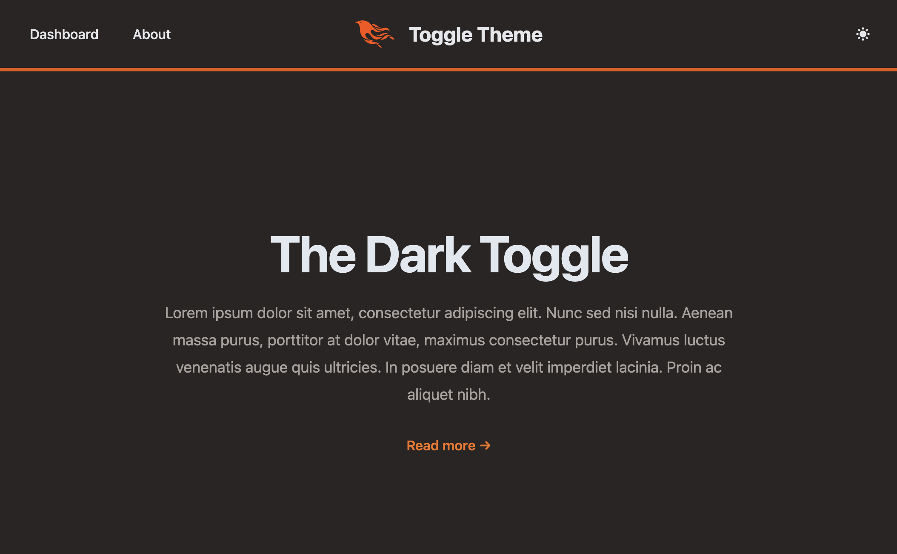

This article assume you have first followed the post:
[Phoenix System Dark Toggle](https://btihen.dev/posts/elixir/phoenix_1_7_11_liveview_1_0_0_system_dark_toggle/)

Code for this article can be found at: 
https://github.com/btihen-dev/phoenix_toggle_theme


## Manual Toggle

Now let's add a simple navbar where we can add the Theme Toggle button.  We will be using (and adjusting code from - https://github.com/aiwaiwa/phoenix_dark_mode)

### Toggle Theme Button

Let's make a component `toggle_theme`

```elixir
# lib/darktoggle_web/components/theme_toggle.ex
defmodule DarktoggleWeb.Components.ToggleTheme do
  use Phoenix.Component

  def render(assigns) do
    ~H"""
    <button
      id="theme-toggle"
      type="button"
      phx-update="ignore"
      phx-hook="DarkThemeToggle"
      class="text-grey-800 hover:bg-gray-100 dark:text-gray-200 dark:hover:bg-gray-700 dark:hover:text-gray-300 rounded-lg text-sm p-2"
    >
      <svg
        id="theme-toggle-dark-icon"
        class="w-5 h-5 text-transparent hidden"
        fill="currentColor"
        viewBox="0 0 20 20"
        xmlns="http://www.w3.org/2000/svg"
      >
        <!-- show moon icon within day mode -->
        <path
          d="M10 2a1 1 0 011 1v1a1 1 0 11-2 0V3a1 1 0 011-1zm4 8a4 4 0 11-8 0 4 4 0 018 0zm-.464 4.95l.707.707a1 1 0 001.414-1.414l-.707-.707a1 1 0 00-1.414 1.414zm2.12-10.607a1 1 0 010 1.414l-.706.707a1 1 0 11-1.414-1.414l.707-.707a1 1 0 011.414 0zM17 11a1 1 0 100-2h-1a1 1 0 100 2h1zm-7 4a1 1 0 011 1v1a1 1 0 11-2 0v-1a1 1 0 011-1zM5.05 6.464A1 1 0 106.465 5.05l-.708-.707a1 1 0 00-1.414 1.414l.707.707zm1.414 8.486l-.707.707a1 1 0 01-1.414-1.414l.707-.707a1 1 0 011.414 1.414zM4 11a1 1 0 100-2H3a1 1 0 000 2h1z"
          fill-rule="evenodd"
          clip-rule="evenodd"
        />
      </svg>

      <svg
        id="theme-toggle-light-icon"
        class="w-5 h-5 text-transparent"
        fill="currentColor"
        viewBox="0 0 20 20"
        xmlns="http://www.w3.org/2000/svg"
      >
        <!-- show sun icon within night mode -->
        <path d="M17.293 13.293A8 8 0 016.707 2.707a8.001 8.001 0 1010.586 10.586z" />
      </svg>
    </button>

    <script>
      // Toggle early based on <html class="dark">
      const themeToggleDarkIcon = document.getElementById('theme-toggle-dark-icon');
      const themeToggleLightIcon = document.getElementById('theme-toggle-light-icon');
      if (themeToggleDarkIcon != null && themeToggleLightIcon != null) {
        let dark = document.documentElement.classList.contains('dark');
        const show = dark ? themeToggleDarkIcon : themeToggleLightIcon
        const hide = dark ? themeToggleLightIcon : themeToggleDarkIcon
        show.classList.remove('hidden', 'text-transparent');
        hide.classList.add('hidden', 'text-transparent');
      }
    </script>
    """
  end
end
```

### Navbar

Make a `navbar` component using (with our new toggle theme button):
```elixir
# lib/darktoggle_web/components/navbar.ex
defmodule DarktoggleWeb.Components.Navbar do
  use DarktoggleWeb, :html

  def render(assigns) do
    ~H"""
    <header class="absolute sticky inset-x-0 top-0 z-50 w-full">
      <nav class="border-b-4 border-orange-600">
        <div class="mx-auto max-w-7xl px-2 lg:px-6 xl:px-8">
          <div class="relative flex h-20 items-center justify-between">
            <div class="absolute inset-y-0 left-0 flex items-center lg:hidden">
              <!-- Mobile menu button-->
              <button
                type="button"
                phx-click={JS.toggle(to: "#mobile-menu")}
                class="relative inline-flex items-center justify-center rounded-lg p-2  text-grey-800 hover:bg-gray-100 dark:text-gray-200 dark:hover:bg-gray-700 dark:hover:text-gray-300 focus:outline-none focus:ring-2 focus:ring-inset focus:ring-white"
                aria-controls="mobile-menu"
                aria-expanded="false"
              >
                <span class="absolute -inset-0.5"></span>
                <span class="sr-only">Open main menu</span>
                <!-- Icon when menu is closed. - Menu open: "hidden", Menu closed: "block" -->
                <svg
                  class="block h-6 w-6"
                  fill="none"
                  viewBox="0 0 24 24"
                  stroke-width="1.5"
                  stroke="currentColor"
                  aria-hidden="true"
                >
                  <path
                    stroke-linecap="round"
                    stroke-linejoin="round"
                    d="M3.75 6.75h16.5M3.75 12h16.5m-16.5 5.25h16.5"
                  />
                </svg>
                <!-- Icon when menu is open. - Menu open: "block", Menu closed: "hidden" -->
                <svg
                  class="hidden h-6 w-6"
                  fill="none"
                  viewBox="0 0 24 24"
                  stroke-width="1.5"
                  stroke="currentColor"
                  aria-hidden="true"
                >
                  <path stroke-linecap="round" stroke-linejoin="round" d="M6 18L18 6M6 6l12 12" />
                </svg>
              </button>
            </div>
            <div class="hidden lg:flex lg:items-center lg:space-x-4">
              <.link
                href={~p"/dev/dashboard/home"}
                class="rounded-lg px-3 py-2 text-md font-medium text-grey-800 hover:bg-gray-100 dark:text-gray-200 dark:hover:bg-gray-700 dark:hover:text-gray-300"
              >
                Dashboard
              </.link>
              <.link
                href={~p"/"}
                class="rounded-lg px-3 py-2 text-md font-medium text-grey-800 hover:bg-gray-100 dark:text-gray-200 dark:hover:bg-gray-700 dark:hover:text-gray-300"
              >
                About
              </.link>
            </div>
            <div class="absolute left-1/2 transform -translate-x-1/2 flex items-center">
              <.link
                href={~p"/"}
                class="-m-1.5 p-2.5 flex items-center rounded-lg  text-grey-800 hover:bg-gray-100 dark:text-gray-200 dark:hover:bg-gray-700 dark:hover:text-gray-300"
              >
                
                <span class="ml-4 text-2xl font-bold">Toggle Theme</span>
              </.link>
            </div>
            <div class="absolute inset-y-0 right-0 flex items-center pr-2 lg:static lg:inset-auto lg:ml-6 lg:pr-0">
              <DarktoggleWeb.Components.ToggleTheme.render />
            </div>
          </div>
        </div>
        <!-- Mobile menu, show/hide based on menu state. -->
        <div class="lg:hidden hidden" id="mobile-menu">
          <div class="space-y-1 px-2 pb-3 pt-2">
            <.link
              href={~p"/dev/dashboard/home"}
              class="block rounded-lg px-3 py-2 text-base font-medium  text-grey-800 hover:bg-gray-100 dark:text-gray-200 dark:hover:bg-gray-700 dark:hover:text-gray-300"
            >
              Dashboard
            </.link>
            <.link
              href={~p"/"}
              class="block rounded-lg px-3 py-2 text-base font-medium  text-grey-800 hover:bg-gray-100 dark:text-gray-200 dark:hover:bg-gray-700 dark:hover:text-gray-300"
            >
              About
            </.link>
          </div>
        </div>
      </nav>
    </header>
    """
  end
end
```

Now add our new component to the `root` template using:
`<DarktoggleWeb.Components.Navbar.render/>` the body tag:
```elixir
  <body class="bg-white dark:bg-stone-800">
    <DarktoggleWeb.Components.Navbar.render/>
    <%= @inner_content %>
  </body>
```

so the `root.html.heex` file will now look like:
```elixir
<!-- lib/darktoggle_web/components/layouts/root.html.heex -->
<!DOCTYPE html>
<html lang="en" class="[scrollbar-gutter:stable]">
  <head>
    <meta charset="utf-8" />
    <meta name="viewport" content="width=device-width, initial-scale=1" />
    <meta name="csrf-token" content={get_csrf_token()} />
    <.live_title suffix=" · Phoenix Framework">
      <%= assigns[:page_title] || "Darktoggle" %>
    </.live_title>
    <link phx-track-static rel="stylesheet" href={~p"/assets/app.css"} />
    <script defer phx-track-static type="text/javascript" src={~p"/assets/app.js"}>
    </script>
  </head>
  <body class="bg-white dark:bg-stone-800">
    <DarktoggleWeb.Components.Navbar.render />
    <%= @inner_content %>
  </body>
</html>
```

Test this (with your system settings) to be sure it works as expected.

NOTE: Later in this article I will cover add user information.

### JS Store State

We need a little JS to listen for and save our theme selection.  Make the file: `assets/vendor/toggle_theme.js`

```js
// assets/vendor/toggle_theme.js
// Dark/Light Mode theme toggle lightly adjusted from:
// https://github.com/aiwaiwa/phoenix_dark_mode/blob/main/dark_mode.js
const localStorageKey = "theme";

const isDark = () => {
  if (localStorage.getItem(localStorageKey) === "dark") return true;
  if (localStorage.getItem(localStorageKey) === "light") return false;
  return window.matchMedia("(prefers-color-scheme: dark)").matches;
};

const setupToggleTheme = () => {
  toggleVisibility = (dark) => {
    const themeToggleDarkIcon = document.getElementById(
      "theme-toggle-dark-icon",
    );
    const themeToggleLightIcon = document.getElementById(
      "theme-toggle-light-icon",
    );
    if (themeToggleDarkIcon == null || themeToggleLightIcon == null) return;
    const show = dark ? themeToggleDarkIcon : themeToggleLightIcon;
    const hide = dark ? themeToggleLightIcon : themeToggleDarkIcon;
    show.classList.remove("hidden", "text-transparent");
    hide.classList.add("hidden", "text-transparent");
    if (dark) {
      document.documentElement.classList.add("dark");
    } else {
      document.documentElement.classList.remove("dark");
    }
    try {
      localStorage.setItem(localStorageKey, dark ? "dark" : "light");
    } catch (_err) {}
  };
  toggleVisibility(isDark());
  document
    .getElementById("theme-toggle")
    .addEventListener("click", function () {
      toggleVisibility(!isDark());
    });
};

const toggleThemeHook = {
  mounted() {
    setupToggleTheme();
  },
  updated() {},
};

export default toggleThemeHook;
```

### Attach JS Hook

Now connect the JS store / Hook with-in: `app.js` by adding:
```js
import toggleThemeHook from "../vendor/toggle_theme";
let Hooks = {};
Hooks.DarkThemeToggle = toggleThemeHook;
```
and updating the `liveSocket` to include the `Hook` using:
```js
let liveSocket = new LiveSocket("/live", Socket, {
  longPollFallbackMs: 2500,
  params: { _csrf_token: csrfToken },
  hooks: Hooks, // add this line
});
```

Now the entire file should look like:
```js
// assets/js/app.js
// Include phoenix_html to handle method=PUT/DELETE in forms and buttons.
import "phoenix_html";
// Establish Phoenix Socket and LiveView configuration.
import { Socket } from "phoenix";
import { LiveSocket } from "phoenix_live_view";
import topbar from "../vendor/topbar";

import toggleThemeHook from "../vendor/toggle_theme";
let Hooks = {};
Hooks.DarkThemeToggle = toggleThemeHook;

let csrfToken = document
  .querySelector("meta[name='csrf-token']")
  .getAttribute("content");
let liveSocket = new LiveSocket("/live", Socket, {
  longPollFallbackMs: 2500,
  params: { _csrf_token: csrfToken },
  hooks: Hooks,
});

// Show progress bar on live navigation and form submits
topbar.config({ barColors: { 0: "#29d" }, shadowColor: "rgba(0, 0, 0, .3)" });
window.addEventListener("phx:page-loading-start", (_info) => topbar.show(300));
window.addEventListener("phx:page-loading-stop", (_info) => topbar.hide());

// connect if there are any LiveViews on the page
liveSocket.connect();

// expose liveSocket on window for web console debug logs and latency simulation:
// >> liveSocket.enableDebug()
// >> liveSocket.enableLatencySim(1000)  // enabled for duration of browser session
// >> liveSocket.disableLatencySim()
window.liveSocket = liveSocket;
```

### Configure Tailwind CSS

Our final change is to update the Configuration, we need to adjust the `assets/tailwind.js` file and change `darkMode: 'media'` to `darkMode: 'class'` thus the tailwind file will now look like:

```js
// assets/tailwind.js
const plugin = require("tailwindcss/plugin")
const fs = require("fs")
const path = require("path")

module.exports = {
  darkMode: 'class',
  content: [
  ...
  ]
  ...
}
```

### Results

Now you should see 

And then Toggling the button again you should see: 


## Resources:

* Tailwind CSS v2 (Phoenix v1.7.14) - https://v2.tailwindcss.com/docs/dark-mode
* Tailwind CSS color pallet - https://tailwindcss.com/docs/customizing-colors
* Phoenix Dark Mode repo - https://github.com/aiwaiwa/phoenix_dark_mode
