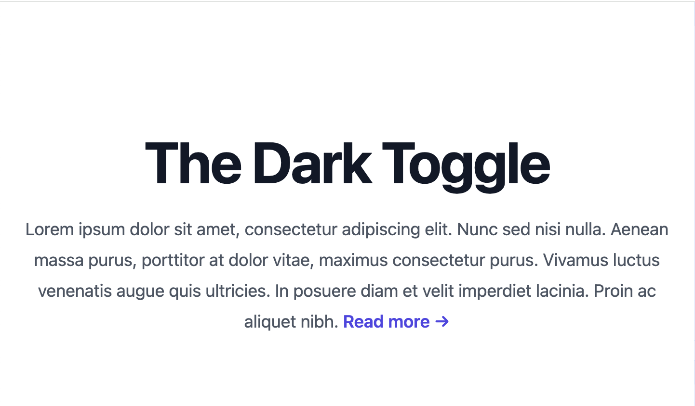

I've been interested in a simple darkmode with Tailwind.  We will start with the config and changes for system settings control.  Then we will implement a user toggle button.

Here is what I discovered.

## Install a Default Phoenix Project

Let's install a default Phoenix project - using the newest version as of `2024-06-29`

```bash
mix archive.install hex phx_new 1.7.14 --force
mix phx.new darktoggle
cd darktoggle
mix ecto.create
mix ecto.migrate
iex -S mix phx.server

git init
git add .
git commit -m 'initial commit'
```

## System Theme Toggle

This is quite straightforward we just need to configure tailwindcss and update the css for darkmode.  We will start with the config and then add and test the CSS.

### Config for System Toggle

We will start with system settings toggle.  Phoenix 1.7.14/LiveView 1.0.0 is using Tailwind v2 - so be sure to visit the [Tailwind v2 docs](https://v2.tailwindcss.com/docs/dark-mode). If you want to learn about Tailwindcss v3 you can read the [docs](https://tailwindcss.com/docs/dark-mode), but we will be focusing on the TailwindCSS v2 - using the defaults

First we need to adjust the `assets/tailwind.js` file:

```js
// assets/tailwind.js
const plugin = require("tailwindcss/plugin")
const fs = require("fs")
const path = require("path")

module.exports = {
  darkMode: 'media',
  content: [
  ...
  ]
  ...
}
```

### CSS for DarkMode

Let's start by simplifying the home / landing page `home.html.heex` I'll use the following as a starting point:

```html
<!-- lib/darktoggle_web/controllers/page_html/home.html.heex -->
<.flash_group flash={@flash} />

<div class="relative isolate px-6 pt-10 lg:px-8">
  <div class="mx-auto max-w-2xl py-12 sm:py-24 lg:py-36">
    <div class="text-center">
      <h1 class="text-4xl font-bold tracking-tight text-gray-900 dark:text-slate-100 sm:text-6xl">
        The Dark Toggle
      </h1>
      <p class="mt-6 text-lg leading-8 text-gray-600">
        Lorem ipsum dolor sit amet, consectetur adipiscing elit. Nunc sed nisi nulla.
        <a href="#" class="font-semibold text-indigo-600">
          <span class="absolute inset-0" aria-hidden="true"></span>Read more
          <span aria-hidden="true">&rarr;</span>
        </a>
      </p>
    </div>
  </div>
</div>
```

So now test the sites, you should see a bright white web page:



Now we will add dark mode.

To add a darkmode CSS we prefix the class with `dark:` a lot like is done for hover attributes with `hover:`  Let's got to:
`https://tailwindcss.com/docs/customizing-colors`
and pick a dark and light color that work well together, I like `stone-900` (dark background) and `zinc-100` (light text).

So let's update the `root.html.ex` (which controls all the pages) and add `dark:bg-stone-900` so we change from:
```html
  <body class="bg-white">
    <%= @inner_content %>
  </body>
```
to
```html
  <body class="bg-white dark:bg-stone-900">
    <%= @inner_content %>
  </body>
```

Now the `root` page looks like:
```html
<!-- lib/darktoggle_web/components/layouts/root.html.heex -->
<!DOCTYPE html>
<html lang="en" class="[scrollbar-gutter:stable]">
  <head>
    <meta charset="utf-8" />
    <meta name="viewport" content="width=device-width, initial-scale=1" />
    <meta name="csrf-token" content={get_csrf_token()} />
    <.live_title suffix=" · Phoenix Framework">
      <%= assigns[:page_title] || "Darktoggle" %>
    </.live_title>
    <link phx-track-static rel="stylesheet" href={~p"/assets/app.css"} />
    <script defer phx-track-static type="text/javascript" src={~p"/assets/app.js"}>
    </script>
  </head>
  <body class="bg-white dark:bg-stone-900">
    <%= @inner_content %>
  </body>
</html>
```

Now when you change your system settings to - darkmode you should see something like:


Of course the text is no longer easily visible, so let's make some changes to `home.html.heex`.  we will add:
* `h1` (bright text with `dark:text-slate-100`),
* `p` (gray text with `dark:text-stone-400`), and
* `a` (colored link text with `dark:text-indigo-300`).

so these three changes in the page look like:
```html
<!-- lib/darktoggle_web/controllers/page_html/home.html.heex -->
<.flash_group flash={@flash} />

<div class="relative isolate px-6 pt-10 lg:px-8">
  <div class="mx-auto max-w-2xl py-12 sm:py-24 lg:py-36">
    <div class="text-center">
      <h1 class="text-4xl font-bold tracking-tight text-gray-900 dark:text-slate-100 sm:text-6xl">
        The Dark Toggle
      </h1>
      <p class="mt-6 text-lg leading-8 text-gray-600 dark:text-stone-400">
        Lorem ipsum dolor sit amet, consectetur adipiscing elit. Nunc sed nisi nulla.
        <a href="#" class="font-semibold text-indigo-600 dark:text-indigo-300">
          <span class="absolute inset-0" aria-hidden="true"></span>Read more
          <span aria-hidden="true">&rarr;</span>
        </a>
      </p>
    </div>
  </div>
</div>
```

This is a now back to readable:


That's the basic idea of system settings controlling light and darkmode.  However, in a real app, you will need to go through every page and component and add the `dark:` classes so that all the pages are useable - this is a fair bit of work and a bit of a pitty this isn't part of the defaut design.

## Resources:

* Tailwind CSS v2 (Phoenix v1.7.14) - https://v2.tailwindcss.com/docs/dark-mode
* Tailwind CSS color pallet - https://tailwindcss.com/docs/customizing-colors
* Tailwind CSS v3 - https://tailwindcss.com/docs/dark-mode
* Phoenix Dark Mode repo - https://github.com/aiwaiwa/phoenix_dark_mode
