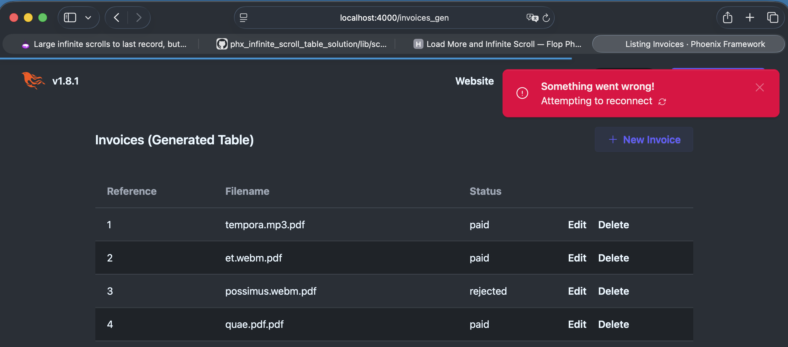
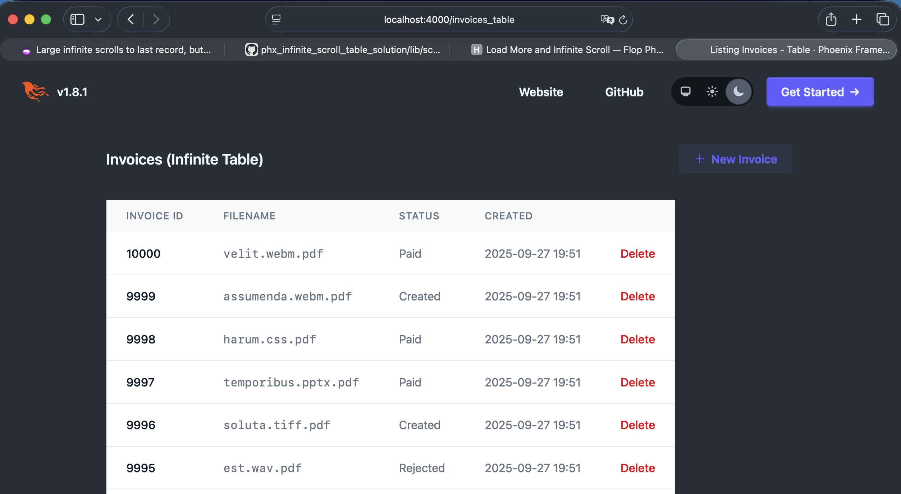
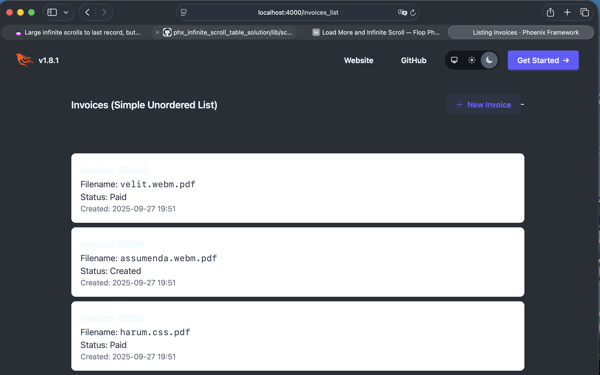
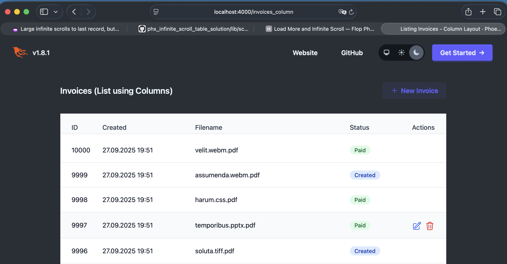

## TLDR

An index page with MANY records you can use pagination with infinite scrolling and switch from using a table format and instead using a [list with infinite scrolling](https://github.com/btihen-dev/phx_infinite_scroll_table_solution/blob/main/lib/scroll_test_web/live/invoice_sticky/index.ex).

In this case it seems that infinite scrolling only works with Lists and not with Tables - exactly as [documented](https://hexdocs.pm/flop_phoenix/load_more_and_infinite_scroll.html).

## Overview

At work we have some index pages with thousands of records.  This is of course unworkable with a standard table without pagination:



We implemented infinite scroll as documented (but within a table instead of a list).

We found that when we paginate more than 4 or 5 times we can no longer return to the first record.

This was recorded in an [Elixir Form Issue](https://elixirforum.com/t/large-infinite-scrolls-to-last-record-but-not-back-to-the-first-record/72382).

I also found the [following issue](https://elixirforum.com/t/how-do-you-use-the-phoenix-infinitescroll-hook-with-tables/70750)

In the end, we gave up using an HTML Table `<table>` and used an Unordered List `<ul>` exactly as described in the [Hex Docs](https://hexdocs.pm/flop_phoenix/load_more_and_infinite_scroll.html).  We then made the list look like a table.

Here is the [code](https://github.com/btihen-dev/phx_infinite_scroll_table_solution) we used to solve the problem.

## Infinite Scrolling with a Table (Broken)

Our first attempt to solving this problem was to extend our index table to use pagination and add infinite scroll hooks.



This code looked like - which can be found at [GitHub](https://github.com/btihen-dev/phx_infinite_scroll_table_solution/blob/main/lib/scroll_test_web/live/invoice_table/index.ex):

```elixir
defmodule ScrollTestWeb.InvoiceTable.Index do
  use ScrollTestWeb, :live_view

  alias ScrollTest.Billing

  @impl true
  def render(assigns) do
    ~H"""
    <Layouts.app flash={@flash}>
      <.header>
        Invoices (Infinite Scroll Table)
        <:actions>
          <.button navigate={~p"/invoices/new"}>
            <.icon name="hero-plus" /> New Invoice
          </.button>
        </:actions>
      </.header>

      <div
        id="invoices-container"
        data-phx-hook="Phoenix.InfiniteScroll"
        class=""
      >
        <!-- Top sentinel: triggers when user scrolls back to top -->
        <div phx-viewport-top='[["push", {"event": "prev-page", "page_loading": true}]]'></div>

        <table>
          <thead class="bg-gray-50 sticky top-0 z-10">
            <tr>
              <th class="px-6 py-3 text-left text-xs font-medium text-gray-500 uppercase tracking-wider">
                Invoice ID
              </th>
              <th class="px-6 py-3 text-left text-xs font-medium text-gray-500 uppercase tracking-wider">
                Filename
              </th>
              <th class="px-6 py-3 text-left text-xs font-medium text-gray-500 uppercase tracking-wider">
                Status
              </th>
              <th class="px-6 py-3 text-left text-xs font-medium text-gray-500 uppercase tracking-wider">
                Created
              </th>
              <th class="relative px-6 py-3">
                <span class="sr-only">Actions</span>
              </th>
            </tr>
          </thead>
          <tbody
            id="invoices"
            phx-update="stream"
            phx-viewport-top={@page > 1 && JS.push("prev-page", page_loading: true)}
            phx-viewport-bottom={!@end_of_timeline? && JS.push("next-page", page_loading: true)}
            class={[
              "bg-white divide-y divide-gray-200",
              if(@end_of_timeline?, do: "pb-10", else: "pb-10"),
              "pt-0"
            ]}
          >
            <tr :for={{id, invoice} <- @streams.invoices} id={id} class="hover:bg-gray-50">
              <td class="px-6 py-4 whitespace-nowrap text-sm font-medium text-gray-900">
                {invoice.id}
              </td>
              <td class="px-6 py-4 whitespace-nowrap text-sm text-gray-500 font-mono">
                {invoice.filename}
              </td>
              <td class="px-6 py-4 whitespace-nowrap text-sm text-gray-500">
                <span class="capitalize">{invoice.status}</span>
              </td>
              <td class="px-6 py-4 whitespace-nowrap text-sm text-gray-500">
                {Calendar.strftime(invoice.inserted_at, "%Y-%m-%d %H:%M")}
              </td>
              <td class="px-6 py-4 whitespace-nowrap text-right text-sm font-medium">
                <.link
                  phx-click={JS.push("delete", value: %{id: invoice.id}) |> hide("##{id}")}
                  data-confirm="Are you sure?"
                  class="text-red-600 hover:text-red-900"
                >
                  Delete
                </.link>
              </td>
            </tr>
          </tbody>
        </table>

    <!-- Bottom sentinel: triggers when user scrolls near the bottom -->
        <div phx-viewport-bottom='[["push", {"event": "next-page", "page_loading": true}]]'></div>
      </div>

      <div :if={@end_of_timeline?} class="mt-5 text-[50px] text-center">
        🎉 You made it to the beginning of time 🎉
      </div>
    </Layouts.app>
    """
  end

  defp paginate_invoices(socket, new_page) when new_page >= 1 do
    %{per_page: per_page, page: cur_page} = socket.assigns
    invoices = Billing.paginated_invoices(offset: (new_page - 1) * per_page, limit: per_page)

    {invoices, at, limit} =
      if new_page >= cur_page do
        {invoices, -1, per_page * 3 * -1}
      else
        {Enum.reverse(invoices), 0, per_page * 3}
      end

    case invoices do
      [] ->
        assign(socket, end_of_timeline?: at == -1)

      [_ | _] = invoices ->
        socket
        |> assign(end_of_timeline?: false)
        |> assign(:page, new_page)
        |> stream(:invoices, invoices, at: at, limit: limit)
    end
  end

  @impl true
  def mount(_params, _session, socket) do
    {:ok,
     socket
     |> assign(:page_title, "Listing Invoices - Table")
     |> assign(page: 1, per_page: 20)
     |> paginate_invoices(1)}
  end

  @impl true
  def handle_event("delete", %{"id" => id}, socket) do
    invoice = Billing.get_invoice!(id)
    {:ok, _} = Billing.delete_invoice(invoice)

    {:noreply, stream_delete(socket, :invoices, invoice)}
  end

  def handle_event("next-page", params, socket) do
    IO.inspect(
      %{
        event: "next-page",
        params: params,
        current_page: socket.assigns.page,
        per_page: socket.assigns.per_page,
        end_of_timeline: socket.assigns.end_of_timeline?,
        going_to_page: socket.assigns.page + 1
      },
      label: "NEXT-PAGE EVENT"
    )

    {:noreply, paginate_invoices(socket, socket.assigns.page + 1)}
  end

  def handle_event("prev-page", %{"_overran" => true} = params, socket) do
    IO.inspect(
      %{
        event: "prev-page",
        overran: true,
        params: params,
        current_page: socket.assigns.page,
        per_page: socket.assigns.per_page,
        end_of_timeline: socket.assigns.end_of_timeline?,
        resetting_to_page: 1
      },
      label: "PREV-PAGE OVERRAN EVENT"
    )

    {:noreply, paginate_invoices(socket, 1)}
  end

  def handle_event("prev-page", params, socket) do
    IO.inspect(
      %{
        event: "prev-page",
        overran: false,
        params: params,
        current_page: socket.assigns.page,
        per_page: socket.assigns.per_page,
        end_of_timeline: socket.assigns.end_of_timeline?,
        can_go_back: socket.assigns.page > 1,
        going_to_page: if(socket.assigns.page > 1, do: socket.assigns.page - 1, else: :no_change)
      },
      label: "PREV-PAGE EVENT"
    )

    if socket.assigns.page > 1 do
      {:noreply, paginate_invoices(socket, socket.assigns.page - 1)}
    else
      {:noreply, socket}
    end
  end
end
```

however we found that after 4-5 page reloads we could no longer to return to the first record.

We were able to fix this problem with a lot of JS but in the end in our case it conflicted with other features so we had to find another solution.

## Infinite scroll with a List (Works)

Next we created a simple list - just to test the infinite.



The [code](https://github.com/btihen-dev/phx_infinite_scroll_table_solution/blob/main/lib/scroll_test_web/live/invoice_list/index.ex) :

```elixir
defmodule ScrollTestWeb.InvoiceList.Index do
  use ScrollTestWeb, :live_view

  alias ScrollTest.Billing

  @impl true
  def render(assigns) do
    ~H"""
    <Layouts.app flash={@flash}>
      <.header>
        Listing Invoices
        <:actions>
          <.button navigate={~p"/invoices/new"}>
            <.icon name="hero-plus" /> New Invoice
          </.button>-
        </:actions>
      </.header>

      <ul
        id="invoices"
        phx-update="stream"
        phx-viewport-top={@page > 1 && JS.push("prev-page", page_loading: true)}
        phx-viewport-bottom={!@end_of_timeline? && JS.push("next-page", page_loading: true)}
        class={[
          if(@end_of_timeline?, do: "pb-10", else: "pb-[calc(200vh)]"),
          if(@page == 1, do: "pt-10", else: "pt-[calc(200vh)]")
        ]}
      >
        <li :for={{id, invoice} <- @streams.invoices} id={id}>
          <.invoice_card invoice={invoice} />
        </li>
      </ul>
      <div :if={@end_of_timeline?} class="mt-5 text-[50px] text-center">
        🎉 You made it to the beginning of time 🎉
      </div>
    </Layouts.app>
    """
  end

  defp invoice_card(assigns) do
    ~H"""
    <div class="border border-gray-100 rounded-lg p-4 mb-2 shadow-sm bg-white">
      <div class="font-bold text-lg">Invoice: {@invoice.id}</div>
      <div class="text-gray-700">Filename: <span class="font-mono">{@invoice.filename}</span></div>
      <div class="text-gray-700">Status: <span class="capitalize">{@invoice.status}</span></div>
      <div class="text-gray-500 text-sm">
        Created: {Calendar.strftime(@invoice.inserted_at, "%Y-%m-%d %H:%M")}
      </div>
    </div>
    """
  end

  defp invoice_row(assigns) do
    ~H"""
    <div class="border border-gray-100 rounded-lg p-2 mb-2 shadow-sm bg-white">
      <div class="flex items-center">
        <div class="flex items-center w-[10%]">
          <.icon name="hero-hashtag" class="w-4 h-4 text-gray-400 mr-2" />
          <span class="font-bold text-lg">{@invoice.id}</span>
        </div>
        <div class="flex items-center w-[30%] justify-center">
          <.icon name="hero-calendar" class="w-4 h-4 text-gray-400 mx-2" />
          <span class="text-gray-500 text-sm">
            {Calendar.strftime(@invoice.inserted_at, "%Y-%m-%d %H:%M")}
          </span>
        </div>
        <div class="flex items-center w-[40%]">
          <.icon name="hero-document-text" class="w-4 h-4 text-gray-400 mr-2" />
          <span class="text-gray-700 font-mono">{@invoice.filename}</span>
        </div>
        <div class="flex items-center flex-1">
          <.icon name="hero-check-circle" class="w-4 h-4 text-gray-400 mr-2" />
          <span class="text-gray-700 capitalize">{@invoice.status}</span>
        </div>
      </div>
    </div>
    """
  end

  defp paginate_invoices(socket, new_page) when new_page >= 1 do
    %{per_page: per_page, page: cur_page} = socket.assigns
    invoices = Billing.paginated_invoices(offset: (new_page - 1) * per_page, limit: per_page)

    {invoices, at, limit} =
      if new_page >= cur_page do
        {invoices, -1, per_page * 3 * -1}
      else
        {Enum.reverse(invoices), 0, per_page * 3}
      end

    case invoices do
      [] ->
        assign(socket, end_of_timeline?: at == -1)

      [_ | _] = invoices ->
        socket
        |> assign(end_of_timeline?: false)
        |> assign(:page, new_page)
        |> stream(:invoices, invoices, at: at, limit: limit)
    end
  end

  @impl true
  def mount(_params, _session, socket) do
    {:ok,
     socket
     |> assign(:page_title, "Listing Invoices")
     |> assign(page: 1, per_page: 20)
     |> paginate_invoices(1)}
  end

  @impl true
  def handle_event("delete", %{"id" => id}, socket) do
    invoice = Billing.get_invoice!(id)
    {:ok, _} = Billing.delete_invoice(invoice)

    {:noreply, stream_delete(socket, :invoices, invoice)}
  end

  def handle_event("next-page", _, socket) do
    IO.inspect(label: "next_page")
    {:noreply, paginate_invoices(socket, socket.assigns.page + 1)}
  end

  def handle_event("prev-page", %{"_overran" => true}, socket) do
    IO.inspect(label: "prev-page overran")
    {:noreply, paginate_invoices(socket, 1)}
  end

  def handle_event("prev-page", _, socket) do
    IO.inspect(label: "prev_page")

    if socket.assigns.page > 1 do
      {:noreply, paginate_invoices(socket, socket.assigns.page - 1)}
    else
      {:noreply, socket}
    end
  end
end
```

This code worked, but was a big change in our Interface.

## List looking like a Table

Given the success of using a list we then used CSS to create a table look alike.



You can see the [code][https://github.com/btihen-dev/phx_infinite_scroll_table_solution/blob/main/lib/scroll_test_web/live/invoice_sticky/index.ex]:

```elixir
defmodule ScrollTestWeb.InvoiceSticky.Index do
  use ScrollTestWeb, :live_view

  alias ScrollTest.Billing

  @impl true
  def render(assigns) do
    ~H"""
    <Layouts.app flash={@flash}>
      <.header>
        Invoices (List looking like a Table)
        <:actions>
          <.button navigate={~p"/invoices/new"}>
            <.icon name="hero-plus" /> New Invoice
          </.button>-
        </:actions>
      </.header>

      <ul
        id="invoices"
        phx-update="stream"
        phx-viewport-top={@page > 1 && JS.push("prev-page", page_loading: true)}
        phx-viewport-bottom={!@end_of_timeline? && JS.push("next-page", page_loading: true)}
        class={[
          if(@end_of_timeline?, do: "pb-10", else: "pb-[calc(200vh)]"),
          if(@page == 1, do: "pt-10", else: "pt-[calc(200vh)]")
        ]}
      >
        <li :for={{id, invoice} <- @streams.invoices} id={id}>
          <.invoice_card invoice={invoice} />
        </li>
      </ul>
      <div :if={@end_of_timeline?} class="mt-5 text-[50px] text-center">
        🎉 You made it to the beginning of time 🎉
      </div>
    </Layouts.app>
    """
  end

  defp invoice_card(assigns) do
    ~H"""
    <div class="border border-gray-100 rounded-lg p-4 mb-2 shadow-sm bg-white">
      <div class="font-bold text-lg">Invoice: {@invoice.id}</div>
      <div class="text-gray-700">Filename: <span class="font-mono">{@invoice.filename}</span></div>
      <div class="text-gray-700">Status: <span class="capitalize">{@invoice.status}</span></div>
      <div class="text-gray-500 text-sm">
        Created: {Calendar.strftime(@invoice.inserted_at, "%Y-%m-%d %H:%M")}
      </div>
    </div>
    """
  end

  defp invoice_row(assigns) do
    ~H"""
    <div class="border border-gray-100 rounded-lg p-2 mb-2 shadow-sm bg-white">
      <div class="flex items-center">
        <div class="flex items-center w-[10%]">
          <.icon name="hero-hashtag" class="w-4 h-4 text-gray-400 mr-2" />
          <span class="font-bold text-lg">{@invoice.id}</span>
        </div>
        <div class="flex items-center w-[30%] justify-center">
          <.icon name="hero-calendar" class="w-4 h-4 text-gray-400 mx-2" />
          <span class="text-gray-500 text-sm">
            {Calendar.strftime(@invoice.inserted_at, "%Y-%m-%d %H:%M")}
          </span>
        </div>
        <div class="flex items-center w-[40%]">
          <.icon name="hero-document-text" class="w-4 h-4 text-gray-400 mr-2" />
          <span class="text-gray-700 font-mono">{@invoice.filename}</span>
        </div>
        <div class="flex items-center flex-1">
          <.icon name="hero-check-circle" class="w-4 h-4 text-gray-400 mr-2" />
          <span class="text-gray-700 capitalize">{@invoice.status}</span>
        </div>
      </div>
    </div>
    """
  end

  defp paginate_invoices(socket, new_page) when new_page >= 1 do
    %{per_page: per_page, page: cur_page} = socket.assigns
    invoices = Billing.paginated_invoices(offset: (new_page - 1) * per_page, limit: per_page)

    {invoices, at, limit} =
      if new_page >= cur_page do
        {invoices, -1, per_page * 3 * -1}
      else
        {Enum.reverse(invoices), 0, per_page * 3}
      end

    case invoices do
      [] ->
        assign(socket, end_of_timeline?: at == -1)

      [_ | _] = invoices ->
        socket
        |> assign(end_of_timeline?: false)
        |> assign(:page, new_page)
        |> stream(:invoices, invoices, at: at, limit: limit)
    end
  end

  @impl true
  def mount(_params, _session, socket) do
    {:ok,
     socket
     |> assign(:page_title, "Listing Invoices")
     |> assign(page: 1, per_page: 20)
     |> paginate_invoices(1)}
  end

  @impl true
  def handle_event("delete", %{"id" => id}, socket) do
    invoice = Billing.get_invoice!(id)
    {:ok, _} = Billing.delete_invoice(invoice)

    {:noreply, stream_delete(socket, :invoices, invoice)}
  end

  def handle_event("next-page", _, socket) do
    IO.inspect(label: "next_page")
    {:noreply, paginate_invoices(socket, socket.assigns.page + 1)}
  end

  def handle_event("prev-page", %{"_overran" => true}, socket) do
    IO.inspect(label: "prev-page overran")
    {:noreply, paginate_invoices(socket, 1)}
  end

  def handle_event("prev-page", _, socket) do
    IO.inspect(label: "prev_page")

    if socket.assigns.page > 1 do
      {:noreply, paginate_invoices(socket, socket.assigns.page - 1)}
    else
      {:noreply, socket}
    end
  end
end
```
This works well.  In our case, we don't need structured data as this GUI is only used by people.  So in this case abandoning a table has no secondary consequences for us.

## Resources

* https://hexdocs.pm/flop_phoenix/load_more_and_infinite_scroll.html
