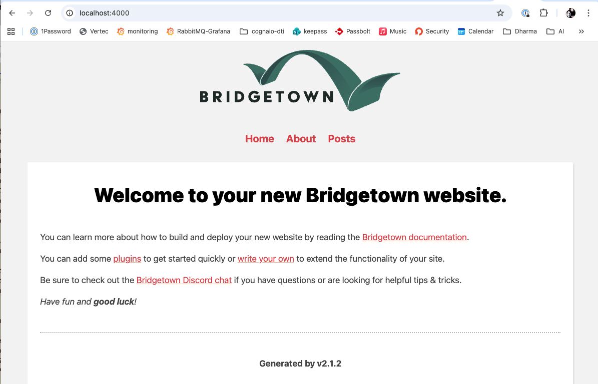

## **Overview**

Bridgetown allows static site generation with familiar ruby technology (ERB, Markdown, etc).  Bridgetown is an active project and in the last 2 years it has gone from v1.0.0 to v2.1.2.

Excellent resources and a deep dive can be found at https://edge.bridgetownrb.com/docs

Bridgetown requires `node` and by default uses `PostCSS`, but you can switch to `SASS` if needed.  No CSS framework is installed by default.

## **Quick-Start**

Let's build a basic site, and then we will do a deeper dive:

```bash
# install Bridgetown and all dependencies:
gem install bridgetown -N

# using rbenv?
rbenv rehash

# build a (default) website:
bridgetown new ruby_kafi
# if you already know what plugins are interesting you can use something like:
# bridgetown new ruby_kafi -t erb -c tailwindcss,netlify,stimulus

# go into the site
cd  ruby_kafi

# start bridgetown on port 4000
bin/bridgetown start
```

Now you should see a basic page:



## Resources 

files (usually markdown) that are the base for the generated html.

There are two types:

- static pages - landing pages, about us, contact, etc.
- dynamic pages (usually within collections) - blog posts, events, etc

### **Front Matter**

Front Matter is a section at the top of a Markdown page that contains **meta data** used by Bridgetown to properly build pages.

Front Matter starts and ends with 3 dashes: `---`

For a static page, a basic front matter will always have a `layout` and `title`:

```markdown
---
layout: page
title: Contact
---
```

Dynamic/Collections pages also need a few extra fields: `date` and `categories`:

```markdown
---
layout: post
title:  "Making a Post"
date:   2026-04-25 12:03:56 +0200
categories: updates
---
```

for a full explanation, see: https://www.bridgetownrb.com/docs/front-matter

### **Organize Static Pages**

By default static pages are in the `src` folder, but this can get messy with complex sites.
Also, by default, `src/_pages` serves static pages.  So, let's add this folder:

```bash
# make the new default static page location
mkdir src/_pages

# move the existing static pages
mv src/*.md src/_pages/.

# check that everything still works
bin/bridgetown start
```

### **Add a Static Page (Resource)**

Let's add a `contact` page:
```ruby
mkdir src/_pages
cat <<EOF>> src/_pages/contact.md
---
layout: page
title: Contact
---

<h1>Contact Ruby Kafi</h1>

Hosted by Puzzle
EOF
```

Now we can update the `navbar` within the **components** folder at: 

`src/_components/shared/navbar.erb`

and we will simply add: 

`<li><a href="<%= relative_url '/contact' %>">Contact</a></li>`

So now it looks like this:

```erb
<header>
  " alt="Logo" />
</header>

<nav>
  <ul>
    <li><a href="<%= relative_url '/' %>">Home</a></li>
    <li><a href="<%= relative_url '/about' %>">About</a></li>
    <li><a href="<%= relative_url '/contact' %>">Contact</a></li>
    <li><a href="<%= relative_url '/posts' %>">Posts</a></li>
  </ul>
</nav>
```

Finally let's check that we can have our new page:

```bash
# check that everything still works
bin/bridgetown start
```

### **Add a `post`** (Resource within a collection)

Bridgetown uses **Kramdown** as the Markdown rendering engine.  You can learn more about [Kramdown Markdown](https://kramdown.gettalong.org/quickref.html)

Let's make a new post.

```bash
# by default we are encouraged to date the pages
touch src/_posts/2026-04-25-making-a-post.md

cat <<EOF>> src/_posts/2026-04-25-making-a-post.md
---
layout: post
title:  "Making a Post"
date:   2026-04-25 12:03:56 +0200
categories: updates
---

## Making a new post page

Use Frontmatter and Markdown

follow the instructions at [btihen.dev]()
EOF
```

If there is something wrong with the page it won't be indexed (and you won't see a problem in the log :(

It's likely to be the frontmatter - just copy that from a working page, adjust it and it should now show up.

If that still doesn't work - remove all content but a title and the **Frontmatter** and slowly add to it until the error is found.


## **Add an Image to a Page**

By default Bridgetown / Kramdown don't size your image so you will need to add a little extra code to images.

You have several options to address this:

### Option 1: Use inline markdown CSS

using `{:style="width: 100%; height: auto;"}`

so for an image:

```markdown
{:style="width: 100%; height: auto;"}
```

### Option 2: Use HTML with inline CSS

you can mix in HTML with your Markdown i.e.

```html
<div style="width: 100%; overflow: hidden;">
  
</div>
```

### Option 3: Add a CSS class to your stylesheet

If this is needed often - then this is the best solution.

Add to your CSS file: `frontend/styles/index.css`

```css
.full-width-image {
  width: 100%;
  height: auto;
  display: block;
}
```

In Markdown use the inline CSS to define the class:

```markdown
{:.full-width-image}
```

### Page with Images

Let's add an image to a post:
```bash
# to keep things organized make a folder for these images
mkdir src/images/posts

# by default we are encouraged to date the pages
touch src/_posts/2026-04-25-adding-an-image.md

cat <<EOF>> src/_posts/2026-04-25-adding-an-image.md
---
layout: post
title:  "Adding an Image"
date:   2026-04-25 12:03:56 +0200
categories: updates
---

## Adding an Image

### with Inline CSS 

{:style="width: 100%; height: auto;"}

### with embedded HTML

<div style="width: 100%; overflow: hidden;">
  
</div>
EOF
```

now you should see the images.


## **Create a Draft Post**

### Setup
In order to control what is published and what isn't we  simply add `<% next if post.data.draft %>` to our posts page `src/_pages/posts.md` within it's the loop like:

```erb
---
layout: page
title: Posts
---

<ul>
  <% collections.posts.each do |post| %>
    <% next if post.data.draft %>
  
    <li>
      <a href="<%= post.relative_url %>"><%= post.data.title %></a>
    </li>
  <% end %>
</ul>
```

### Draft page

we add a `draft` variable to the frontmatter like:

```bash
touch src/_posts/2026-04-25-adding-an-image.md

cat <<EOF>> src/_posts/2026-04-25-adding-a-draft.md
---
layout: post
title:  "Adding a Draft"
date:   2026-04-25 12:03:56 +0200
categories: updates
draft:  true
---

## A Draft Page

This is not yet ready to publish.
EOF
```

now it skips any file with `draft: true` and will not be compiled to html.

## **A New Collections** (Events)

Lets assume in addition to publishing your blog - you also want to publish events.

### New Resources

let's create some events:
```bash
mkdir src/_events

cat <<EOF>>src/_events/bridgetown-intro.me
---
layout: event
title:  "Introduction to Bridgetown"
date:   2026-05-05 11:30:00 +0200
categories: websites ruby static-generation
---

A brief intro / demo into using Bridgetown.
```

### New Layout for Events

Now we need to build the layout we mentioned in the frontmatter:
```bash
cat <<EOF>> src/_layouts/event.erb
---
layout: default
---

<h1><big>Event:</big> <%= data.title %></h1>
<h2><big>Date:</big> <%= resource.data.date.strftime("%B %d, %Y at %I:%M %p") %></h2>
<h3><big>Topic(s):</big> <%= data.categories.join(', ') %></h3>

<%= yield %>
EOF
```

### Define / Configure new Collection

We have added some header info since the date and time are important.

To configure this we need to add to the file `config/initializers.rb`:

```ruby
collections do
  # path: `src/_events
  events do
    output true
    # controls how the page paths are generated
    permalink "pretty"
    # a future dated frontmatter is published anyway.
    future true
  end
end
```

Other interesting config options are:

* `sort_by` allows you to pick a front-matter key and sort by it
* `sort_direction` is pretty clear - `ascending` or `descending` are the two choices

Now this file looks like: 
```ruby
Bridgetown.configure do |config|
  # The base hostname & protocol for your site, e.g. https://example.com
  url ""

  # Available options are `erb` (default), `serbea`, or `liquid`
  template_engine "erb"

  collections do
    events do
      output true
      permalink "pretty"
      future true
    end
  end
end
```

This layout loads the default layout and for each talk we will have the 'title', 'topic' and 'date'!

### Collection Page for Events 

Now we will need the page to list all our events.

```md
cat <<EOF>> src/_pages/events.md
---
layout: page
title: Events
---

<ul>
  <% collections.events.each do |event| %>
    <% next if event.data.draft %>
  
    <li>
      <a href="<%= event.relative_url %>"><%= event.data.title %></a>
    </li>
  <% end %>
</ul>
EOF
```

Finally lets add this to the navbar: `src/_components/shared/navbar.erb` and adding: 

`<li><a href="<%= relative_url '/events' %>">Events</a></li>`

now it looks like:

```md
<header>
  <h1>Ruby Kafi</h1>
  <a href="<%= relative_url '/' %>">
    " alt="Ruby Kafi Logo">
  </a>
</header>

<nav>
  <ul>
    <li><a href="<%= relative_url '/' %>">Home</a></li>
    <li><a href="<%= relative_url '/about' %>">About</a></li>
    <li><a href="<%= relative_url '/contact' %>">Contact</a></li>
    <li><a href="<%= relative_url '/events' %>">Events</a></li>
    <li><a href="<%= relative_url '/posts' %>">Posts</a></li>
  </ul>
</nav>

```
we should now see events listed at; `http://localhost:4000/events`


## **Controlling the URLs (permalinks)**

This is important since you are likely to need to use specific URLs (to match a prior site). 

This is documented at: https://www.bridgetownrb.com/docs/content/permalinks

The predefined formats are:

* `pretty` defined as `/[locale]/:categories/:year/:month/:day/:slug/`
* `pretty_ext` defined as `/[locale]/:categories/:year/:month/:day/:slug.*`
* `simple` defined as `/[locale]/:categories/:slug/`
* `simple_ext` defined as `/[locale]/:categories/:slug.*`

'slug' is basically the file-name & categories is defined in the

However, you can also define the url your self with:

`permalink "/[locale]/:categories/:year/:month/:title/"`

Now this file looks like: 
```ruby
Bridgetown.configure do |config|
  # The base hostname & protocol for your site, e.g. https://example.com
  url ""

  # Available options are `erb` (default), `serbea`, or `liquid`
  template_engine "erb"

  collections do
    events do
      output true
      permalink "/:collection/:year/:month/:title/"
      future true
    end
  end
end
```

This will make event posts based on the title and dates, i.e.: 

`http://localhost:4000/events/2026/05/intro-to-bridgetown/`

**After changing `config/initializers.rb` you MUST restart bridgetown!**


## Conclusion

This looks promising for people familiar with Rails, we will see how it competes with Astro and the other JAMF Stacks for the general public.

So far, the only downsides have been:
* I am not sure I fully understand the logic of 3 added aspects of additional features - for example why is there a netlify automation and bundle config?
* I have only been able to install AlpineJS as a weblink and not as an included module (If I figure it out I'll update this document and or make a configuration script) - maybe I just need to learn into StimulusJS.
* I would like to use Fly.io too (if I figure it out I'll write a configuration script)

Apparently, Vue, React, Bulma plugin-configuations are comming too.
As well as workflows and deployment for github and gitlab.
This should be interesting and fun.


## Appendix


### **Pagination**

https://www.bridgetownrb.com/docs/prototype-pages

This required `pagination` is enabled (https://www.bridgetownrb.com/docs/content/pagination/)


### **prototypes - Similar Pages and Searching**

https://edge.bridgetownrb.com/docs/prototype-pages

https://www.bridgetownrb.com/docs/prototype-pages#searching-in-collections

You've probably seen a section on many webpages with 'similar' articles (which lists articles with the same `tag` or `category`) - let's set that up for talks.

First make a few talks with tags and categories.

Now lets create the pages to define our 'similar' talks:
```bash
mkdir -p src/talks/categories
cat<<EOF>src/talks/categories/categories.html
---
title: Talks about :prototype-term-titleize
prototype:
  term: categories
  collection: talks
---
EOF

mkdir -p src/talks/tags
cat<<EOF>src/talks/tags/tag.html
---
title: Talks about :prototype-term-titleize
prototype:
  term: tag
  collection: talks
---
EOF
```


### **Deploy**

Let's now deploy this Webpage (using the `configure` command) it is very straightforward!

1. First, be sure you have pushed your project to github or gitlab - create the repo online and push it with:
```bash
git add .
git commit -m "Configured w TailwindCSS and Handlee Font"
git remote add origin git@github.com:gitusername/bridge_tail_site.git
git branch -M main
git push -u origin main
```
1. Second, install the config for your deploy service (in this case `netlify`) by typing:
```bash
bundle exec bridgetown configure netlify
git add bin/netlify.sh netlify.toml
git commit -m "add netlify config"
git push
```
3. Third, connect your netlify account to the repo you just created.
4. Four, click `deploy` within the netlify site (if it hasn't already startet) and wait 5-10 mins (yes its kinda slow to deploy) and you should have your new website!

Woo Hoo.

### What didn't work (yet!)

#### Bridgetown File Routing

Let's try the new File Routing feature described at: https://edge.bridgetownrb.com/docs/routes

First update the `Gemfile` - uncomment: `gem "bridgetown-routes", "~> 1.0.0.beta3", group: :bridgetown_plugins` - now it should look similar to:
```ruby
# Gemfile
source "https://rubygems.org"
git_source(:github) { |repo| "https://github.com/#{repo}.git" }

gem "bridgetown", "~> 1.0.0.beta3"

# Uncomment to add file-based dynamic routing to your project:
gem "bridgetown-routes", "~> 1.0.0.beta3", group: :bridgetown_plugins

gem "puma", "~> 5.5"
```

Now we need to run bundler:
```bash
bundle install
```

Now setup the Roda config `server/roda_app.rb`:
```ruby
# server/roda_app.rb
require "bridgetown-routes"

class RodaApp < Bridgetown::Rack::Roda
  # Uncomment to use Bridgetown SSR:
  # plugin :bridgetown_ssr

  # And optionally file-based routing:
  plugin :bridgetown_routes

  route do |r|
    # Load Roda routes in server/routes (and src/_routes via `bridgetown-routes`)
    Bridgetown::Rack::Routes.start! self
  end
end
```

Now lets add:
```ruby
# ./server/routes/preview.rb

class Routes::Preview < Bridgetown::Rack::Routes
  route do |r|
    r.on "preview" do
      # Our special rendering pathway to preview a page
      # route: /preview/:collection/:path
      r.get String, String do |collection, path|
        item = Bridgetown::Model::Base.find("repo://#{collection}/#{path}")

        unless item.content.present?
          next Bridgetown::Model::Base.find("repo://pages/_pages/404.html")
            .render_as_resource
            .output
        end

        item
          .render_as_resource
          .output
      end
    end
  end
end
```

Now lets make an index page for this route:
```ruby
mkdir -p src/_routes/items
cat <<EOF>src/_routes/items/index.erb
---<%
# route: /items
r.get do
  render_with data: {
    layout: :page,
    title: "Dynamic Items",
    items: [
      { number: 1, slug: "123-abc" },
      { number: 2, slug: "456-def" },
      { number: 3, slug: "789-xyz" },
    ]
  }
end
%>---

<ul>
  <% resource.data.items.each do |item| %>
    <li><a href="/items/<%= item[:slug] %>">Item #<%= item[:number] %></a></li>
  <% end %>
</ul>
EOF
```

Now lets create the template for items:
```ruby
cat <<EOF>>src/_routes/items/[slug].erb
---<%
# route: /items/:slug
r.get do
  item_id, *item_sku = r.params[:slug].split("-")
  item_sku = item_sku.join("-")

  render_with data: {
    layout: :page,
    title: "Item Page",
    item_id: item_id,
    item_sku: item_sku
  }
end
%>---

<p><strong>Item ID:</strong> <%= resource.data.item_id %></p>

<p><strong>Item SKU:</strong> <%= resource.data.item_sku %></p>
EOF
```


### **Bridgetown Vocabulary**

It is important to note that this technology is not built on Rails, but [Roda](https://github.com/jeremyevans/roda) a very fast routing and website gem.  Because of this and that it is a static site generator the vocabulary and conventions takes a little adjustment.

**NOTE**: almost all site editing is done in the `src` folder

* **Resource** - is a file used to generate a webpage

* **Front Mater** - meta-information at at the top of a 'resource'/markdown file and is used to assist in dated webpage generation.

* **Collection** - a group of resources that belong together (and are processed similary). By default there are 3 type:
  - **data**: `src/_data folder` for internal usage (centralized data to populate pages) - doesn't directly generate html pages
  - **pages**: `src/_pages` static non-dated pages (like an about us page or landing page) - by default the url will be `/the/path/filename.html` - 'frontmatter' is not used in the page generation (by default these are in the src directly, but if you make `src/_pages` everything works automatically)
  - **posts**: `src/_posts` for dated content like blog pages - by default the url will be: `YYYY-MM-DD-slug-goes-here.html` (this can be adjusted using **Permalinks**) - the frontmatter at the top of the MD file is critical to page generation.

* **Partials** - these are usually things like the header and footer and are used within `layout` pages (same concept as in rails and use the `render` call in the above example for default.erb.  This folder starts with the html `head` (html language, seo info, etc) and `footer` are located.

* **Components** - collection of reusable web-components. Here you can include `CSS` & `JavaScript` files alongside the `rb` and `erb` files - for example (the default starts with `src/_components/shared/navbar.rb` and `src/_components/shared/navbar.erb`) - I believe JS and CSS are scoped to the component class defined in the .rb file:

* **Layouts** - templates define the look and feel of the generated webpage (from the `resources`)

* **plugins** - these extend bridgetown's feature set, i.e. search, inline svg, seo tags, sitemap, ...

* **configurations** - `-c` automated deploy systems, tailwind, turbo, etc.

* **Templates** - `-t` this is the system used in your layouts and components (you can choose between `liquid`, `erb` and `serbea`) - I'll stick with `erb` since that is familiar

* **Prototype Pages** - requires that `pagination` is enabled. Prototypes lets you create automatically generated content, often used to create the related content links to tag pages.

* **templates** - the language used within the layout (defined by the file extension, erb, ) - the site default can be configured


## Feature still to explore

**Add a Custom Font**


**Bundle Configs**
* Setup for purging css: (bundle exec bridgetown configure purgecss) - https://www.bridgetownrb.com/docs/bundled-configurations#purgecss-post-build-hook - installed by default with Tailwind
* Rails Default JS - (bundle exec bridgetown configure stimulus) - https://www.bridgetownrb.com/docs/bundled-configurations#stimulus
* Rails Turbo features: (bundle exec bridgetown configure turbo) - https://www.bridgetownrb.com/docs/bundled-configurations#turbo
* Animation Transitions: (bundle exec bridgetown configure swup) - https://www.bridgetownrb.com/docs/bundled-configurations#swupjs-page-transitions

**Automations**
* Bulma Configured Site: (bundle exec bridgetown apply https://github.com/whitefusionhq/bulmatown)
* Cloudinary Configuration: (bundle exec bridgetown apply https://github.com/bridgetownrb/bridgetown-cloudinary)
* Netlify Configuration: (bundle exec bridgetown apply https://github.com/bridgetownrb/automations/netlify.rb) - how is this different from Netlify bundle configure?

**Testing**
* MiniTests: (bundle exec bridgetown configure minitesting) - https://www.bridgetownrb.com/docs/testing#use-ruby-and-minitest-to-test-html-directly
* Cypres JS Testing: (bundle exec bridgetown apply https://github.com/ParamagicDev/bridgetown-automation-cypress)

**Plugins**
* SEO Tags (bundle add bridgetown-seo-tag -g bridgetown_plugins): https://github.com/bridgetownrb/bridgetown-seo-tag
* Atom Feed (bundle add bridgetown-feed -g bridgetown_plugins): https://github.com/bridgetownrb/bridgetown-feed
* SVG in HTML inline (bundle add "bridgetown-svg-inliner" -g bridgetown_plugins): https://github.com/ayushn21/bridgetown-svg-inliner
* Liquid QuickSearch (bundle add bridgetown-quick-search -g bridgetown_plugins): https://github.com/bridgetownrb/bridgetown-quick-search
* Add a SiteMap (bundle add bridgetown-sitemap -g bridgetown_plugins): https://github.com/ayushn21/bridgetown-sitemap
* Markdown JS (bundle add bridgetown-mdjs -g bridgetown_plugins): https://github.com/bridgetownrb/bridgetown-mdjs
* HTML Minify (bundle add bridgetown-minify-html -g bridgetown_plugins): https://github.com/bt-rb/bridgetown-minify-html
* Github ViewComponents (bundle add bridgetown-view-component -g bridgetown_plugins): https://github.com/bridgetownrb/bridgetown-view-component -- but the docs are here: https://www.bridgetownrb.com/docs/components/ruby#need-compatibility-with-rails-try-viewcomponent-experimental
* GraphQL Api for Bridgetown (bundle add graphtown -g bridgetown_plugins): https://github.com/whitefusionhq/graphtown
* Bulma Starter (bundle exec bridgetown apply https://github.com/whitefusionhq/bulmatown): https://github.com/whitefusionhq/bulmatown (something went wrong on my first try - and don't use this with tailwindcss :)

**Content Management Plugins**
* Notable MD Editor (bundle add bridgetown-notable -g bridgetown_plugins): https://github.com/jamie/bridgetown-notable
* Prismic Flat CMS (bin/bridgetown apply https://github.com/bridgetownrb/bridgetown-prismic): https://github.com/bridgetownrb/bridgetown-prismic
