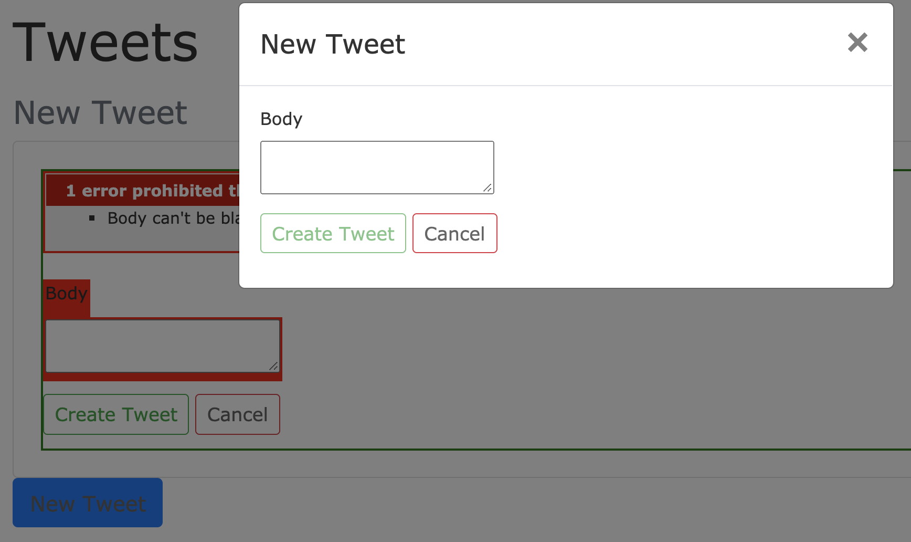

## Overview

Now that you have the basics of using Hotwire in Rails [Using Hotwire in Rails](/post_ruby_rails/rails_6_1_hotwire_simple_realtime/) - its interesting to try using it in other contexts, inparticular **modals** are very useful for inputs in Single Page Apps.  So in this Blog we will make the new input form a modal and leave the edit as an in-place form.

## Basic Setup

Start with the code at the end of: [Using Hotwire in Rails](/post_ruby_rails/rails_6_1_hotwire_simple_realtime/)


## Add jQuery to Bootstrap Setup

First we need to ensure we have JS and JQuery (installed with Bootstrap) - so we will simply add the following to the end of our &lt;body> in the `application.html.erb` file:
```ruby
# app/views/layouts/application.html.erb
<body>
  <p id="notice"><%= notice %></p>
  <%= yield %>
  <script src="https://code.jquery.com/jquery-3.5.1.slim.min.js" integrity="sha384-DfXdz2htPH0lsSSs5nCTpuj/zy4C+OGpamoFVy38MVBnE+IbbVYUew+OrCXaRkfj" crossorigin="anonymous"></script>
  <script src="https://cdn.jsdelivr.net/npm/bootstrap@4.5.3/dist/js/bootstrap.bundle.min.js" integrity="sha384-ho+j7jyWK8fNQe+A12Hb8AhRq26LrZ/JpcUGGOn+Y7RsweNrtN/tE3MoK7ZeZDyx" crossorigin="anonymous"></script>
</body>
```

## Add Modal to Index

So we will start by replacing the new-form with a button that toggles the modal.
```ruby
# app/views/tweets/index.html.erb
<h1>Tweets</h1>
<%= turbo_stream_from "tweets" %>

<h2 class="mt-3 h4 text-muted">New Tweet</h2>
<%= render "tweets/modal_new", tweet: @tweet %>

<h2 class="mt-3 h4 text-muted">Tweet Feed</h2>
<%= turbo_frame_tag "tweets" do %>
  <%= render @tweets %>
<% end %>
```

So now lets make a partial that has the modal toggle button and the associated html to enable the modal to function (this code is basically copied from the Bootstrap website):
```ruby
# app/views/tweets/_modal_new.html.erb
<%= link_to "#", class: 'btn btn-sm btn-outline-primary', data: { toggle: "modal", target: "#tweetModal" } do %>
New Tweet
<% end %>

<div class="modal fade" id="tweetModal" tabindex="-1" aria-labelledby="exampleModalLabel" aria-hidden="true">
  <div class="modal-dialog">
    <div class="modal-content">
      <%= render "tweets/modal_form", tweet: tweet %>
    </div>
  </div>
</div>
```

Notice we have a partial for the form still - this is because we have to point turbo at a dom_id within a partial (without doing this we can't get validation errors back into this form).  This is a mix of the Bootstrap example code placed within the rails form.
```ruby
#  app/views/tweets/_modal_form.html.erb
<%= form_with(model: tweet, id: dom_id(tweet)) do |form| %>

  <div class="modal-header">
    <h5 class="modal-title">New Tweet</h5>
    <button type="button" class="close" data-dismiss="modal" aria-label="Close">
      <span aria-hidden="true">&times;</span>
    </button>
  </div>

  <div class="modal-body">
    <% if tweet.errors.any? %>
    <div id="error_explanation">
      <h2><%= pluralize(tweet.errors.count, "error") %> prohibited this tweet from being saved:</h2>

      <ul>
        <% tweet.errors.each do |error| %>
        <li><%= error.full_message %></li>
        <% end %>
      </ul>
    </div>
    <% end %>

    <div class="field">
      <%= form.label :body %>
      <%= form.text_area :body %>
    </div>
  </div>

  <div class="modal-footer">
    <div class="actions">
      <%= form.submit class: "btn btn-sm btn-outline-success" %>
      <%= link_to "Cancel", tweet, class: "btn btn-sm btn-outline-danger" %>
    </div>
  </div>

<% end %>
```

### Test

1. Modal Opens
2. Modal Close Works
3. Modal Cancel Works
4. Create valid Tweet -- works and broadcasts
5. Create invalid Tweet -- Errors go to wrong form (must click cancel or reload)

In fact, if you put the regular form back into the index page you will see that the validation errors show up there.



## Fix validation errors

We fix this like this like a normal form - we change how the controller uses turbo_stream. So instead of pointing to the partial: "tweets/form" we need to point to "tweets/modal_form" (the new partial with the form).
```ruby
# app/controllers/tweets_controller.rb
  def create
    @tweet = Tweet.new(tweet_params)
    respond_to do |format|
      if @tweet.save
        format.html { redirect_to tweets_url, notice: "Tweet was successfully created." }
        format.json { render :show, status: :created, location: @tweet }
      else
        format.turbo_stream { # route turbo_stream validation errors
                      render turbo_stream: turbo_stream.replace(
                              @tweet, partial: "tweets/modal_form",
                              locals: { tweet: @tweet}) }
        format.html { render :new, status: :unprocessable_entity }
        format.json { render json: @tweet.errors, status: :unprocessable_entity }
      end
    end
  end
```

Now all our tests should work.

## Using turbo templates

Let's refactor - for future flexibility.  We'll create the template.  Since we are using the `create` method within the controller - we'll call the file: `create.turbo_stream.html.erb` - notice, unsurprisingly it looks what's in the controller.

```ruby
# app/views/tweets/create.turbo_stream.erb
<!--             action  dom_id           partial with the dom_id        actual data -->
<%= turbo_stream.replace @tweet, partial: "tweets/modal_form", locals: { tweet: @tweet } %>
```

Now we can make the controller look like:
```ruby
# app/controllers/tweets_controller.rb
  def create
    @tweet = Tweet.new(tweet_params)
    respond_to do |format|
      if @tweet.save
        format.html { redirect_to tweets_url, notice: "Tweet was successfully created." }
        format.json { render :show, status: :created, location: @tweet }
      else
        format.turbo_stream  # route turbo_stream validation errors
        format.html { render :new, status: :unprocessable_entity }
        format.json { render json: @tweet.errors, status: :unprocessable_entity }
      end
    end
  end
```

Using the template allows us the flexibilty to make multiple dynamic changes to the page on a create.  This is demonstrated in the post describing using Flash messages with Hotwire.

## Resources

The repo where you can find this code in the branch:
https://github.com/btihen/ruby_kafi_hotwire_tweets/commits/hotwire_modal_new_tweet

The important commit is:
https://github.com/btihen/ruby_kafi_hotwire_tweets/commit/0c37fb6071b31d13f4cf3ce2499326893724e131
