## Overview

[Hotwire](https://hotwire.dev/)  is planned to be integrated into Rails 7.x and is already included in the soon to be published book: [Modern Front-End Development for Rails: Hotwire, Stimulus, Turbo, and React ](https://pragprog.com/titles/nrclient/modern-front-end-development-for-rails/)

Hotwire allows us to build Single Page Apps using Ruby and Rails with nearly NO configuration! It allow very responsive web-applications as it reloads only the parts of the page that change via a socket.  Hotwire using [Turbo](https://turbo.hotwire.dev/) - an evolution of TurboLinks and as such is mobile friendly and in most cases can send the replacement HTML directly from the server to the client with minimal or no client side processing over websockets so there is minimal lag time.

In this article we convert a seemingly 'single-page' web app that reloads with every request see previous article [Tweets - A Single Page Rails App (using reloads)](/post_ruby_rails/rails_6_1_single_page_app_simulate_reloads/) and convert it into a proper 'single-page' app that only refreshes the aspects that change.  This makes web-pages with lots of data and complexity FAST and feel like native apps.  This is done with Hotwire (using web-sockets).

## Basic Setup

We will be starting with a basic Tweet Simulator it looks something like:


The starting code base can be found at: https://github.com/btihen/tweet_simulator_rails

The steps to re-create this code can be found at: [Tweets - A Single Page Rails App (using reloads)](/post_ruby_rails/rails_tweet_single_page_reloads/)

The actual Tweet Hotwire code from this article can be found at:

## Install and configure Hotwire

### Install Hotwire

To use hotwire - we need to install it:
```bash
bundle add hotwire-rails
bin/rails hotwire:install
```

The hotwire package is smart enough to install via webpack if that's installed or in the asset pipeline if no webpacker is installed.  This project uses webpack (but it shouldn't matter).

This also installs Stimulus Javascript and enables redis if not already installed.  Now you should see the following steps:
* Stimulus config in: `application.js` and setup.
* Turbo install and setup
* Removal of Turbolinks
* Enable Redis gem
* Configure Redis to work with ActionCable (Rails Websockets)

and the output should look something like:
```bash
Appending Stimulus setup code to
      append  app/javascript/packs/application.js
Creating controllers directory
      create  app/javascript/controllers
      create  app/javascript/controllers/hello_controller.js
      create  app/javascript/controllers/index.js
Installing all Stimulus dependencies
         run  yarn add stimulus from "."
...
✨  Done in 36.58s.

Install Turbo
         run  yarn add @hotwired/turbo-rails from "."
...
✨  Done in 7.40s.

      insert  app/javascript/packs/application.js
Remove Turbolinks
        gsub  Gemfile
         run  bin/bundle from "."
         run  bin/yarn remove turbolinks from "."
yarn remove v1.22.10
[1/2] 🗑  Removing module turbolinks...
...

        gsub  app/javascript/packs/application.js
        gsub  app/javascript/packs/application.js
Enable redis in bundle
        gsub  Gemfile
Switch development cable to use redis
        gsub  config/cable.yml

Turbo successfully installed ⚡️
```

NOTE: a prerequisite is that you already have Redis (server) installed in your development environment.

### Check Project config for Hotwire

1. References to turbolinks must be removed
2. Turbo is installed
3. Stimulus is installed

If you have problems you can experiment try adding one or more of the following:
```ruby
  <%= yield :head %>
  <%= turbo_include_tags %>
  <%= stimulus_include_tags %>
```
In particular, I found the top two helpful - but this is a new technology - and it is still evolving.  In the end the `app/views/layouts/application.html.erb` might need to look like:
```ruby
<!DOCTYPE html>
<html>

<head>
  <title>Tweets</title>
  <meta name="viewport" content="width=device-width,initial-scale=1">
  <%= csrf_meta_tags %>
  <%= csp_meta_tag %>

  <link rel="stylesheet" href="https://cdn.jsdelivr.net/npm/bootstrap@4.6.0/dist/css/bootstrap.min.css" integrity="sha384-B0vP5xmATw1+K9KRQjQERJvTumQW0nPEzvF6L/Z6nronJ3oUOFUFpCjEUQouq2+l" crossorigin="anonymous">
  <%= stylesheet_link_tag 'application', media: 'all' %>
  <%= javascript_pack_tag 'application' %>
  <%= yield :head %>
  <%= turbo_include_tags %>
  <%# stimulus_include_tags %>
</head>

<body>
  <%= yield %>
</body>

</html>
```

Check the app is still working and make a git snapshot.
```bash
git add .
git commit -m "install and configure hotwire-rails"
```

## Using Hotwire

Avoid the page reloads and only update our changes by sending new HTML

### Broadcast New Tweets to all Clients

To broadcast changes to a client we need to modify the model and add the broadcast command.   A Broadcast "tweets" sends changes to the turbo_stream (websocket channel) with the same name.
To add the new tweets to the top of the "tweets" page (frame) we need to use the `broadcast_prepend_to` instead of the `broadcast_append_to` (which puts new entries at the bottom)
```ruby
# app/models/tweet.rb
class Tweet < ApplicationRecord
  validates :body, presence: true

  # broadcast "tweets" send all changes to the turbo_stream view "tweets"
  # broadcast_prepend_to places new information at the top instead of appending to the bottom
  after_create_commit { broadcast_prepend_to "tweets" }
end
```

In order for this model broadcast to work we need to create a place to send it.  We do this in the view via a stream with the command `<%= turbo_stream_from "tweets" %>` we also need to tell this `stream` where to update -- we do this with the turbo tag of the same name: `<%= turbo_frame_tag "tweets" do %>`

So lets update our index page :
```ruby
# app/views/tweets/index.html.erb
<!-- connects to the backend broadcast (via a channel) -->
<%= turbo_stream_from "tweets" %>

<!-- frame that receives the taged data -->
<%= turbo_frame_tag "tweets" do %>
  <%= render @tweets %>
<% end %>
```

In order to see our new frames lets update our css to make them visible - lets add a border to our turbo-frames:
```css
# app/assets/stylesheets/tweets.scss
turbo-frame {
  display: block;
  border: 1px solid green
}
```

Let's check that our new broadcast feature run: `bin/rails s` and open two browser windows point at `http://localhost:3000`

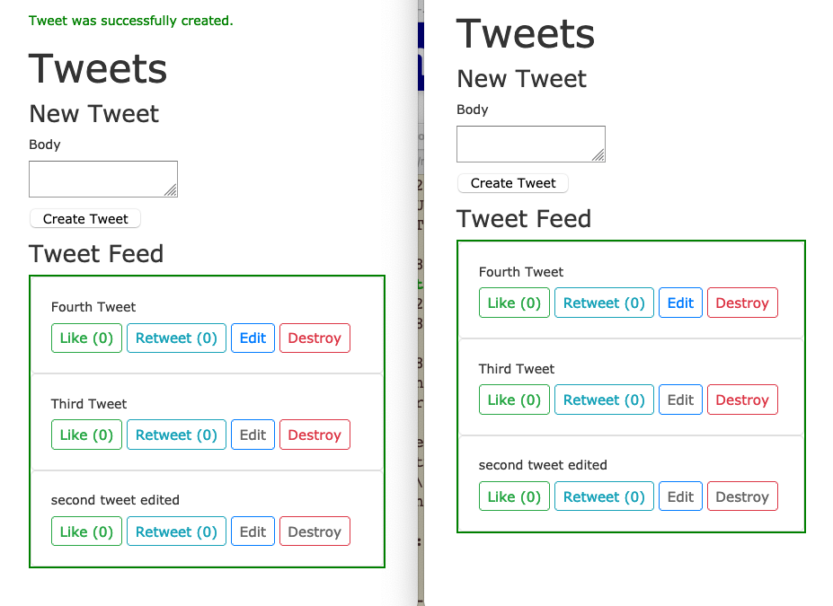

You can see in the left window we created a new tweet and it automatically appeared in the right window!  HOW COOL IS THAT!

Notice that the "blue" turbo-frame is around all the displayed tweets.

Lets also take a quick look at the logs - from this transaction:

```bash
Started POST "/tweets" for 127.0.0.1 at 2021-02-28 21:12:59 +0100
Processing by TweetsController#create as TURBO_STREAM
  Parameters: {"authenticity_token"=>"[FILTERED]", "tweet"=>{"body"=>"Fourth Tweet"}, "commit"=>"Create Tweet"}
  TRANSACTION (1.6ms)  BEGIN
  ↳ app/controllers/tweets_controller.rb:28:in `block in create'
  Tweet Create (60.1ms)  INSERT INTO "tweets" ("body", "created_at", "updated_at") VALUES ($1, $2, $3) RETURNING "id"  [["body", "Fourth Tweet"], ["created_at", "2021-02-28 20:12:59.221408"], ["updated_at", "2021-02-28 20:12:59.221408"]]
  ↳ app/controllers/tweets_controller.rb:28:in `block in create'
  TRANSACTION (2.4ms)  COMMIT
  ↳ app/controllers/tweets_controller.rb:28:in `block in create'
  Rendered tweets/_tweet.html.erb (Duration: 1.7ms | Allocations: 416)
[ActionCable] Broadcasting to tweets: "<turbo-stream action=\"prepend\" target=\"tweets\"><template><div class=\"card card-body\">\n  <div>Fourth Tweet</div>\n\n  <div class=\"mt-2\">\n    <a class=\"btn btn-sm btn-outline-success\" rel=\"nofollow\" data-method=\"post\" href=\"/tweets/7/like\">Like (0)</a>\n\n    <a class=\"btn btn-sm btn-outline-info\" rel=\"nofollow\" data-method=\"post\" href=\"/tweets/7/retweet\">Retweet (0)</a>\n\n    <a class=\"btn btn-sm btn-outline-primary\" href=\"/tweets/7/edit\">Edit</a>\n\n    <a data-confirm=\"Are you sure?\" class=\"btn btn-sm btn-outline-danger\" rel=\"nofollow\" data-method=\"delete\" href=\"/tweets/7\">Destroy</a>\n  </div>\n</div>\n</template></turbo-stream>"
Redirected to http://localhost:3000/tweets
Completed 302 Found in 105ms (ActiveRecord: 64.1ms | Allocations: 5636)

Turbo::StreamsChannel transmitting "<turbo-stream action=\"prepend\" target=\"tweets\"><template><div class=\"card card-body\">\n  <div>Fourth Tweet</div>\n\n  <div class=\"mt-2\">\n    <a class=\"btn btn-sm btn-outline-success\" rel=\"nofollow\" data-method=\"post\" href=\"/tweets/7/like\">Like (0)</a>\n\n    <a class=\"btn btn-s... (via streamed from tweets)
Turbo::StreamsChannel transmitting "<turbo-stream action=\"prepend\" target=\"tweets\"><template><div class=\"card card-body\">\n  <div>Fourth Tweet</div>\n\n  <div class=\"mt-2\">\n    <a class=\"btn btn-sm btn-outline-success\" rel=\"nofollow\" data-method=\"post\" href=\"/tweets/7/like\">Like (0)</a>\n\n    <a class=\"btn btn-s... (via streamed from tweets)
Started GET "/tweets" for 127.0.0.1 at 2021-02-28 21:12:59 +0100
Processing by TweetsController#index as TURBO_STREAM
  Rendering layout layouts/application.html.erb
  Rendering tweets/index.html.erb within layouts/application
  Rendered tweets/_form.html.erb (Duration: 2.6ms | Allocations: 501)
  Tweet Load (41.8ms)  SELECT "tweets".* FROM "tweets" ORDER BY "tweets"."created_at" DESC
  ↳ app/views/tweets/index.html.erb:15
  Rendered collection of tweets/_tweet.html.erb [3 times] (Duration: 1.3ms | Allocations: 429)
  Rendered tweets/index.html.erb within layouts/application (Duration: 50.7ms | Allocations: 2283)
[Webpacker] Everything's up-to-date. Nothing to do
  Rendered layout layouts/application.html.erb (Duration: 75.7ms | Allocations: 7207)
Completed 200 OK in 80ms (Views: 34.9ms | ActiveRecord: 41.8ms | Allocations: 7831)
```

There is a bunch of interesting information, but for now I just want to point out the only thing sent was the new html to display:
```bash
[ActionCable] Broadcasting to tweets: "<turbo-stream action=\"prepend\" target=\"tweets\"><template><div class=\"card card-body\">\n  <div>Fourth Tweet</div>\n\n  <div class=\"mt-2\">\n    <a class=\"btn btn-sm btn-outline-success\" rel=\"nofollow\" data-method=\"post\" href=\"/tweets/7/like\">Like (0)</a>\n\n    <a class=\"btn btn-sm btn-outline-info\" rel=\"nofollow\" data-method=\"post\" href=\"/tweets/7/retweet\">Retweet (0)</a>\n\n    <a class=\"btn btn-sm btn-outline-primary\" href=\"/tweets/7/edit\">Edit</a>\n\n    <a data-confirm=\"Are you sure?\" class=\"btn btn-sm btn-outline-danger\" rel=\"nofollow\" data-method=\"delete\" href=\"/tweets/7\">Destroy</a>\n  </div>\n</div>\n</template></turbo-stream>"
Redirected to http://localhost:3000/tweets
```

Using websockets to send html to the parts of the webpage that need to be updated is very efficient.

Since the broadcast is at the model level, we can even create a new tweet on the cli and all our web-clients will update:
```bash
bin/rails c
Tweet.create(body: "CLI tweet appears")
```

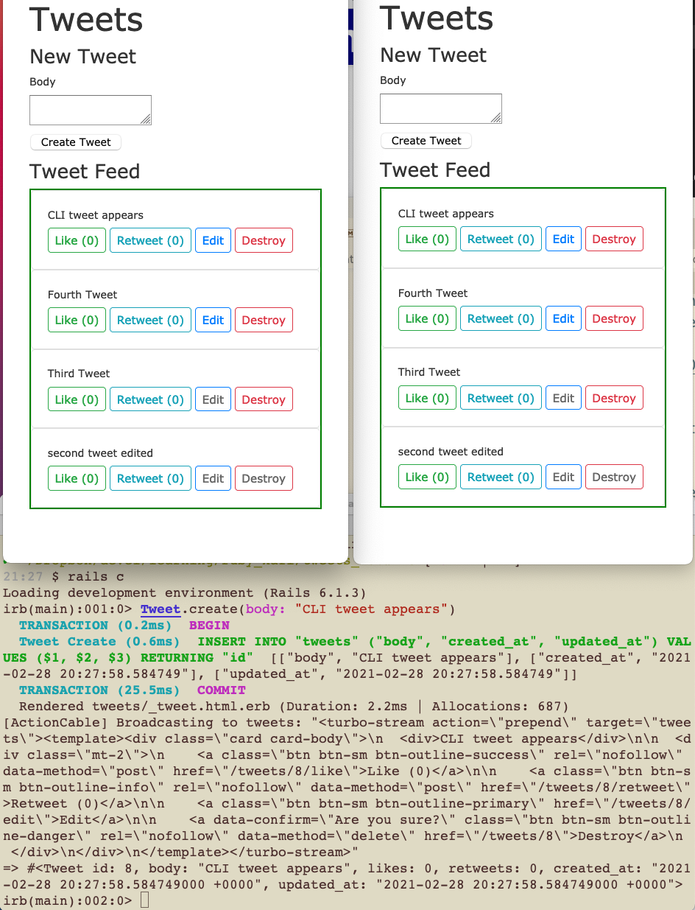

Lets make a snapshot:
```bash
git add .
git commit -m "new tweets are broadcast to all clients"
```

### Broadcast Deleted Tweets to all Clients

we need to add another broadcast to the model:
```ruby
# app/models/tweet.rb
class Tweet < ApplicationRecord
  validates :body, presence: true

  # broadcast "tweets" send all changes to the `turbo_stream` view "tweets"
  # `broadcast_prepend_to` places new information at the top instead of appending to the bottom
  after_create_commit { broadcast_prepend_to "tweets" }
  after_destroy_commit { broadcast_remove_to "tweets" }
end
```

But for this to work we will need to create frames around every tweet so we can find and delete the individual tweet to do this we will at a tag to our `_tweet` partial.
```ruby
# app/views/tweets/_tweet.html.erb
<!-- this tag with `tweet` instead of 'tweets' identifies an individual tweet -->
<%= turbo_frame_tag tweet do %>
<div class="card card-body">
  <div><%= tweet.body %></div>

  <div class="mt-2">
    <%= link_to "Like (#{tweet.likes})",
                tweet_like_path(tweet),
                method: :post,
                class: "btn btn-sm btn-outline-success" %>

    <%= link_to "Retweet (#{tweet.retweets})",
                tweet_retweet_path(tweet),
                method: :post,
                class: "btn btn-sm btn-outline-info" %>

    <%= link_to 'Edit', edit_tweet_path(tweet),
                class: "btn btn-sm btn-outline-primary" %>

    <%= link_to 'Destroy', tweet_path(tweet), method: :delete,
                data: { confirm: 'Are you sure?' },
                class: "btn btn-sm btn-outline-danger" %>
  </div>
</div>
<% end %>
```

Now when you should be able to delete a tweet in the middle of the tweets and not reload the entire page index page.  You will notice also that each tweet now has the turbo-frame border.

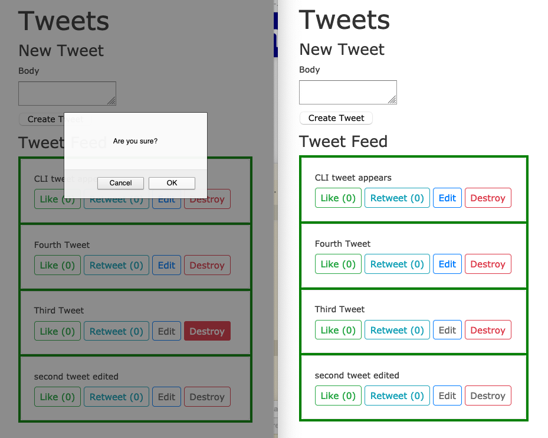

In the above image you can see we are deleting the 3rd tweet - in the middle of the tweets.  And of course it works in both our web-clients because of the new broadcast and tags we added.

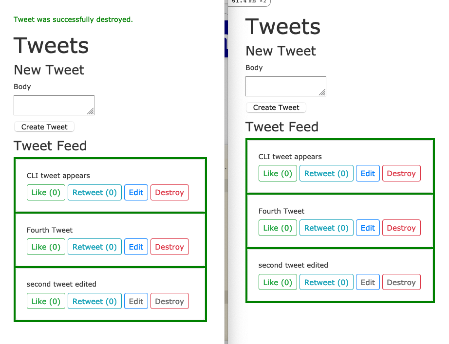

Looking at the logs we see that we only send the information that is changing to each client:
```bash
Turbo::StreamsChannel transmitting "<turbo-stream action=\"remove\" target=\"tweet_6\"></turbo-stream>" (via streamed from tweets)
Turbo::StreamsChannel transmitting "<turbo-stream action=\"remove\" target=\"tweet_6\"></turbo-stream>" (via streamed from tweets)
```

here is the full transaction:
```bash
Started DELETE "/tweets/6" for 127.0.0.1 at 2021-02-28 21:45:44 +0100
Processing by TweetsController#destroy as TURBO_STREAM
  Parameters: {"authenticity_token"=>"[FILTERED]", "id"=>"6"}
  Tweet Load (5.5ms)  SELECT "tweets".* FROM "tweets" WHERE "tweets"."id" = $1 LIMIT $2  [["id", 6], ["LIMIT", 1]]
  ↳ app/controllers/tweets_controller.rb:63:in `set_tweet'
  TRANSACTION (0.8ms)  BEGIN
  ↳ app/controllers/tweets_controller.rb:53:in `destroy'
  Tweet Destroy (27.4ms)  DELETE FROM "tweets" WHERE "tweets"."id" = $1  [["id", 6]]
  ↳ app/controllers/tweets_controller.rb:53:in `destroy'
  TRANSACTION (30.8ms)  COMMIT
  ↳ app/controllers/tweets_controller.rb:53:in `destroy'
[ActionCable] Broadcasting to tweets: "<turbo-stream action=\"remove\" target=\"tweet_6\"></turbo-stream>"
Redirected to http://localhost:3000/tweets
Completed 302 Found in 234ms (ActiveRecord: 66.0ms | Allocations: 6664)

Turbo::StreamsChannel transmitting "<turbo-stream action=\"remove\" target=\"tweet_6\"></turbo-stream>" (via streamed from tweets)
Turbo::StreamsChannel transmitting "<turbo-stream action=\"remove\" target=\"tweet_6\"></turbo-stream>" (via streamed from tweets)
Started GET "/tweets" for 127.0.0.1 at 2021-02-28 21:45:44 +0100
Processing by TweetsController#index as TURBO_STREAM
  Rendering layout layouts/application.html.erb
  Rendering tweets/index.html.erb within layouts/application
  Rendered tweets/_form.html.erb (Duration: 1.9ms | Allocations: 501)
  Tweet Load (1.6ms)  SELECT "tweets".* FROM "tweets" ORDER BY "tweets"."created_at" DESC
  ↳ app/views/tweets/index.html.erb:15
  Rendered collection of tweets/_tweet.html.erb [3 times] (Duration: 1.2ms | Allocations: 528)
  Rendered tweets/index.html.erb within layouts/application (Duration: 10.2ms | Allocations: 2380)
[Webpacker] Everything's up-to-date. Nothing to do
  Rendered layout layouts/application.html.erb (Duration: 27.4ms | Allocations: 7296)
Completed 200 OK in 31ms (Views: 26.6ms | ActiveRecord: 1.6ms | Allocations: 7918)
```

Let's take another snapshot:
```bash
git add .
git commit -m "broadcast deleted tweets via hotwire"
```


### Edit / Updates to all clients!

Turbo unlike Turbo-Links works with Forms as well as links.  This allows us to edit our posts.

#### Start with the Create Form

Lets start by testing the create form as is with validation errors - if we enter a blank message we should get an error.

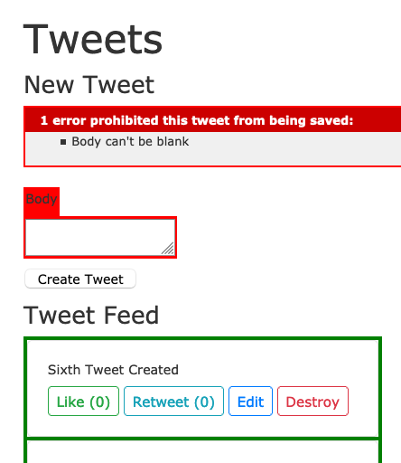

Now lets put this form in a turbo-frame - since we will need this in a form for edit - lets start with the easy case - new / create - where the form will always be in the same location. Ideally, the `turbo_stream_from` definition is before the first `turbo_frame_tag`.  Now your index view will look something like:
```ruby
# app/views/tweets/index.html.erb
<p id="notice"><%= notice %></p>

<!-- connects to the backend broadcast (via a channel) -->
<%= turbo_stream_from "tweets" %>

<h1>Tweets</h1>

<h4>New Tweet</h4>

<!-- the form needs to be in a frame - otherwise we can't edit in place -->
<%= turbo_frame_tag "tweet-form" do %>
  <%= render "tweets/form", tweet: @tweet %>
<% end %>

<h4>Tweet Feed</h4>

<!-- frame that receives the taged data -->
<%= turbo_frame_tag "tweets" do %>
  <%= render @tweets %>
<% end %>
```

Log file - from the log file we see we are still reloading the page see the line: `Tweet Load (83.9ms)  SELECT "tweets".* FROM "tweets" ORDER BY "tweets"."created_at"`:
```bash
Started POST "/tweets" for 127.0.0.1 at 2021-03-01 20:55:34 +0100
Processing by TweetsController#create as TURBO_STREAM
  Parameters: {"authenticity_token"=>"[FILTERED]", "tweet"=>{"body"=>""}, "commit"=>"Create Tweet"}
  Rendering layout layouts/application.html.erb
  Rendering tweets/index.html.erb within layouts/application
  Rendered tweets/_form.html.erb (Duration: 4.9ms | Allocations: 1362)
  Tweet Load (83.9ms)  SELECT "tweets".* FROM "tweets" ORDER BY "tweets"."created_at" DESC
  ↳ app/views/tweets/index.html.erb:23
  Rendered collection of tweets/_tweet.html.erb [4 times] (Duration: 2.0ms | Allocations: 700)
  Rendered tweets/index.html.erb within layouts/application (Duration: 94.0ms | Allocations: 3159)
[Webpacker] Everything's up-to-date. Nothing to do
  Rendered layout layouts/application.html.erb (Duration: 119.2ms | Allocations: 8006)
Completed 422 Unprocessable Entity in 125ms (Views: 35.9ms | ActiveRecord: 83.9ms | Allocations: 9244)
```

To fix this we will need the `form` to have a tag id - to do this we can update the form with `<%= form_with(model: tweet, id: dom_id(tweet)) do |form| %>` - also:
```ruby
<%= form_with(model: tweet, id: dom_id(tweet)) do |form| %>
<% if tweet.errors.any? %>
<div id="error_explanation">
  <h2><%= pluralize(tweet.errors.count, "error") %> prohibited this tweet from being saved:</h2>

  <ul>
    <% tweet.errors.each do |error| %>
    <li><%= error.full_message %></li>
    <% end %>
  </ul>
</div>
<% end %>

<div class="field">
  <%= form.label :body %>
  <%= form.text_area :body %>
</div>

<div class="actions">
  <%= form.submit %>
</div>
<% end %>
```
But even still we need to the controller how to use the turbo_stream.  There are several ways (with and without a template).  We will start without a tempate (actually the template info is inline) using: `format.turbo_stream { render turbo_stream: turbo_stream.replace(@tweet, partial: "tweets/form", locals: { tweet: @tweet}) }`.  Not the create controller should look like:
```ruby
# app/controllers/tweets_controller.rb
  def create
    @tweet = Tweet.new(tweet_params)

    respond_to do |format|
      if @tweet.save
        format.html { redirect_to tweets_url, notice: "Tweet was successfully created." }
        format.json { render :show, status: :created, location: @tweet }
      else
        format.turbo_stream { render turbo_stream: turbo_stream.replace(@tweet, partial: "tweets/form", locals: { tweet: @tweet}) }
        @tweets = Tweet.all.order(created_at: :desc)
        format.html { render :index, status: :unprocessable_entity }
        format.json { render json: @tweet.errors, status: :unprocessable_entity }
      end
    end
  end
```

Now when we create an invalid message we should see (notice the turbo-frame outline):
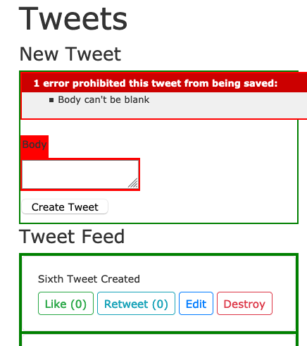


When we look at the logs we can confirm we are using the TURBO_STREAM for both directions and NOT reloading the page (no `LOAD` in the log):
```bash
Started POST "/tweets" for 127.0.0.1 at 2021-03-01 21:22:13 +0100
Processing by TweetsController#create as TURBO_STREAM
  Parameters: {"authenticity_token"=>"[FILTERED]", "tweet"=>{"body"=>""}, "commit"=>"Create Tweet"}
  Rendered tweets/_form.html.erb (Duration: 3.0ms | Allocations: 1373)
Completed 200 OK in 7ms (Views: 0.3ms | ActiveRecord: 0.0ms | Allocations: 2641)
```

Now that validation errors work again - lets be sure that we can still create a new tweet.

Assuming all works - lets take a quick snapshot:
```bash
git add .
git commit -m "new tweet form is hooked into turbo-stream and validations still work"
```

?????
Turbo - is clever enough to figure out the routing in the default case and will use its own stream to update the page - however you could also define an explicit stream - something like: `format.turbo_stream { render turbo_stream: turbo_stream.prepend(@tweet, locals: { tweet: @tweet}) }` or with `format.turbo_stream` and a turbo view `app/views/tweets/create.turbo_stream` - containing: `<%=  %>`
????


#### In-Place Edit

In oder to do an in-place edit we will need yet another type of broadcast `
  after_update_commit { broadcast_replace_to "tweets" }`
so our new model will now look like:
```ruby
# app/models/tweet.rb
class Tweet < ApplicationRecord
  validates :body, presence: true

  # broadcast "tweets" send all changes to the `turbo_stream` view "tweets"
  # `broadcast_prepend_to` places new information at the top instead of appending to the bottom
  after_create_commit { broadcast_prepend_to "tweets" }
  after_destroy_commit { broadcast_remove_to "tweets" }
  after_update_commit { broadcast_replace_to "tweets" }
end
```

Now would hope it would all work, but when we click on Edit, the item disappears (and re-appears on reload).
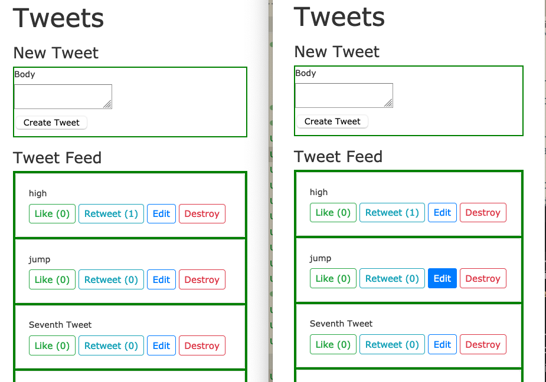

Lets look at the logs:
```bash
Started GET "/tweets/11/edit" for 127.0.0.1 at 2021-03-03 20:10:53 +0100
Processing by TweetsController#edit as HTML
  Parameters: {"id"=>"11"}
  Tweet Load (0.7ms)  SELECT "tweets".* FROM "tweets" WHERE "tweets"."id" = $1 LIMIT $2  [["id", 11], ["LIMIT", 1]]
  ↳ app/controllers/tweets_controller.rb:68:in `set_tweet'
  Rendering tweets/edit.html.erb
  Rendered tweets/_form.html.erb (Duration: 2.3ms | Allocations: 676)
  Rendered tweets/edit.html.erb (Duration: 3.8ms | Allocations: 980)
Completed 200 OK in 8ms (Views: 4.5ms | ActiveRecord: 0.7ms | Allocations: 2104)
```
We see that it loads the tweet and sends it to the edit.html.erb page (which loads the form partial), but we don't see anything but the index page (minus the tweet we wanted to edit).  Unfortunately, Hotwire, doesn't provide an error, it just doesn't find a location to render the edit on our index (since the edit link is within a stream tag) and just replaces our dom_id with nothing.  Here is where Hotwire could provide much better feedback.

In any case, the fix is straightforward, we need to tell Rails what in the edit page goes into the index page so we can do that with another frame_tag: `<%= turbo_frame_tag dom_id(@tweet) do %>` Now the edit.html.erb page should look like:
```ruby
# app/views/tweets/edit.html.erb
<h1>Editing Tweet</h1>

<%= turbo_frame_tag dom_id(@tweet) do %>
  <%= render 'form', tweet: @tweet %>
<% end %>

<%= link_to 'Show', @tweet %> |
<%= link_to 'Back', tweets_path %>
```
NOTE: We don't need to fix the form partial since we did that in the previous `new` step with by adding a dom_id tag to the form with: `<%= form_with(model: tweet, id: dom_id(tweet)) do |form| %>`.

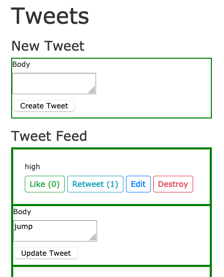

We might notice that the edit page lacks formatting (the form is squished up against the left of our frame).  This is because our tweet partial has a card div but that is lacking when replace the dom_id with the form -- we can easily fix this by adding the CSS to our edit page:
```ruby
# app/views/tweets/edit.html.erb
<h1>Editing Tweet</h1>

<%= turbo_frame_tag dom_id(@tweet) do %>
<div class="card card-body">
  <%= render 'form', tweet: @tweet %>
</div>
<% end %>

<%= link_to 'Show', @tweet %> |
<%= link_to 'Back', tweets_path %>
```

Now when we reload and try to edit -- we see what we expect:
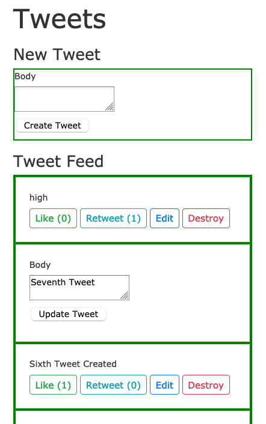

Now when we actually do an edit we see it all works as expected.  From the logs we see
it loads the tweet from the db, then the the edit page which loads the frame (this time it actually places it into the dom_id we provided, but unfortunately, we can't see that from the logs)!  And we can see that when we submit the edit -- the tweet model sends out the html patch send to both windows we have open.
```bash
Started GET "/tweets/11/edit" for 127.0.0.1 at 2021-03-03 20:34:56 +0100
Processing by TweetsController#edit as HTML
  Parameters: {"id"=>"11"}
  Tweet Load (1.0ms)  SELECT "tweets".* FROM "tweets" WHERE "tweets"."id" = $1 LIMIT $2  [["id", 11], ["LIMIT", 1]]
  ↳ app/controllers/tweets_controller.rb:68:in `set_tweet'
  Rendering tweets/edit.html.erb
  Rendered tweets/_form.html.erb (Duration: 2.5ms | Allocations: 649)
  Rendered tweets/edit.html.erb (Duration: 3.8ms | Allocations: 985)
Completed 200 OK in 9ms (Views: 5.3ms | ActiveRecord: 1.0ms | Allocations: 2110)

Started PATCH "/tweets/11" for 127.0.0.1 at 2021-03-03 20:35:11 +0100
Processing by TweetsController#update as TURBO_STREAM
  Parameters: {"authenticity_token"=>"[FILTERED]", "tweet"=>{"body"=>"jump! how high?"}, "commit"=>"Update Tweet", "id"=>"11"}
  Tweet Load (1.1ms)  SELECT "tweets".* FROM "tweets" WHERE "tweets"."id" = $1 LIMIT $2  [["id", 11], ["LIMIT", 1]]
  ↳ app/controllers/tweets_controller.rb:68:in `set_tweet'
  TRANSACTION (1.0ms)  BEGIN
  ↳ app/controllers/tweets_controller.rb:45:in `block in update'
  Tweet Update (58.8ms)  UPDATE "tweets" SET "body" = $1, "updated_at" = $2 WHERE "tweets"."id" = $3  [["body", "jump! how high?"], ["updated_at", "2021-03-03 19:35:11.765970"], ["id", 11]]
  ↳ app/controllers/tweets_controller.rb:45:in `block in update'
  TRANSACTION (2.3ms)  COMMIT
  ↳ app/controllers/tweets_controller.rb:45:in `block in update'
  Rendered tweets/_tweet.html.erb (Duration: 2.0ms | Allocations: 499)
[ActionCable] Broadcasting to tweets: "<turbo-stream action=\"replace\" target=\"tweet_11\"><template><!-- this tag with `tweet` instead of 'tweets' identifies an individual tweet -->\n<turbo-frame id=\"tweet_11\">\n\n<div class=\"card card-body\">\n  <div>jump! how high?</div>\n\n  <div class=\"mt-2\">\n    <a class=\"btn btn-sm btn-outline-success\" rel=\"nofollow\" data-method=\"post\" href=\"/tweets/11/like\">Like (0)</a>\n\n    <a class=\"btn btn-sm btn-outline-info\" rel=\"nofollow\" data-method=\"post\" href=\"/tweets/11/retweet\">Retweet (0)</a>\n\n    <a class=\"btn btn-sm btn-outline-primary\" href=\"/tweets/11/edit\">Edit</a>\n\n    <a data-confirm=\"Are you sure?\" class=\"btn btn-sm btn-outline-danger\" rel=\"nofollow\" data-method=\"delete\" href=\"/tweets/11\">Destroy</a>\n  </div>\n</div>\n\n</turbo-frame></template></turbo-stream>"
Redirected to http://localhost:3000/tweets
Completed 302 Found in 116ms (ActiveRecord: 63.1ms | Allocations: 6308)

Turbo::StreamsChannel transmitting "<turbo-stream action=\"replace\" target=\"tweet_11\"><template><!-- this tag with `tweet` instead of 'tweets' identifies an individual tweet -->\n<turbo-frame id=\"tweet_11\">\n\n<div class=\"card card-body\">\n  <div>jump! how high?</div>\n\n  <div class=\"mt-2\">\n    <a class=\"btn btn-sm btn... (via streamed from tweets)
Turbo::StreamsChannel transmitting "<turbo-stream action=\"replace\" target=\"tweet_11\"><template><!-- this tag with `tweet` instead of 'tweets' identifies an individual tweet -->\n<turbo-frame id=\"tweet_11\">\n\n<div class=\"card card-body\">\n  <div>jump! how high?</div>\n\n  <div class=\"mt-2\">\n    <a class=\"btn btn-sm btn... (via streamed from tweets)
```

Lets add a `cancel` button to the form so we don't need to reload the page to stop editing - we can do that with a show link `<%= link_to "Cancel", @tweet, class: "btn btn-sm btn-outline-danger" %>` - so our form would now look like:
```ruby
# app/views/tweets/_form.html.erb
<%= form_with(model: tweet, id: dom_id(tweet)) do |form| %>
<% if tweet.errors.any? %>
<div id="error_explanation">
  <h2><%= pluralize(tweet.errors.count, "error") %> prohibited this tweet from being saved:</h2>

  <ul>
    <% tweet.errors.each do |error| %>
    <li><%= error.full_message %></li>
    <% end %>
  </ul>
</div>
<% end %>

<div class="field">
  <%= form.label :body %>
  <%= form.text_area :body %>
</div>

<div class="action">
  <%= form.submit class: "btn btn-sm btn-outline-success" %>
  <%= link_to "Cancel", @tweet, class: "btn btn-sm btn-outline-danger" %>
</div>
<% end %>
```

Unfortunately, now when we hit `cancel` - the tweet disappears -- because @tweet points to the show page and our current show page has no turbo_frame with a `dom_id`. We can fix this by putting our show page (formatted like the tweet partial wrapped in a frame tag with a dom_id) - like:
```ruby
# app/views/tweets/show.html.erb
<%= turbo_frame_tag dom_id(@tweet) do %>

<div class="card card-body">
  <div><%= @tweet.body %></div>

  <div class="mt-2">
    <%= link_to "Like (#{@tweet.likes})",
                tweet_like_path(@tweet),
                method: :post,
                class: "btn btn-sm btn-outline-success" %>

    <%= link_to "Retweet (#{@tweet.retweets})",
                tweet_retweet_path(@tweet),
                method: :post,
                class: "btn btn-sm btn-outline-info" %>

    <%= link_to 'Edit', edit_tweet_path(@tweet),
                class: "btn btn-sm btn-outline-primary" %>

    <%= link_to 'Destroy', tweet_path(@tweet), method: :delete,
                data: { confirm: 'Are you sure?' },
                class: "btn btn-sm btn-outline-danger" %>
  </div>
</div>

<% end %>
```
However, this is a bit silly since this is basically the same as our partial and we have two places to change if we want to adjust our tweet layout -- so we can fix this by using the tweet partial:
```ruby
# app/views/tweets/show.html.erb
<%= turbo_frame_tag dom_id(@tweet) do %>
  <%= render @tweet %>
<% end %>
```
This works, but renders a tag inside a turbo_frame with the tweet dom_id inside the same turbo_frame with the same dom_id (I only noticed this since I have the css marking all turbo_frames):
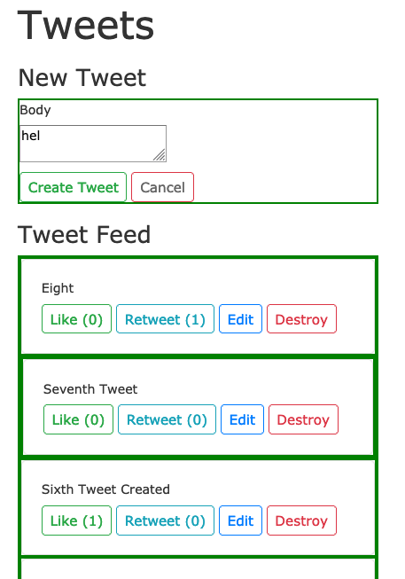

This is because the tweet partial also has a dom_id - and show will process whatever it finds -- but only sends whatever is marked by the dom_id.

This was a little tricky to notice at first without the HTML inspector -- since in show I used the explicit dom_id: `<%= turbo_frame_tag @tweet do %>` and in the tweet partial I used the implicit dom_id tag: `<%= turbo_frame_tag tweet do %>`.  Unfortunately, for now Rails Turbo provides does not yet provide warnings when you render the same dom_id twice.

In any case, now it may be clear that the the proper solution is that show should now read like:
```ruby
# app/views/tweets/show.html.erb
<%= render @tweet %>
```

Now when you inspect the HTML you will only see one dom_id for each tweet and since turbo only replaces items with the correct tags and ids - it renders the tweet partial now.  This is all a bit tricky to debug, hopefully, with time more errors or logging will be added - but for now, I suggest adding `<!-- -->` HTML comments with the name of the file inside each turbo tag to ease debugging -- at least until everything works as wished.

Now let's be sure the validation still works for edit too. Try to submit an empty edit - we should see:
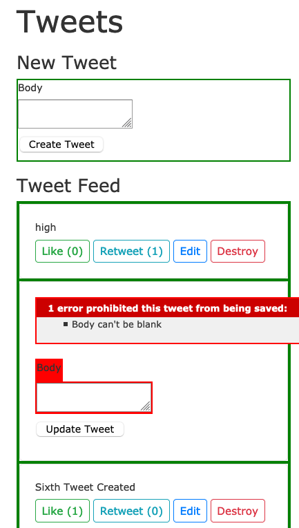
because the form now has a dom_id and the validation errors are sent there.

If some other route is happening another way to fix this would be to add `format.turbo_stream { render turbo_stream: turbo_stream.replace(@tweet, partial: "tweets/form", locals: { tweet: @tweet}) }` to the controller update method:
```ruby
# app/controllers/tweets_controller.rb
def update
    respond_to do |format|
      if @tweet.update(tweet_params)
        format.html { redirect_to tweets_url, notice: "Tweet was successfully updated." }
        format.json { render :show, status: :ok, location: @tweet }
      else
        format.turbo_stream { render turbo_stream: turbo_stream.replace(@tweet, partial: "tweets/form", locals: { tweet: @tweet}) }
        format.html { render :edit, status: :unprocessable_entity }
        format.json { render json: @tweet.errors, status: :unprocessable_entity }
      end
    end
  end
```

OK - ideally all functionality in the edit form is now working well!

Time for another snapshot:
```bash
git add .
git commit -m "turbo frame now allows in-place edit and cancel edit without reloading"
```

### Likes and Retweet

I was able to get these special routes / actions to update just the calling browser, but unable to get these to broadcast to all open connections.

## Resources

I am particularly fond of the GoRails videos.

* https://hotwire.dev/
* https://turbo.hotwire.dev/
* https://github.com/hotwired/hotwire-rails
* https://www.youtube.com/watch?v=NtTfYfWAzw0
* https://www.youtube.com/watch?v=77GvSdc2Pf8
* https://www.youtube.com/watch?v=NtTfYfWAzw0
* https://www.youtube.com/watch?v=MRv4XGu6QkY
* https://gorails.com/episodes/hotwire-rails?autoplay=1
* https://robrace.dev/build-a-twitter-clone-with-rails-hotwire/
* https://blog.cloud66.com/taking-rails-to-the-next-level-with-hotwire/
* https://betterprogramming.pub/hotwire-actiontext-and-rails-6-be025dce7d87
