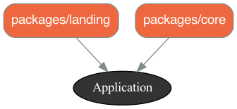

## Organizing Code

Gems and Engines have long been used to organize Ruby and Rails code into workable small units.

Shopify has introduced a new system called 'packages' - they use the packwerk gem to help us.  In fact, it is designed to make it easy to take large (and likely highly coupled) large codebase and move toward 'packages' self-contained (or have explicit dependencies).  Ideally the code is in small enough units to help us keep the context in mind as we work on it.

I found it initially difficult to understand packwerk in the context of a complex codebase.  So instead I built a new 'play' app and then moved each piece into a package.  Hopefully, this will inspire you to use Gem, Engines or Packages to clarify dependencies and make the code a logical until that is easy to reason about.

## Ruby and Rails Environment

Using Rails 7 & Ruby 3.1.2 - I found that it is important to update my ruby environment - so before we start this is what I didn't remove errors:

```bash
# I've had the error several times without updating:
# /Users/btihen/.rbenv/versions/3.1.0/lib/ruby/gems/3.1.0/gems/bundler-2.3.8/lib/bundler/rubygems_ext.rb:18:in `source': uninitialized constant Gem::Source (NameError)
#
#       (defined?(@source) && @source) || Gem::Source::Installed.new
#                                            ^^^^^^^^
# Did you mean?  Gem::SourceList
# this seems to fix it:
# https://bundler.io/guides/bundler_2_upgrade.html
# https://stackoverflow.com/questions/4859600/bundler-throws-uninitialized-constant-gemsilentui-nameerror-error-after-upgr
rbenv local 3.1.2
gem update --system
gem install bundler
gem install rails
rbenv rehash
```

## Rails Project - Simple Blog

Since my other projects are using `esbuild` I use that here too

```ruby
rails new rails_pack -T --database=postgresql --css=bootstrap --javascript=esbuild
cd rails_pack
bin/rails db:create

# add the packwerk (packages) gem
bundle add packwerk
bundle binstub packwerk
# initialize packwerk
bin/packwerk init

# to visualize your package design
bundle add graphwerk
gem 'graphwerk', group: %i[development test]
bundle install
bundle exec rake graphwerk:update
# (or pocky https://github.com/mquan/pocky)
```

NOTE: to turn a folder into a package - add the file: `package.yml` in the package folder - this will be described in more detail as we go.

## Configure Packages

in `config/application.rb` add:
```ruby
config.paths.add 'app/packages', glob: '*/{*,*/concerns}', eager_load: true
```

So now it might look like:
```ruby
# config/application.rb
require_relative "boot"

require "rails"
# Pick the frameworks you want:
require "active_model/railtie"
require "active_job/railtie"
require "active_record/railtie"
require "active_storage/engine"
require "action_controller/railtie"
require "action_mailer/railtie"
require "action_mailbox/engine"
require "action_text/engine"
require "action_view/railtie"
require "action_cable/engine"
# require "rails/test_unit/railtie"

# Require the gems listed in Gemfile, including any gems
# you've limited to :test, :development, or :production.
Bundler.require(*Rails.groups)

module RailsPack
  class Application < Rails::Application
    # Initialize configuration defaults for originally generated Rails version.
    config.load_defaults 7.0

    # Don't generate system test files.
    config.generators.system_tests = nil

    # config packages fur packwerk
    config.paths.add 'app/packages', glob: '*/{*,*/concerns}', eager_load: true
  end
end
```

Also change `app/controllers/application_controller.rb` to:
```ruby
# app/controllers/application_controller.rb
class ApplicationController < ActionController::Base
  append_view_path(Dir.glob(Rails.root.join('app/packages/*/views')))
end
```

Finally, lets create the location for the packages:
```bash
mkdir app/packages
```

## Create a Landing Page

We can generate the code using:
```bash
bin/rails g controller landing index
```

You will see it creates the files;
```bash
create  app/controllers/landing_controller.rb
 route  get 'landing/index'
invoke  erb
create    app/views/landing
create    app/views/landing/index.html.erb
invoke  helper
create    app/helpers/landing_helper.rb
```

So we see it has created a controller, a view and a helper - we will copy this structure into a new package `landing` using:
```bash
mkdir -p app/packages/landing
mkdir -p app/packages/landing/public
mkdir -p app/packages/landing/controllers
mkdir -p app/packages/landing/views
mkdir -p app/packages/landing/helpers

# copy the generated files
mv app/controllers/landing_controller.rb app/packages/controllers/.
mv app/views/landings app/packages/views/landings
mv app/helpers/landing_helper.rb app/packages/helpers/.
```

copy our package.yml to configure the package
```yml
cat <<EOF>> app/packages/landing/package.yml
# Turn on dependency checks for this package
enforce_dependencies: true

# Turn on privacy checks for this package
enforce_privacy: true

# this allows you to modify what your package's public path is within the package
public_path: public/

# A list of this package's dependencies
# Note that packages in this list require their own `package.yml` file
dependencies:
- '.'
EOF
```

Now finally, the update the routing:
```ruby
Rails.application.routes.draw do
  get 'landing/index'
  root "landing#index"
end
```

lets try the packwerk check to see if we have clearly defined our package:
```
bin/packwerk check
```

Lets generate a diagram of our app:
```bash
bin/rails graphwerk:update
```

Now you can open `packwerk.png` and see the code structure and dependencies.

The `application` is the rails core.


finally, lets be sure all is working:
```
bin/rails s
```

**we should be able to get to `localhost:3000/` and see our landing page**

**NOTE:** IF YOU GET ERRORS REGARDING CONTROLLER OBJECT NOT FOUND RESTART RAILS!

## Core Data / Admin Controlled

most apps need some core data like users, etc. So lets generate this too:

```bash
bin/rails g scaffold user full_name email
```

now that we have generated the files and see the list lets create the package:
```bash
# create the package
mkdir -p app/packages/core
# recreate the structure of created files within the package
mkdir -p app/packages/core/public
mkdir -p app/packages/core/controllers
mkdir -p app/packages/core/helpers
mkdir -p app/packages/core/models
mkdir -p app/packages/core/views

# move the generated files into the package
mv app/controllers/users_controller.rb app/packages/core/controllers/.
mv app/helpers/users_helper.rb app/packages/core/helpers/.
mv app/models/user.rb app/packages/core/models/.
mv app/views/users/views/users app/packages/core/views/.
```

the package config
```yml
cat <<EOF> app/packages/core/package.yml
# Turn on dependency checks for this package
enforce_dependencies: true

# Turn on privacy checks for this package
enforce_privacy: true

# this allows you to modify what your package's public path is within the package
public_path: public/

# A list of this package's dependencies
# Note that packages in this list require their own `package.yml` file
dependencies:
- '.'
EOF
```

update the routes (even though the package is called core - lets make the path called `admin` since that is who will be managing the settings within this package)
```ruby
Rails.application.routes.draw do
  scope :admin do
    resources :users
  end
  get 'landing/index'
  get 'landing', to: 'landing#index'
  root 'landing#index' # Defines the root path route ("/")
end
```

Now that we have created a new model we need to migrate:
```bash
bin/rails db:migrate
```
Perhaps it would be good to keep migrations with packages, like we do with engines.  But for now we will let it be.


lets try the packwerk check to see if we have clearly defined our package:
```
bin/packwerk check
```
If you have used the default `package.yml` then all should be good.


Lets update our diagram of our app:
```bash
bin/rails graphwerk:update
```
you should now see both the landing and core module



Lets be sure all is working & we can create a user or two at `localhost:3000/admin/users`

**NOTE:** IF YOU GET ERRORS REGARDING CONTROLLER OBJECT NOT FOUND RESTART RAILS!

## Adding the Blogs

Now we need to app to allow some activity.  Let's create a blog site.  We will create a `post` & later a `comment` model.  Again we will use a generator and then put everything in its place.

```bash
bin/rails g scaffold post content user:references
```

Now that we have generated standard code lets create the package:
```bash
mkdir -p app/packages/blogs
midir -p app/packages/blogs/public
midir -p app/packages/blogs/controllers
midir -p app/packages/blogs/helpers
midir -p app/packages/blogs/models
midir -p app/packages/blogs/views

# and move the files into the package
mv app/controllers/posts_controller.rb app/packages/blogs/controllers/.
mv app/helpers/posts_helpers.rb app/packages/blogs/helpers/.
mv app/models/post.rb app/packages/blogs/models/.
mv app/models/views/posts app/packages/blogs/views/.
```

and now we need the `package.yml` file to activate the **blogs**s package:
```yml
cat <<EOF> app/packages/blogs/package.yml
# Turn on dependency checks for this package
enforce_dependencies: true

# Turn on privacy checks for this package
enforce_privacy: true

# this allows you to modify what your package's public path is within the package
public_path: public/

# A list of this package's dependencies
# Note that packages in this list require their own `package.yml` file
dependencies:
- '.'
EOF
```

update the routes (even though the package is called core - lets make the path called `admin` since that is who will be managing the settings within this package)
```ruby
Rails.application.routes.draw do
  scope 'blogs' do
    resources :posts
  end
  scope 'admin' do
    resources :users
  end
  get 'landing/index'
  get 'landing', to: 'landing#index'
  root 'landing#index' # Defines the root path route ("/")
end

```

Now that we have created a new model we need to migrate:
```bash
bin/rails db:migrate
```

Since I don't want to get fancy with a current_user in the root controller - we can add the following to our new controller in `create`:
```ruby
  # POST /posts or /posts.json
  def create
    current_user = User.first
    @post = Post.new(post_params.merge(user: current_user))

    respond_to do |format|
      if @post.save
        format.html { redirect_to post_url(@post), notice: 'Post was successfully created.' }
        format.json { render :show, status: :created, location: @post }
      else
        format.html { render :new, status: :unprocessable_entity }
        format.json { render json: @post.errors, status: :unprocessable_entity }
      end
    end
  end
```

lets try the packwerk check to see if we have clearly defined our package:
```
bin/packwerk check
```
Hmmm - now we are getting some problems!
1) We are access the User from Core, but we haven't explicitly allow that.
2) We depend on Core in Blogs, but we haven't explicity stated that we want that.

Let's fix the declared dependencies:
```yml
# app/packages/blogs/package.yml
# Turn on dependency checks for this package
enforce_dependencies: true

# Turn on privacy checks for this package
enforce_privacy: true

# this allows you to modify what your package's public path is within the package
public_path: public/

# A list of this package's dependencies
# Note that packages in this list require their own `package.yml` file
dependencies:
- '.'
- 'app/packages/core'
```

This should fix the declared package dependencies, now lets fix the access problem between the dependencies.  The easiest fix is to put whatever we need accessible by other packages in the package's `public` folder:

```bash
mkdir app/packages/core/public/models
mv app/packages/core/models/user.rb app/packages/core/public/models/.
```

now `bin/packwerk check` should be clean

**Note:** in a real-world complex application there may be too many dependencies to fix all at once.  In this case you can run:
```bash
bin/packwerk update-deprecations
```
Now packwerk will ignore the problems and allow you to fix them over-time - this list can be seen in the file: `app/packages/blogs/deprecated_references.yml` it will look something like:
```yml
# This file contains a list of dependencies that are not part of the long term plan for app/packages/blogs.
# We should generally work to reduce this list, but not at the expense of actually getting work done.
#
# You can regenerate this file using the following command:
# bin/packwerk update-deprecations app/packages/blogs
---
app/packages/core:
  "::User":
    violations:
    - privacy
    files:
    - app/packages/blogs/controllers/posts_controller.rb
    - app/packages/blogs/models/post.rb
```

Lets update our diagram of our app:
```bash
bin/rails graphwerk:update
```
you should now see both the landing and core module


You may notice that everything is dependent on `application` rails.  This is expected for a rails-app.

Lets be sure all is working & we can create a user or two at `localhost:3000/blogs/posts`

**NOTE:** IF YOU GET ERRORS REGARDING CONTROLLER OBJECT NOT FOUND RESTART RAILS!

## Going further!

To gain more ideas I recommend the book: [Package-Based Rails Applications](https://leanpub.com/package-based-rails-applications), by Stephan Hagemann (also wrote the book on using engines for modular Rails applications).

In particular, in the book he discusses ways to reduce even the rails dependencies, integrate events, etc for further loose coupling.

## Resources

* site - https://github.com/Shopify/packwerk/
* video - https://www.youtube.com/watch?v=olEA157z7kU
* book - https://leanpub.com/package-based-rails-applications
* docs - https://github.com/Shopify/packwerk/blob/main/USAGE.md
* help - https://github.com/Shopify/packwerk/blob/main/TROUBLESHOOT.md

## Articles

* https://www.shopify.com/partners/blog/monolith-software
* https://shopify.engineering/enforcing-modularity-rails-apps-packwerk
* https://thecodest.co/blog/ruby-on-rails-modularization-with-packwerk-episode-i/
* https://www.globalapptesting.com/engineering/implementing-packwerk-to-delimit-bounded-contexts
