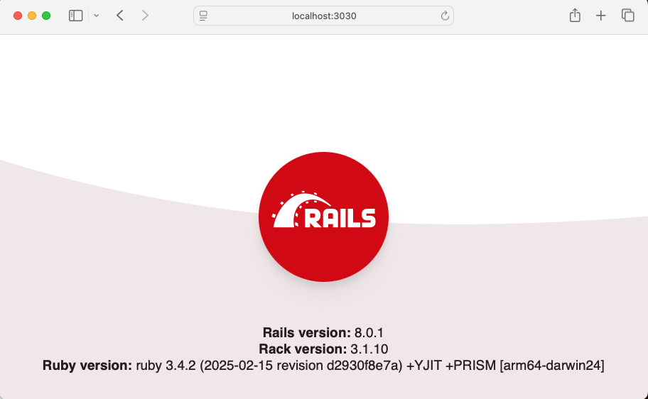
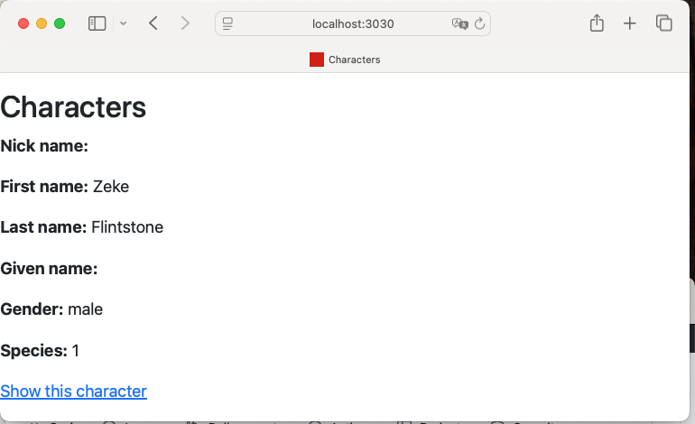
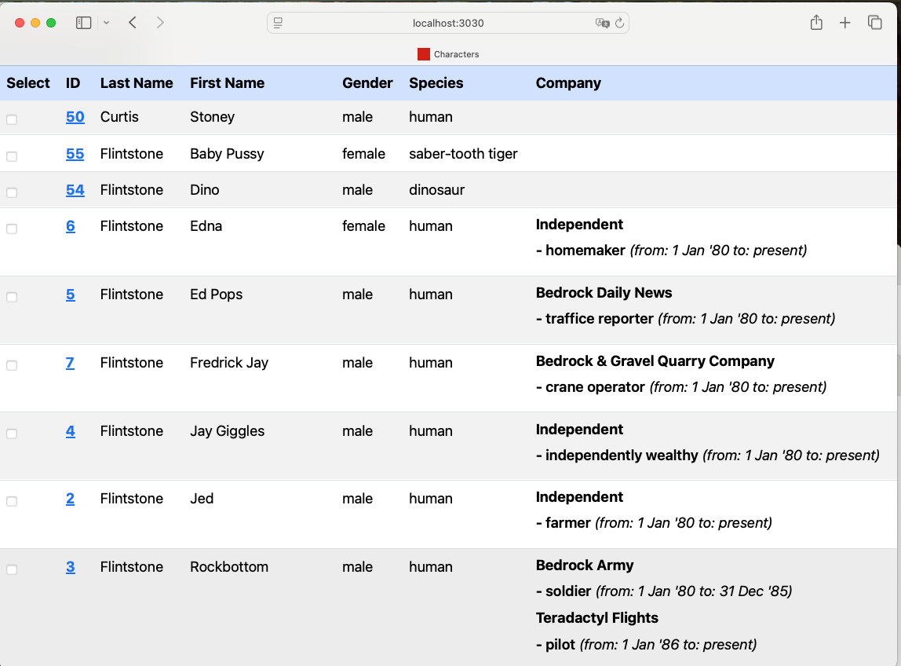
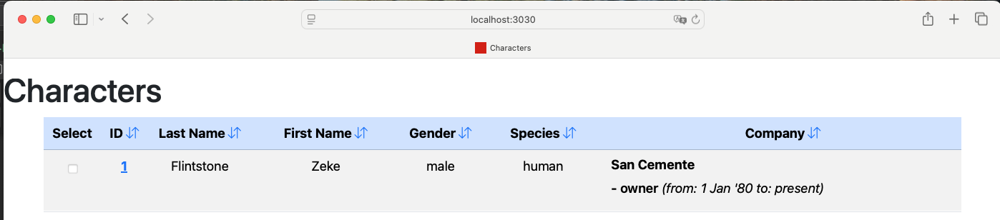
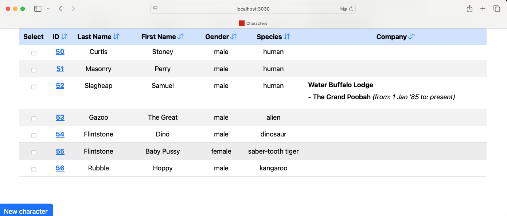
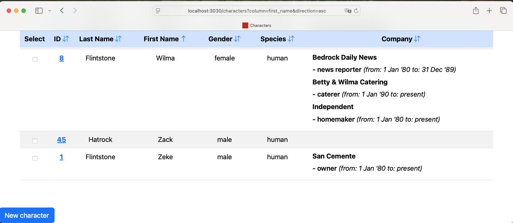
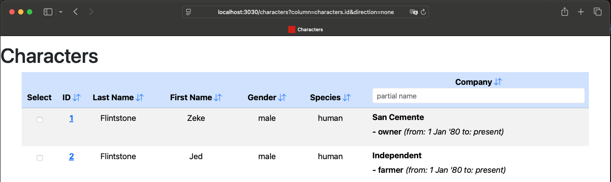
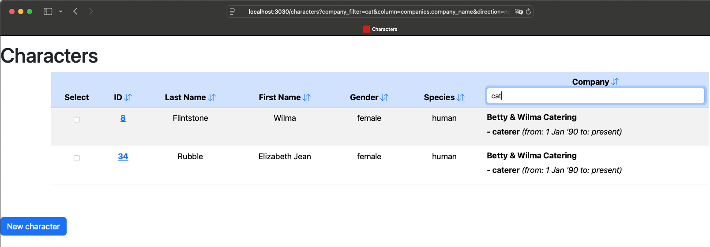
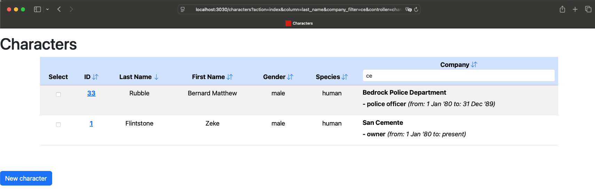
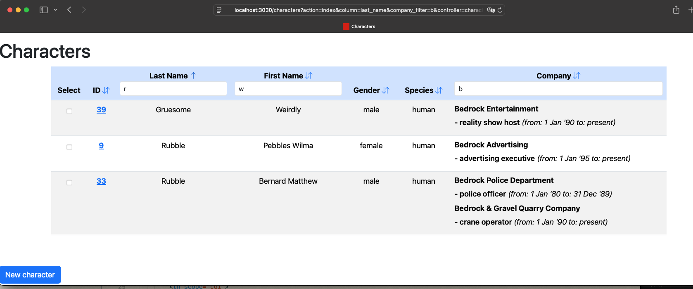

I recently learned that Rails 8 (actually 7.1+) has delightful features that make it easy to render dynamic tables without JavaScript.  This is an exploration of using these new features.  This article is an extension of: https://www.colby.so/posts/turbo-8-refresh-sorting

The cool thing is that morph updates without a full page reload - so its fast! and very easy to setup.

This article will go further and build sorting, filtering, and dropdown matching that all work together.

The code for this article and the commits can be found at: https://github.com/btihen-dev/rails_advanced_tables


## Basic Application

### Create the App

Initially, I am a bit more comfortable using `esbuild` instead of `import-maps`, but feel free to use `import-maps` if you wish.

NOTE: when using **esbuild** be sure to use `bin/dev` to start rails, I am not sure of the best practices, but I believe with **import-maps** you can use `bin/rails s` or `bin/dev`.

Create a new rails app:

```bash
# install the latest ruby
rbenv install 3.4.2
# install the latest rails
gem install rails
# create the app
rails new advanced_tables -T -j esbuild -d postgresql --css=bootstrap
# change to the new app
cd advanced_tables
```

In my setup (using postgres within Docker), I need to change the default config by adding `host: localhost` to `config/database.yml`, i.e.:

```yaml
# config/database.yml
default: &default
  adapter: postgresql
  encoding: unicode
  host: localhost
  port: 5432
```

Now I can create the database and start rails:

```bash
# create the database
bin/rails db:create

# start rails
bin/dev
```

now if you open `http://localhost:3000` you should see the default rails page.



PS - I use `bin/dev -p 3039` to avoid conflicts with my other rails apps.

Assuming that works - commit:
```bash
git add .
git commit -m "initial commit"
```

### Create Models

We need some models to work with.

#### Build the models
```ruby
bin/rails g scaffold Species species_name
bin/rails g scaffold Character nick_name first_name \
            last_name given_name gender species:references
bin/rails g scaffold Company company_name
bin/rails g scaffold Job role company:references
bin/rails g model CharacterJob start_date:date end_date:date \
            character:references job:references
```

#### Update/Tidy Models
**Character**
```ruby
# app/models/character.rb
class Character < ApplicationRecord
  belongs_to :species

  has_many :character_jobs, dependent: :destroy
  has_many :jobs, through: :character_jobs
  has_many :companies, through: :jobs

  validates :first_name,
            uniqueness: {
              scope: :last_name,
              message: "first_name and last_name already exists"
            }
  validates :first_name, presence: true
  validates :last_name, presence: true
  validates :species, presence: true
  validates :gender, presence: true
  validates :gender, inclusion: { in: %w[male female] }

  normalizes :first_name, :nick_name, :last_name, :given_name,
             with: ->(value) { value.strip }
end
```

**CharacterJob**
```ruby
# app/models/character_job.rb
class CharacterJob < ApplicationRecord
  belongs_to :character
  belongs_to :job

  has_one :company, through: :job

  validates :job, presence: true
  validates :character, presence: true
  validates :start_date, presence: true
  validates :character,
            uniqueness: {
              scope: [ :job, :start_date ],
              message: "character and job with start_date already exists"
            }
end
```

**Company**
```ruby
# app/models/company.rb
class Company < ApplicationRecord
  has_many :jobs, dependent: :destroy
  has_many :character_jobs, through: :jobs
  has_many :characters, through: :character_jobs

  validates :company_name, presence: true
  validates :company_name, uniqueness: true

  normalizes :company_name, with: ->(value) { value.strip }
end
```

**Job**
```ruby
# app/models/job.rb
class Job < ApplicationRecord
  belongs_to :company

  has_many :character_jobs, dependent: :destroy
  has_many :people, through: :character_jobs

  validates :company, presence: true
  validates :role, presence: true
  validates :role,
            uniqueness: {
              scope: :company_id,
              message: "role and company already exists"
            }

  normalizes :role, :title, :company,
             with: ->(value) { value.strip }
end
```

**Species**
```ruby
# app/models/species.rb
class Species < ApplicationRecord
  has_many :characters, dependent: :destroy

  validates :species_name, presence: true
  validates :species_name, uniqueness: true

  normalizes :species_name, with: ->(value) { value.strip }
end
```

### Root Route

Lets make the character index page our home (root) page by adding `root "characters#index"` to the end of our routes:
```ruby
#
Rails.application.routes.draw do
  resources :jobs
  resources :companies
  resources :characters
  resources :species

  get "up" => "rails/health#show", as: :rails_health_check

  # Defines the root path route ("/")
  root "characters#index"
end
```

### Seed Data
```ruby
# copy https://github.com/btihen-dev/rails_advanced_tables/blob/main/db/seeds.rb in db/seeds.rb

bin/rails db:migrate
bin/rails db:seed
```

### Check your Work

Start Rails: `bin/dev`

now when you open `http://localhost:3000` you should see an ugly list of characters.



Assuming that works - commit:
```bash
git add .
git commit -m "add models and seed data"
```

## Build the Basic Table

Let's change `app/views/characters/index.html.erb` into a table using:

```ruby
# app/views/characters/index.html.erb
<p style="color: green"><%= notice %></p>

<% content_for :title, "Characters" %>

<h1>Characters</h1>

<div id="characters" class="container text-center">

  <table class="table table-striped table-hover">
    <thead class="sticky-top">
      <tr class="table-primary">
        <th scope="col">Select</th>
        <th scope="col">ID</th>
        <th scope="col">Last Name</th>
        <th scope="col">First Name</th>
        <th scope="col">Gender</th>
        <th scope="col">Species</th>
        <th scope="col">Company</th>
      </tr>
    </thead>

    <tbody class="scrollable-table">
      <% @characters.each do |character| %>
        <tr id="<%= dom_id(character) %>">
          <td>
            <%= check_box_tag "selected_rows[]",
                character.id,
                false,
                id: "selected_rows_#{character.id}" # required we need to set the ID
            %>
          </td>
          <th scope="row"><%= link_to character.id, edit_character_path(character) %></th>
          <td><%= character.last_name %></td>
          <td><%= character.first_name %></td>
          <td><%= character.gender %></td>
          <td><%= character.species.species_name %></td>
          <td class="text-start">
            <% character.character_jobs.each do |character_job| %>
              <div class="job-container mb-2">
                <div class="company-row">
                  <div class="h6"><b><%= character_job.job.company.company_name %></b></div>
                </div>
                <div class="job-details-row">
                  <span style="font-weight: 600;">- <%= character_job.job.role %></span>
                  <span>
                    <em>
                      (from: <%= character_job.start_date.strftime("%e %b '%y") %>
                      to: <%= character_job.end_date&.strftime("%e %b '%y") || 'present' %>)
                    </em>
                  </span>
                </div>
              </div>
            <% end %>
          </td>
        </tr>
      <% end %>
    </tbody>
  </table>

</div>

<%= link_to "New character", new_character_path, class: "mt-5 sticky-top btn btn-primary" %>
```

Ensure your rails is running with `bin/dev` and open your browser and go to `http://localhost:3000` be sure you see a list of characters like:



Unfortunately now we have an N+1 query problem - when we look at the query log summary we see:
```log
...
15:27:32 web.1  | Completed 200 OK in 286ms (Views: 96.4ms | ActiveRecord: 156.7ms (167 queries, 69 cached) | GC: 1.1ms)
```

167 queries is way to many! Its because we are loading all the character jobs for each character and `@characters = Character.all` is not preloading the character jobs.

Let's fix the N+1 query by preloading the character jobs in `app/controllers/characters_controller.rb` with:

```ruby
# app/controllers/characters_controller.rb
  def index
    @characters =
      Character
        .includes(:species)
        .includes(character_jobs: { job: :company })
        .order(:last_name, :first_name)
  end
```

Now we can see we can do the query with only 5 queries:
```log
15:38:58 web.1  | Completed 200 OK in 53ms (Views: 13.3ms | ActiveRecord: 10.4ms (5 queries, 0 cached) | GC: 0.0ms)
...
```

Now let's commit our work:
```bash
git add .
git commit -m "character table with efficient query"
```


## Add Sortable Columns

We want to make the table sortable by clicking on the column headers. We will need arrows to indicate the sort direction we want to cycle through ascending and descending or no sort.  The following code control the sorting arrows.

```ruby
# app/helpers/characters_helper.rb
module CharactersHelper
  def sort_link(column:)
    direction = column == params[:column] ? future_direction : ''
    display_arrow = sort_arrow_tag_for(column, direction)
    link_to(
      display_arrow.html_safe,
      characters_path(column: column, direction: direction)
    )
  end

  def future_direction
    case params[:direction]
    when '' then 'asc'
    when 'asc' then 'desc'
    else ''
    end
  end

  def sort_arrow_tag_for(column, direction)
    params[:column] == column ? sort_arrow(direction) : tag.i(class: "bi bi-arrow-down-up")
  end

  def sort_arrow(direction)
    case direction
    when 'asc' then tag.i(class: "bi bi-arrow-up")
    when 'desc' then tag.i(class: "bi bi-arrow-down")
    else tag.i(class: "bi bi-arrow-down-up")
    end
  end
end
```

Now let's integrate the arrows into the headers in: `app/views/people/index.html.erb`

We will add the sort_link to the header in each column.  With ID we need to use `character.id` as the column name to avoid confusion with the other id column we have included in our query. Similarly, we will use `company.company_name` for the company column.

```ruby
# app/views/characters/index.html.erb
<p style="color: green"><%= notice %></p>

<% content_for :title, "Characters" %>

<h1>Characters</h1>

<div id="characters" class="container text-center">

  <table class="table table-striped table-hover">
    <thead class="sticky-top">
      <tr class="table-primary">
        <th scope="col">Select</th>
        <th scope="col">
          ID <%= sort_link(column: "characters.id") %>
        </th>
        <th scope="col">
          Last Name <%= sort_link(column: "last_name") %></th>
        <th scope="col">
          First Name <%= sort_link(column: "first_name") %>
        </th>
        <th scope="col">
          Gender <%= sort_link(column: "gender") %>
        </th>
        <th scope="col">
          Species <%= sort_link(column: "species.species_name") %>
        </th>
        <th scope="col">
          Company <%= sort_link(column: "companies.company_name") %>
        </th>
      </tr>
    </thead>

    <tbody class="scrollable-table">
      <% @characters.each do |character| %>
        <tr id="<%= dom_id(character) %>">
          <td>
            <%= check_box_tag "selected_rows[]",
                character.id,
                false,
                id: "selected_rows_#{character.id}",  # required Explicitly set the ID
            %>
          </td>
          <th scope="row"><%= link_to character.id, edit_character_path(character) %></th>
          <td><%= character.last_name %></td>
          <td><%= character.first_name %></td>
          <td><%= character.gender %></td>
          <td><%= character.species.species_name %></td>
          <td class="text-start">
            <% character.character_jobs.each do |character_job| %>
              <div class="job-container mb-2">
                <div class="company-row">
                  <div class="h6"><b><%= character_job.job.company.company_name %></b></div>
                </div>
                <div class="job-details-row">
                  <span style="font-weight: 600;">- <%= character_job.job.role %></span>
                  <span>
                    <em>
                      (from: <%= character_job.start_date.strftime("%e %b '%y") %>
                      to: <%= character_job.end_date&.strftime("%e %b '%y") || 'present' %>)
                    </em>
                  </span>
                </div>
              </div>
            <% end %>
          </td>
        </tr>
      <% end %>
    </tbody>
  </table>

</div>

<%= link_to "New character", new_character_path, class: "mt-5 sticky-top btn btn-primary" %>
```

To keep the controller simple we use: `characters.id`, `species.species_name`, and `companies.company_name` as the column names - which is consistent with the query sort name.

start rails with `bin/dev` and be sure we can toggle through the sort arrows in the header column.



Assuming this works (looks similar and the arrows rotate when clicked), then it's time to update the controller to actually sort the list based on the column we clicked.

```ruby
# app/controllers/characters_controller.rb
class CharactersController < ApplicationController
  before_action :set_character, only: %i[ show edit update destroy ]

  # GET /characters or /characters.json
  def index
    # query with sorting
    column = params[:column]
    direction = params[:direction]

    # base query
    query = Character
            .includes(:species)
            .includes(character_jobs: { job: :company })

    # add sort if direction is given
    query = if direction == 'none' || column.blank?
              query.order('characters.id')
            else
              query.order("#{column} #{direction}")
            end

    # execute query
    @characters = query.all
  end
```

Test and be sure you can sort (ascending, descending or no sort) on each column in the table.

Assuning this works, let's commit this.
```bash
git add .
git commit -m "table with dynamic sortable columns"
```

## Scroll Location Preservation

Our sorting works well, but when we scroll down the page and then click a sort arrow, the page scrolls back to the top. Let's fix this.

We will add morph-dom and scroll preservation to just our page where we need it.  To do this we need to update the header with a header refresh using:

```ruby
# app/views/layouts/application.html.erb
  <head>
    ...
    <% if content_for? :head %><%= yield :head %><% end %>
    ...
  </head>
```

NOTE: if you want to add this to every template then do the following in your template __(probably best to do only in new projects)__

```ruby
# app/views/layouts/application.html.erb
  <head>
    ...
    <!-- adds morph dom and scroll preservation to every page -->
    <%# turbo_refreshes_with method: :morph, scroll: :preserve  %>
    <%# yield :head %>
    ...
  </head>
```

Now we need to add morph dom and scroll preserve code to our page using:  `<%= turbo_refreshes_with method: :morph, scroll: :preserve %>` so now our index page looks like:

```ruby
# app/views/characters/index.html.erb
<%= turbo_refreshes_with method: :morph, scroll: :preserve %>
<p style="color: green"><%= notice %></p>
<% content_for :title, "Characters" %>
<h1>Characters</h1>
<div id="characters" class="container text-center">
...
```

Finally we need to add `data: { turbo_action: 'replace' }` to our sort_links to tell morph dom be used and preserve our scroll location.  We need to modify our helper to look like:
```ruby
# app/helpers/characters_helper.rb
module CharactersHelper
  def sort_link(column:)
    next_direction = column == params[:column] ? future_direction : 'asc'
    display_arrow = params[:column] == column ? current_sort_arrow : tag.i(class: "bi bi-arrow-down-up")
    link_to(
      display_arrow.html_safe,
      characters_path(column: column, direction: next_direction),
      data: { turbo_action: 'replace' }
    )
  end
 ...
```

Now restart rails `bin/dev` and test.

Scroll down to the bottom of the page:



Now trigger a sort. We should remain at the bottom of the page:




## Add Partial Match Filter

### Single Field Filter

Let's make a little form to filter accept values to match:

```ruby
# app/views/characters/_filter_form.html.erb
<%= form_with url: characters_path, method: :get,
    data: { controller: "characters-filter", turbo_action: 'replace' } do |form| %>
  <%= form.text_field(
    field_name,
    placeholder: placeholder,
    value: params[field_name],
    class: "form-control form-control-sm",
    autocomplete: "off",
    data: { action: "input->characters-filter#filter" }) %>
<% end %>
```

To make a form that accepts values as they are typed we need a stimulus controller that matches the name `characters-filter` with a function called `filter`.

To make this javascript controller (& integrate it into our project use:.

```bash
bin/rails g stimulus characters_filter
```

Now we can add the following code:

```js
// app/javascript/controllers/characters_filter_controller.js
import { Controller } from "@hotwired/stimulus";

export default class extends Controller {
  filter() {
    clearTimeout(this.timeout);
    this.timeout = setTimeout(() => {
      this.element.requestSubmit();
    }, 200);
  }
}
```

let's add partial filter to the company filter using:

`<%= render "filter_form", field_name: :company_filter, placeholder: "partial name" %>`

within the table header - thus it would look like:

```ruby
# app/views/characters/index.html.erb
<%= turbo_refreshes_with method: :morph, scroll: :preserve %>
<p style="color: green"><%= notice %></p>

<% content_for :title, "Characters" %>

<h1>Characters</h1>

<div id="characters" class="container text-center" data-controller="characters-filter">

  <table class="table table-striped table-hover">
    <thead class="sticky-top">
      <tr class="table-primary">
        <th scope="col">Select</th>
        <th scope="col">
          ID <%= sort_link(column: "characters.id") %>
        </th>
        <th scope="col">
          Last Name <%= sort_link(column: "last_name") %></th>
        <th scope="col">
          First Name <%= sort_link(column: "first_name") %>
        </th>
        <th scope="col">
          Gender <%= sort_link(column: "gender") %>
        </th>
        <th scope="col">
          Species <%= sort_link(column: 'species.species_name') %>
        </th>
        <th scope="col">
          Company <%= sort_link(column: 'companies.company_name') %>
          <%= render "filter_form", field_name: :company_filter, placeholder: "partial name" %>
        </th>
      </tr>
    </thead>

...
```

Now if we test it, we should see the following:



let's update the rails controller to use the filter using:

```ruby
    company_filter = params[:company_filter]
    query = if company_filter.present?
              query.joins(character_jobs: { job: :company }).where('companies.company_name ilike ?', "%#{company_filter}%")
            else
              query
            end
```

now the controller should look like:

```ruby
# app/controllers/characters_controller.rb
class CharactersController < ApplicationController
  before_action :set_character, only: %i[ show edit update destroy ]

  # GET /characters or /characters.json
  def index
    # query with sorting
    column = params[:column]
    direction = params[:direction]

    # base query
    query = Character
            .includes(:species)
            .includes(character_jobs: { job: :company })

    # add sort if direction is given
    query = if direction == 'none' || column.blank?
              query.order('characters.id')
            else
              query.order("#{column} #{direction}")
            end

    # partial match filters
    @company_filter = params[:company_filter]
    query = if @company_filter.present?
              query.joins(character_jobs: { job: :company }).where('companies.company_name ilike ?', "%#{@company_filter}%")
            else
              query
            end

    # execute query
    @characters = query.all
  end
...
```

Now if we test (enter part of a company name and hit <enter>) we should see the following:



Assuming this work let's merge.

```bash
git add .
git commit -m "added simple company filter"
```

### Allow Multiple Filters with Sorting

This simple filter is a bit limited since currently we can only filter one column and we can't sort and filter at the same.

Let's add the params to our form(s) using:
```ruby
  <!-- Preserve existing sort parameters -->
  <% if params[:column].present? %>
    <%= form.hidden_field :column, value: params[:column] %>
  <% end %>
  <% if params[:direction].present? %>
    <%= form.hidden_field :direction, value: params[:direction] %>
  <% end %>

  <!-- add all other filter parameters except the current one -->
  <% params.each do |key, value| %>
    <% next if key == field_name || key == 'column' || key == 'direction' || key == 'controller' || key == 'action' %>
    <%= form.hidden_field key, value: value %>
  <% end %>
```

now the _filter_form.html.erb should look like:

```ruby
# app/views/characters/_filter_form.html.erb
<%= form_with url: characters_path, method: :get,
    data: { controller: "characters-filter", turbo_action: 'replace' } do |form| %>

  <!-- Preserve existing sort parameters -->
  <% if params[:column].present? %>
    <%= form.hidden_field :column, value: params[:column] %>
  <% end %>
  <% if params[:direction].present? %>
    <%= form.hidden_field :direction, value: params[:direction] %>
  <% end %>

  <!-- Include all other filter parameters except the current one -->
  <% params.each do |key, value| %>
    <% next if key == field_name || key == 'column' || key == 'direction' || key == 'controller' || key == 'action' %>
    <%= form.hidden_field key, value: value %>
  <% end %>

  <%= form.text_field(
    field_name,
    placeholder: placeholder,
    value: params[field_name],
    class: "form-control form-control-sm",
    autocomplete: "off",
    data: { action: "input->characters-filter#filter" }) %>
<% end %>
```

Now update the sort_link helper:
```ruby
module CharactersHelper
  def sort_link(column:)
    next_direction = column == params[:column] ? future_direction : 'asc'
    display_arrow = params[:column] == column ? current_sort_arrow : tag.i(class: "bi bi-arrow-down-up")
    link_to_params = params.permit!.to_h.merge(column: column, direction: next_direction)
    link_to(
      display_arrow.html_safe,
      characters_path(link_to_params),
      data: { turbo_action: 'replace' }
    )
  end
  ...
```

Now when we test we should be able to sort and filter at the same time.



### Allowing Multiple Filters

Now we should be able to add this filter to other columns:

```ruby
# app/views/characters/index.html.erb
<%= turbo_refreshes_with method: :morph, scroll: :preserve %>
<p style="color: green"><%= notice %></p>

<% content_for :title, "Characters" %>

<h1>Characters</h1>

<div id="characters" class="container text-center" data-controller="characters-filter">

  <table class="table table-striped table-hover">
    <thead class="sticky-top">
      <tr class="table-primary">
        <th scope="col">Select</th>
        <th scope="col">
          ID <%= sort_link(column: "characters.id") %>
        </th>
        <th scope="col">
          Last Name <%= sort_link(column: "last_name") %>
          <%= render "filter_form", field_name: :last_name_filter, placeholder: "partial last name" %>
        </th>
        <th scope="col">
          First Name <%= sort_link(column: "first_name") %>
          <%= render "filter_form", field_name: :first_name_filter, placeholder: "partial first name" %>
        </th>
        <th scope="col">
          Gender <%= sort_link(column: "gender") %>
        </th>
        <th scope="col">
          Species <%= sort_link(column: 'species.species_name') %>
        </th>
        <th scope="col">
          Company <%= sort_link(column: 'companies.company_name') %>
          <%= render "filter_form", field_name: :company_filter, placeholder: "partial company name" %>
        </th>
      </tr>
    </thead>
```

And of course we need to update the controller:
```ruby
# app/controllers/characters_controller.rb
class CharactersController < ApplicationController
  before_action :set_character, only: %i[ show edit update destroy ]

  def index
    # query with sorting
    column = params[:column]
    direction = params[:direction]

    # base query
    query = Character
            .includes(:species)
            .includes(character_jobs: { job: :company })

    # add sort if direction is given
    query = if direction == 'none' || column.blank?
              query.order('characters.id')
            else
              query.order("#{column} #{direction}")
            end

    # partial match filters
    @first_name_filter = params[:first_name_filter]
    @last_name_filter = params[:last_name_filter]
    @company_filter = params[:company_filter]
    query = query.where('characters.first_name ilike ?', "%#{@first_name_filter}%") if @first_name_filter.present?
    query = query.where('characters.last_name ilike ?', "%#{@last_name_filter}%") if @last_name_filter.present?
    query = if @company_filter.present?
              query.joins(character_jobs: { job: :company }).where('companies.company_name ilike ?', "%#{@company_filter}%")
            else
              query
            end


    # execute query
    @characters = query.all
  end
```

Now it should look like:



Let's commit this change.

```bash
git add .
git commit -m "allow multipe filters and sorting"
```

## Add Dropdown Filter

## Add Pagination

## Resources

### Adding Bootstrap to an existing project

* https://www.youtube.com/watch?v=phOUsR0dm5s
* https://medium.com/@gjuliao32/installing-bootstrap-rails-7-a-step-by-step-guide-0fc4a843d94f

### Bootstrap Icons

* https://icons.getbootstrap.com/

### Rails Table Articles

* [Table Sorting Rails 7.1 - 21 Mar 2024](https://www.colby.so/posts/turbo-8-refresh-sorting)
* [Table Filtering Rails 7.0 - 15 Oct 2021](https://www.colby.so/posts/filtering-tables-with-rails-and-hotwire)
* [Table Sorting Rails 7.0 - 19 Sep 2021](https://www.colby.so/posts/sortable-table-with-rails-and-turbo-frames)
* [Table Sorting with Stimulus](https://www.colby.so/posts/a-sortable-table-with-rails-and-stimulusreflex)

### Rails Hotwire

* [Turbo Rails Intro](https://www.colby.so/posts/turbo-rails-101-todo-list)
* [Hotwiring Rails Book](https://book.hotwiringrails.com/)
* [Hot Rails Tutorial - building Turbo Rails](https://www.hotrails.dev/turbo-rails)
* [Rebuilding Turbo Rails - new version](https://www.hotrails.dev/rebuilding-turbo-rails)
* [Rails Hotwire Modals](https://webcrunch.com/posts/hotwire-rails-turbo-modals)
* [Turbo Frame Pages in Ruby on Rails 7](https://www.youtube.com/watch?v=iwZDoz_Ya2k)
* [Digging into Turbo with Ruby on Rails 7](https://www.youtube.com/watch?v=0CSGsHnci2I)
* [Mastering Turbo Frames and Turbo Streams in Rails 7: Build a Journal Entry Tagging Feature](https://www.youtube.com/watch?v=lG5aRBJHDBQ)
* [Odin Probject - Turbo Tutorial](https://www.theodinproject.com/lessons/ruby-on-rails-turbo)
* [Hotwire Turbo Transitions](https://dev.to/nejremeslnici/how-to-use-view-transitions-in-hotwire-turbo-1kdi)

## APPENDIX

when using esbuild you should see the following two files and you should NOT see `import-map` files or config!

David Colby who wrote: https://www.colby.so/posts/turbo-8-refresh-sorting and https://www.colby.so/posts/filtering-tables-with-rails-and-hotwire

writes:

For reference, `Procfile.dev` looks like this for me on a fresh esbuild + bootstrap install:
```bash
web: env RUBY_DEBUG_OPEN=true bin/rails server
js: yarn build --watch
css: yarn watch:css
```

And `package.json` looks like this:
```js
{
  "name": "app",
  "private": true,
  "dependencies": {
    "@hotwired/stimulus": "^3.2.2",
    "@hotwired/turbo-rails": "^8.0.4",
    "@popperjs/core": "^2.11.8",
    "autoprefixer": "^10.4.19",
    "bootstrap": "^5.3.3",
    "bootstrap-icons": "^1.11.3",
    "esbuild": "^0.20.2",
    "nodemon": "^3.1.0",
    "postcss": "^8.4.38",
    "postcss-cli": "^11.0.0",
    "sass": "^1.76.0"
  },
  "scripts": {
    "build": "esbuild app/javascript/*.* --bundle --sourcemap --format=esm --outdir=app/assets/builds --public-path=/assets",
    "build:css:compile": "sass ./app/assets/stylesheets/application.bootstrap.scss:./app/assets/builds/application.css --no-source-map --load-path=node_modules",
    "build:css:prefix": "postcss ./app/assets/builds/application.css --use=autoprefixer --output=./app/assets/builds/application.css",
    "build:css": "yarn build:css:compile && yarn build:css:prefix",
    "watch:css": "nodemon --watch ./app/assets/stylesheets/ --ext scss --exec \"yarn build:css\""
  },
  "browserslist": [
    "defaults"
  ]
}
```
