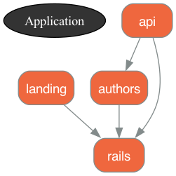

Rails with Strong Boundaries between the Modules

This experiment was inspired from an internal Tech Talk at [Garaio REM](https://www.garaio-rem.ch) by a colleague [Severin Räz](https://www.linkedin.com/in/severin-r%C3%A4z-567ab81b1/?originalSubdomain=ch). He suggested that we could be using `module` to create namespaces (to organize our code with high cohesion) and `private_constant` to enforce API boundaries (enforce low coupling).

The example given was similar to the following:

Typical Ruby Code is very permissive:
```
module Taxes
  class TaxA
    def self.tax(amount) = amount * 0.1
  end

  class TaxB
    def self.tax(amount) = amount * 0.2
  end

  class API
    def self.total(amount) = amount + tax(amount)
    def self.tax(amount) = [TaxA, TaxB].sum { |klass| klass.tax(amount) }
  end
end

# all of this works and is accessible, thus its not clear what the API should, nor is the API enforced!
amount = 100
Taxes::API.total(amount)
amount + Taxes::API.tax(amount)
amount + Taxes::TaxA.new.tax(amount) + Taxes::TaxB.tax(amount)
```

If we rewrite the code with boundaries within the namespace, then it might look like:
```
module Taxes
  class TaxA
    def self.tax(amount) = amount * 0.1
  end
  private_constant :TaxA

  class TaxB
    def self.tax(amount) = amount * 0.2
  end
  private_constant :TaxB

  class API
    class << self
      def total(amount) = amount + tax(amount)

      private
      def tax(amount) = [TaxA, TaxB].sum { |klass| klass.tax(amount) }
    end
  end
end

# Now the public API is clearly defined, and ONLY the Public API is available - all the internals are now protected:

Taxes::API.total(amount)

# Everything else produces errors:

amount + Taxes::API.tax(amount)
# private method `tax' called for class Taxes::API (NoMethodError)

amount + Taxes::TaxA.new.tax(amount) + Taxes::TaxB.tax(amount)
# private constant Taxes::TaxA referenced (NameError)
```

I decided to experiment with idea within the context of a Rails app.

That is this article resulting from the experiment.

## Introduction

While writing Rails applications it is very easy to create highly coupled classes.  And possibly low cohesion within features.

Organizing the code with Modules encourages one to consider cohesion and strong Boundaries with Public APIs encourages coupling that can be easily managed.

One could even go one step further and dependency inversion.

In this quick example we will demonstrate using modules with strong boundaries and an enforced public API.

To facilitate the 'citadel' approach some teams re-organize the code so that all module code is together instead of Rails approach of scattered across the app (some modular proponents like to encourage the rails code to be its own module and not mixed with 'our' code) - this article will show how to do this fully in this style (mini-inner-rails apps):

```
├── app
│   ├── assets
│   └── javascript
├── bin
├── config
├── db
├── lib
├── log
├── modules
│   ├── api
│   ├── authors
│   ├── landing
│   └── rails
├── node_modules
├── public
├── storage
├── test
├── tmp
└── vendor
```

Other structures are also easy to create, the first version seen in the Repo was:
```
├── app
│   ├── assets
│   ├── javascript
│   └── modules
│       ├── api
│       ├── authors
│       ├── landing
│       └── rails
├── bin
├── config
├── db
├── lib
├── log
├── node_modules
├── public
├── storage
├── test
├── tmp
└── vendor
```

It's of course also possible to use 'private_constant' without reorganizing Rails.

## Getting Started

We will build a VERY simple blog - just to show the concepts.  Obviously, this app is way to simple to benefit from Modules.  However, this keeps it simple enough show how it could be implemented.

The code for this experiment can be found at: https://github.com/btihen/protected_rails_modules

Just for fun we will use the newest Rails and Ruby versions, but these techniques should work on any version of Rails.

```
# just for fun
rbenv install 3.3.0-preview1
rbenv local 3.3.0-preview1

# `--main` uses the rails main branch instead of a released version
rails new modules --main --javascript=esbuild --css=tailwind --database=postgresql

cd modules
git init
git add .
git commit -m "initial commit"

bin/rails db:create
```

Later when Rails 7.1 is released we can set the version in the Gemfile with:
`gem 'rails', '~> 7.1'`
instead of the current:
`gem "rails", github: "rails/rails", branch: "main"`

## Config for Modules

First let's start by allowing us to configure Rails to allow for organization by Modules instead of grouping our code all together.

```
mkdir app/modules
```

Allow Rails to find the modules.
```
# config/application.rb
module RailsPack
  class Application < Rails::Application
    ...
    # find the code in our modules
    config.paths.add 'modules', glob: '*/{*,*/concerns}', eager_load: true
  end
end
```

Let the controllers know how to find the `views` within modules by updating the views path in: `app/controllers/application_controller.rb` to:
```
# app/controllers/application_controller.rb
class ApplicationController < ActionController::Base
  # find views within our modules
  append_view_path(Dir.glob(Rails.root.join('modules/*/views')))
end
```

## Move 'Rails' in a Module

Let's create a module for our Rails code.

So our project would look like:


```
├── app
│   ├── assets
│   └── javascript
│
└── modules
    └── rails
        ├── controllers
        │   ├── application_controller.rb
        │   └── concerns
        ├── channels
        │   └── application_cable
        │       ├── channel.rb
        │       └── connection.rb
        ├── helpers
        │   └── application_helper.rb
        ├── jobs
        │   └── application_job.rb
        ├── mailers
        │   └── application_mailer.rb
        ├── models
        │   ├── application_record.rb
        │   └── concerns
        └── views
            └── layouts
                ├── application.html.erb
                ├── mailer.html.erb
                └── mailer.text.erb
```

In this way we can keep our code separate from Rails itself.

```
mkdir modules/rails

mv app/views modules/rails/.
mv app/models modules/rails/.
mv app/helpers modules/rails/.
mv app/channels modules/rails/.
mv app/controllers modules/rails/.
```

be sure rails still works (best to restart rails if already running)
```
bin/rails s
```

update git
```
git add .
git commit -m "rails as a module"
```

## Create a Module - landing page

Let's add a landing page.  Each new module we create will be within a namespace (module) otherwise we cannot enforce privacy!  In the case of a landing page it is unnecessary, but it allows us to create a more complicated module in the future without a major code refactor.  So we will just use a namespace for all modules.

```
bin/rails g controller landing/home index --no-helper

mkdir modules/landing

mv app/views modules/landing/.
mv app/controllers modules/landing/.
```


Now update the routes file to look like:
```
# config/routes.rb
Rails.application.routes.draw do
  namespace :landing do
    get 'home/index'
  end

  # Defines the root path route ("/")
  root 'landing/home#index'
end
```

start rails new with `bin/rails s`

the new landing page should appear!

update git
```
git add .
git commit -m "add landing page module"
```

Now the structure looks like:

```
├── app
│   ├── assets
│   └── javascript
│
└── modules
    ├── landing
    │   ├── controllers
    │   │   └── landing
    │   │       └── home_controller.rb
    │   └── views
    │       └── landing
    │           └── home
    │               └── index.html.erb
    └── rails
```

## Lets create an Author's module

Granted this is just an arbitrary module for demo purposes - but it is separate logically from the landing page and thus has it's own module.

```
bin/rails g scaffold authors/user full_name email --no-helper
bin/rails g scaffold authors/article title body:text authors_user:references --no-helper
bin/rails db:migrate
```

Let's build into an isolated module
```
mkdir modules/authors

mv app/views modules/authors/.
mv app/models modules/authors/.
mv app/controllers modules/authors/.
```

Rails overlooks namespace relations (when it sees `authors_users` it assumes a classname of `AuthorsUsers` but with namespaces it is actually `Authors::Users`) so we need be sure our relationships are properly adjusted.
```
# modules/authors/models/authors/article.rb
class Authors::Article < ApplicationRecord
  belongs_to :authors_user, class_name: 'Authors::User'
end
```

you will probably also want to update users to find all of a user's articles:
```
# modules/authors/models/authors/user.rb
class Authors::User < ApplicationRecord
  has_many :authors_articles, class_name: 'Authors::Article', foreign_key: 'authors_user_id', dependent: :destroy
end
```

so that the following works :
```
bin/rails c
user = Authors::User.first
user.authors_articles
```

**start rails fresh!**

test that `authors/users` & `authors/articles` work as expected


update git
```
git add .
git commit -m "add authors module"
```

Now the project looks like:

```
├── app
│   ├── assets
│   └── javascript
│
└── modules
    ├── authors
    │   ├── controllers
    │   │   └── authors
    │   │       ├── articles_controller.rb
    │   │       └── users_controller.rb
    │   ├── models
    │   │   ├── authors
    │   │   │   ├── article.rb
    │   │   │   └── user.rb
    │   │   └── authors.rb
    │   └── views
    │       └── authors
    │           ├── articles
    │           └── users
    ├── landing
    └── rails
```

## Protected Modules

In Ruby 1.9.3 `private_constant` was introduced to help enforce privacy of Constants `private` only enforces privacy of methods.  Often we think of Constants as predefined information i.e.:
```
ARTICLE_STATUS = %i[draft inreview published].freeze
```
If we don't want to share these states outside our Class then we can can write:
```
ARTICLE_STATUS = %i[draft inreview published].freeze
private_constant :ARTICLE_STATUS
```
Now this is only usable within our class.

However our Classes are also Constants.  So within a module (namespace) we can protect / hide our classes and only allow access to our module via a public API.

Let's try that out using `private_constant` on our Models within the `Authors` namespace.

```
# modules/authors/models/authors/article.rb
module Authors
  class Article < ApplicationRecord
    # class_name: 'Authors::User' is needed otherwise Rails assumes the class AuthorsUser
    belongs_to :authors_user, class_name: 'Authors::User'
  end
  private_constant :Article
end
```

and

```
# modules/authors/models/authors/user.rb
module Authors
  class User < ApplicationRecord
  # class_name: 'Authors::Article' is needed otherwise Rails assumes the class AuthorsArticle
    has_many :authors_articles, class_name: 'Authors::Article', foreign_key: 'authors_user_id', dependent: :destroy
  end
  private_constant :User
end
```

Now if we try to access our our Rails Authors controllers
```
https://localhost:3000/authors/users
# or
https://localhost:3000/authors/articles
```
we throw lots of Privacy errors.

To fix this we need refactor our controllers.

We need to explicitly use our namespace as a module - thus:
```
class Authors::ArticlesController < ApplicationController
```

becomes:
```
module Authors
  class ArticlesController < ApplicationController
```

We also need to change all our class reference from:
```
@authors_articles = Authors::Article.all
```
to:
```
@authors_articles = Article.all
```

Which works since we have now explicitly defined our namespace as a module.  Within our namespace we have full access to our classes - **outside the namespace - we have no access!**

Thus our controllers will now need to look like:
```
# modules/authors/controllers/authors/articles_controller.rb
# an explicit module for namespace
module Authors
  class ArticlesController < ApplicationController
    before_action :set_authors_article, only: %i[ show edit update destroy ]

    def index
      # must now be called directly from within the name space
      @authors_articles = Article.all
      # the following explicit full call is no longer allowed!
      # @authors_articles = Authors::Article.all
    end

    def show
    end

    def new
      @authors_article = Article.new
    end

    def edit
    end

    def create
      @authors_article = Article.new(authors_article_params)

      respond_to do |format|
        if @authors_article.save
          format.html { redirect_to authors_article_url(@authors_article), notice: "Article was successfully created." }
          format.json { render :show, status: :created, location: @authors_article }
        else
          format.html { render :new, status: :unprocessable_entity }
          format.json { render json: @authors_article.errors, status: :unprocessable_entity }
        end
      end
    end

    def update
      respond_to do |format|
        if @authors_article.update(authors_article_params)
          format.html { redirect_to authors_article_url(@authors_article), notice: "Article was successfully updated." }
          format.json { render :show, status: :ok, location: @authors_article }
        else
          format.html { render :edit, status: :unprocessable_entity }
          format.json { render json: @authors_article.errors, status: :unprocessable_entity }
        end
      end
    end

    def destroy
      @authors_article.destroy!

      respond_to do |format|
        format.html { redirect_to authors_articles_url, notice: "Article was successfully destroyed." }
        format.json { head :no_content }
      end
    end

    private
      # Use callbacks to share common setup or constraints between actions.
      def set_authors_article
        @authors_article = Article.find(params[:id])
      end

      # Only allow a list of trusted parameters through.
      def authors_article_params
        params.require(:authors_article).permit(:title, :body, :authors_user_id)
      end
  end
end
```
and

```
# modules/authors/controllers/authors/users_controller.rb
module Authors
  class UsersController < ApplicationController
    before_action :set_authors_user, only: %i[ show edit update destroy ]

    def index
      @authors_users = User.all
      # @authors_users = Authors::User.all
    end

    def show
    end

    def new
      @authors_user = User.new
    end

    def edit
    end

    def create
      @authors_user = User.new(authors_user_params)

      respond_to do |format|
        if @authors_user.save
          format.html { redirect_to authors_user_url(@authors_user), notice: "User was successfully created." }
          format.json { render :show, status: :created, location: @authors_user }
        else
          format.html { render :new, status: :unprocessable_entity }
          format.json { render json: @authors_user.errors, status: :unprocessable_entity }
        end
      end
    end

    def update
      respond_to do |format|
        if @authors_user.update(authors_user_params)
          format.html { redirect_to authors_user_url(@authors_user), notice: "User was successfully updated." }
          format.json { render :show, status: :ok, location: @authors_user }
        else
          format.html { render :edit, status: :unprocessable_entity }
          format.json { render json: @authors_user.errors, status: :unprocessable_entity }
        end
      end
    end

    def destroy
      @authors_user.destroy!

      respond_to do |format|
        format.html { redirect_to authors_users_url, notice: "User was successfully destroyed." }
        format.json { head :no_content }
      end
    end

    private
      # Use callbacks to share common setup or constraints between actions.
      def set_authors_user
        @authors_user = User.find(params[:id])
      end

      # Only allow a list of trusted parameters through.
      def authors_user_params
        params.require(:authors_user).permit(:full_name, :email)
      end
  end
end
```

Now lets create an API for other aspects of our APP.

create public directory for it
```
mkdir modules/authors/public/authors
touch modules/authors/public/authors/article_data.rb
touch modules/authors/public/authors/user_data.rb
```


update git
```
git add .
git commit -m "authors is now a protected module"
```

## Public API for Authors Module

Generally our code must cooperate with other code.  Thus each protected module will need a public API.  The API should be carefully considered and generally (probably with a minimalistic approach).

In this case, I allow full CRUD access to each model (just for demo purposes).

```
# modules/authors/public/authors/article_data.rb
module Authors
  class ArticleData
    include ActiveModel::Model
    attr_accessor :id, :title, :body, :authors_user_id, :created_at, :updated_at

    validates :title, presence: true
    validates :body, presence: true
    validates :authors_user_id, presence: true

    def self.find(id)
      article = Article.find(id)
      new(article.attributes)
    end

    def self.all
      Article.all.map { |article| new(article.attributes) }
    end

    def self.create(params)
      article = Article.new(params)
      article.save
      new(article.attributes)
    end

    def update(params)
      article = Article.find(id)
      article.update(params)
      article.save
      self.attributes = article.attributes
      self
    end

    def destroy
      article = Article.find(id)
      article.destroy
    end
  end
end
```

and

```
# modules/authors/public/authors/user_data.rb
module Authors
  class UserData
    include ActiveModel::Model
    attr_accessor :id, :full_name, :email, :created_at, :updated_at

    validates :full_name, presence: true
    validates :email, presence: true

    def self.find(id)
      user = User.find(id)
      new(user.attributes)
    end

    def self.all
      User.all.map { |user| new(user.attributes) }
    end

    def self.create(params)
      user = User.new(params)
      user.save
      new(user.attributes)
    end

    def update(params)
      user = User.find(id)
      user.update(params)
      user.save
      self.attributes = user.attributes
      self
    end

    def destroy
      user = User.find(id)
      user.destroy
    end
  end
end
```

PS - you may not want to include `include ActiveModel::Model` in the UserData/ArticleData class.

now we cat test:

be sure we can still create new users and articles in our controllers and that we have access outside with the new public entities
```
bin/rails c

Authors::ArticleData.find(1)
Authors::UserData.find(1)
# etc
```

update repo
```
git add .
git commit -m "protected module with public API"
```

Now our code looks like:
```
├── app
│   ├── assets
│   └── javascript
│
└── modules
    ├── authors
    │   ├── controllers
    │   ├── models
    │   ├── public
    │   │   └── authors
    │   │       ├── article_data.rb
    │   │       └── user_data.rb
    │   └── views
    ├── landing
    └── rails
```


## JSON API

Let's use the Ruby API to create a JSON API to collaborate to say a JS frontend.

```
mkdir -p modules/api/controllers/api/v1
touch modules/api/controllers/api/v1/articles_controller.rb
touch modules/api/controllers/api/v1/users_controller.rb
```

```
# modules/api/controllers/api/v1/articles_controller.rb
module Api
  module V1
    class ArticlesController < ApplicationController
      def index
        articles = Authors::ArticleData.all
        render json: { status: 'SUCCESS', message: 'Loaded articles', data: articles }, status: :ok
      end

      # Define other CRUD actions...
    end
  end
end
```
and

```
# modules/api/controllers/api/v1/users_controller.rb
module Api
  module V1
    class UsersController < ApplicationController
      def index
        users = Authors::UserData.all
        render json: { status: 'SUCCESS', message: 'Loaded users', data: users }, status: :ok
      end

      # Define other CRUD actions...
    end
  end
end
```

update the route with:
```
# config/routes.rb
Rails.application.routes.draw do
  namespace :api do
    namespace :v1 do
      resources :articles
      resources :users
    end
  end
  # ...
 end
```

now when we go to
`http://localhost:3000/api/v1/articles`
and
`http://localhost:3000/api/v1/users`

we should get the expected results

let's update git:
```
git add .
git commit -m 'json api for the Authors Module'
```

Now the structure looks like:


```
├── app
│   ├── assets
│   └── javascript
│
└── modules
    ├── api
    │   └── controllers
    │       └── api
    │           └── v1
    │               ├── articles_controller.rb
    │               └── users_controller.rb
    ├── authors
    ├── landing
    └── rails
```

## Tests (Rspec) with Protected Modules

Tests / Rspecs will need to be slightly different when using protected modules - the tests need to be within the `module` so they will need to look like:
```
require 'spec_helper'

module Authors
  describe User do
    # the tests
  end
end
```

instead of:
```
require 'spec_helper'

describe Authors::User do
  # the tests
end
```


## Dependency Graphs & CI Integration

If you have chosen to re-organize your rails environment to create 'packages, modules orcomponents' (whatever you like to call them), you can use the `packwerk` linter to checking dependency & privacy violations.  You can also use `graphwerk` to help you visualize the application structure.

Packwerk is a linter and like RuboCop you can also have it ignore older code that isn't yet using your new design.  There is also a 'danger-packwerk' to auto-comment PRs in a Continious Integration system.

In the gem file add:
```
# Gemfile
...
# Packwerk (modular Rails) - dependency tooling and mapping
gem "packwerk", "~> 2.2"
gem 'graphwerk', group: %i[development test]
```

Setup packwerk with:
```
# add the new gems to the codebase
bundle install

# make it easy to
bundle binstub packwerk

# create initial packwerk config files
bin/packwerk init
```

### Add packwerk.yml files

Describe your dependencies and public APIs

Now you describe you dependencies in the `packwerk.yml` file for each module:

the rails shim:
```
# module/rails/packwerk.yml

enforce_dependencies: true
enforce_privacy: true

# # define the folder with public APIs
# public_path: public/

# # A list of this package's dependencies '.' (the root application)
# dependencies:
# - '.'
```

the landing page depends on Rails:
```
# module/landing/packwerk.yml

enforce_dependencies: true
enforce_privacy: true

# # define the folder with public APIs
# public_path: public/

# # A list of this package's dependencies '.' (the root application)
dependencies:
- 'modules/rails'
```

The authors module depends on rails:
```
# module/authors/packwerk.yml

enforce_dependencies: true
enforce_privacy: true

# # define the folder with public APIs
public_path: public/

# # A list of this package's dependencies '.' (the root application)
dependencies:
- 'modules/rails'
```

the Json API requires both rails and the authors modules
```
# module/api/packwerk.yml

enforce_dependencies: true
enforce_privacy: true

# # define the folder with public APIs
# public_path: api/

# # A list of this package's dependencies - '.' (the root application)
dependencies:
  - 'modules/rails'
  - 'modules/authors'

```

### Check your work

You can now visualize your structure with:
```
bin/rails graphwerk:update
```

now we should find the file `packwerk.png` and we can visualize the dependencies:


and you check for privacy and dependency violations (that you overlooked) with:
```
bin/packwerk check
```
### Gems for CI, CD & Code Review Alerts

https://github.com/rubyatscale/danger-packwerk
https://github.com/bigrails/package_protections

## Testing

I didn't cover testing, but of course, you will probably want to arraign tests similar to the code.  This Modular Architecture will probably also focus on testing the public API and not the 'black-box' implementation.

## Wrap-up

I personally like this structure.  It mirrors the structure when using engines.

```
├── app
│   ├── assets
│   ├── javascript
└── modules
    ├── api
    ├── authors
    ├── landing
    └── rails
```

This also works well and emphasizes that all sits within one App.

```
├── app
    ├── assets
    ├── javascript
    └── modules
        ├── api
        ├── authors
        ├── landing
        └── rails
```

But Modularization can be done without reorganization.
```
├── app
│   ├── assets
│   ├── channels
│   ├── controllers
│   ├── helpers
│   ├── javascript
│   ├── jobs
│   ├── mailers
│   ├── models
│   └── views
└── modules
    └── authors - just business POROs (plain old ruby objects)
```

Another option is to build a Hexagonal structure.  [Hanami 2.0]() is being designed for a Hexagonal Structure with Dependency Inversion, Repository Pattern and Event Architechture built in as core features.  ["Hanami 2: New Framework, New You" - Tim Riley (RubyConf AU 2023)](https://www.youtube.com/watch?v=-B9AbFsQOKo)

## Resources

**Modularity / Citadel Design**

* https://www.modularrails.com
* https://github.com/rubyatscale
* https://gradualmodularization.com
* https://devblast.com/c/modular-rails
* https://stephanhagemann.com/books/gradual-modularization/ (also recommends dependency injection)
* https://shopify.engineering/enforcing-modularity-rails-apps-packwerk
* https://patrickkarsh.medium.com/the-importance-of-modular-code-in-ruby-on-rails-a-deep-dive-f83b6addc7fc
* https://robertfaldo.medium.com/improving-rails-scalability-using-the-modular-monolith-approach-with-enforced-boundaries-f8cea89e85b9
* https://blog.appsignal.com/2020/04/08/the-citadel-architecture-at-appsignal.html
* https://www.modularrails.com
* https://www.youtube.com/watch?v=P6IXPM3zFTw - RailsConf 2020 CE - Monoliths Between Microservices by Vladimir Dementyev
* https://www.youtube.com/watch?v=J9S0qiGkAQY - RailsConf 2022 - Laying the Cultural and Technical Foundation for Big Rails by Alex Evanczuk
* https://www.youtube.com/watch?v=StDoHXO8H6E - Ruby Australia 2023 - All you need is Rails (Engines): Compartmentalising your Monolith by Julián Pinzón


**Packwerk** - gradual modularization - helpful for existing code bases that want to migrate to a modular approach

* https://github.com/Shopify/packwerk
* https://www.youtube.com/watch?v=NwqlyBAxVpQ
* https://shopify.engineering/enforcing-modularity-rails-apps-packwerk
* https://www.globalapptesting.com/engineering/implementing-packwerk-to-delimit-bounded-contexts
* https://thecodest.co/blog/ruby-on-rails-modularization-with-packwerk-episode-i/
https://thecodest.co/blog/ruby-on-rails-modularization-with-packwerk-episode-ii/
https://engineering.gusto.com/a-how-to-guide-to-ruby-packs-gustos-gem-ecosystem-for-modularizing-ruby-applications/


**Private Constant**

* https://www.geeksforgeeks.org/private-classes-in-ruby/
* https://www.rubypigeon.com/posts/private-is-for-humans/
* https://blog.toshima.ru/2020/02/22/ruby-private-constant.html
* https://aaronlasseigne.com/2016/10/26/know-ruby-private_constant/
* https://medium.com/@blazejkosmowski/ruby-opinions-using-private-constant-592553ec49d2
* https://stackoverflow.com/questions/54889436/why-would-you-private-encapsulate-a-private-constant
* https://stackoverflow.com/questions/12944616/what-does-module-private-constant-do-is-there-a-way-to-list-only-private-consta/12944864


**Hexagonal Rails**

* https://www.youtube.com/watch?v=WpkDN78P884 - Ruby Midwest 2011 - Keynote: Architecture the Lost Years by Robert Martin
* https://www.youtube.com/watch?v=CGN4RFkhH2M - GoRuCo 2012 Hexagonal Rails by Matt Wynne (ports and adapters)
* https://www.youtube.com/watch?v=_rbF97T4480 - RailsConf 2014 - Domain Driven Design and Hexagonal Architecture with Rails
* https://www.youtube.com/watch?v=tg5RFeSfBM4 - October CincyRb 2014 - Jim Weirich on Decoupling from Rails

**Hanami 2.0**

* https://hanamirb.org/ - Hanami 2.0 Framework
* https://www.youtube.com/watch?v=-B9AbFsQOKo - "Hanami 2: New Framework, New You" - Tim Riley (RubyConf AU 2023)
* https://discourse.hanamirb.org/t/hanami-2-0-app-structure/705
