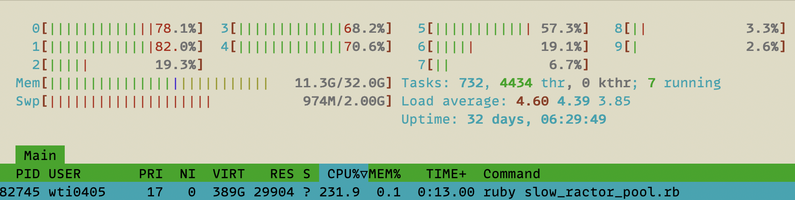
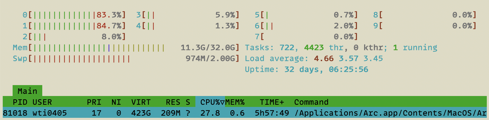
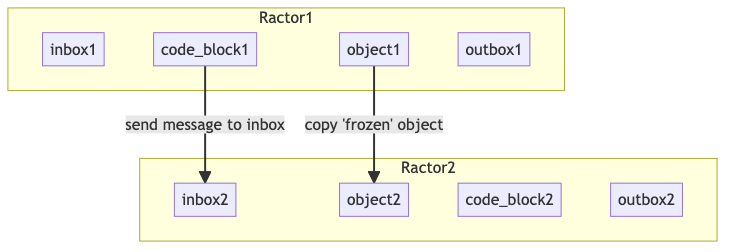
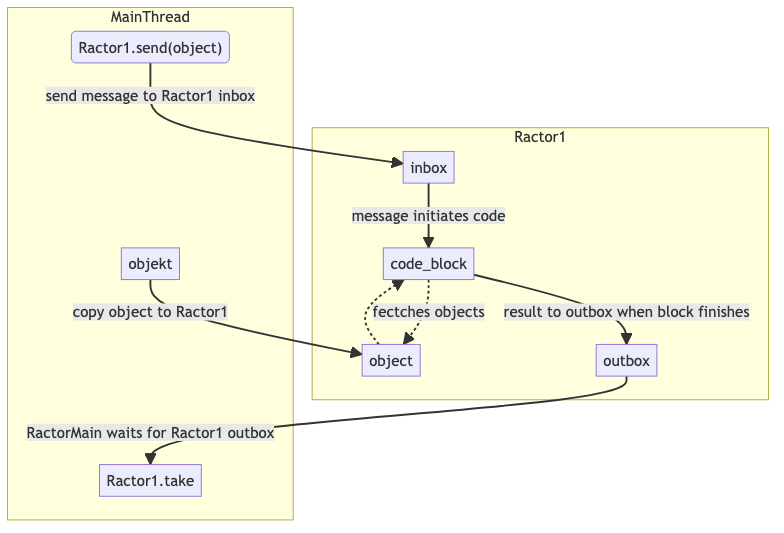
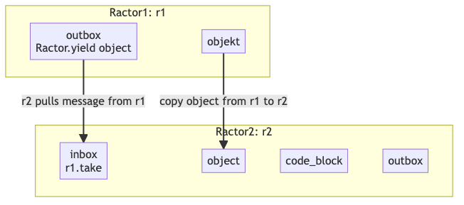
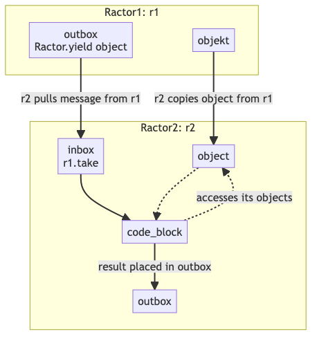
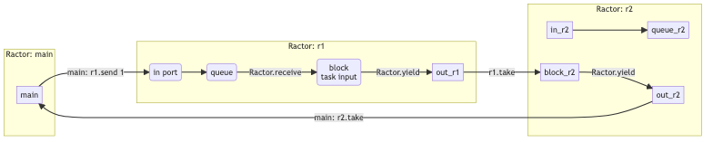

PS - I will update the first images soon.

## Intro

Ruby has threads, but fundamentally they offer only concurrency and share all objects (which requires a lot of care).  Adding Mutex helps with safety, but you are still limited to concurrency.

Ractors (Ruby Actors) provide object safety and allow full parallel computing.

## Comparison

We will use recursion to calculate Fibonacci numbers (I needed something slow enough that I could take screen shots, etc).

so we will start with simple [fibonacci recursion](https://stackoverflow.com/questions/12178642/fibonacci-sequence-in-ruby-recursion)


```ruby
def fibonacci(n)
  ans = recursion(n)
  result = "#{n} - #{ans}"
  puts result
  result
end

def recursion(n)
  n <= 1 ? n : recursion( n - 1 ) + recursion( n - 2 )
end
```

### Traditional Ruby Single Treaded Code

```ruby
def fibonacci(n)
  ans = recursion(n)
  result = "#{n} - #{ans}"
  puts result # its nice to see the results as you go
  result
end

def recursion(n)
  n <= 1 ? n : recursion( n - 1 ) + recursion( n - 2 )
end

rounds = 40
pool_size = 6
results = []

# Single Thread
t1 = Time.now
rounds.times do |i|
  results << fibonacci(i)
end
puts "Single thread - duration #{Time.now - t1}"
pp results
```

We get our answer:
`Single thread - duration 17.414451`
results are nicely created in the order we submit them.

```
0 - 0
1 - 1
2 - 1
3 - 2
4 - 3
5 - 5
6 - 8
...
```

### Simple Multi-Threaded Ruby

Code Source: https://rossta.net/blog/a-ruby-antihero-thread-pool.html

```ruby
def fibonacci(n)
  ans = recursion(n)
  result = "#{n} - #{ans}"
  puts result
  result
end

def recursion(n)
  n <= 1 ? n : recursion( n - 1 ) + recursion( n - 2 )
end

class ThreadPoolNaive
  def initialize(size:)
    @pool = []
  end

  def schedule(*args, &block)
    @pool << Thread.new { block.call(args) }
  end

  def shutdown
    @pool.map(&:join)
  end
end

rounds = 40
pool_size = 4
results = []

# Thread Pool
pool = ThreadPoolNaive.new(size: pool_size)
t1 = Time.now
rounds.times do |i|
  pool.schedule {
    results << fibonacci(i)
  }
end
pool.shutdown
puts "Concurrent Threads with #{pool_size} threads - duration #{Time.now - t1}"
pp results
```

We get our answer in basically the same time:
`Concurrent Threads with 4 threads - duration 17.351042`
However, we can see from the results that the execution order is not linear:
```
0 - 0
2 - 1
3 - 2
31 - 1346269
32 - 2178309
6 - 8
7 - 13
...
```
So if the order is important than sorting would be necessary.

### Ruby Parallel Ractor Code

```ruby
def fibonacci(n)
  ans = recursion(n)
  result = "#{n} - #{ans}"
  puts result # its nice to see the results as you go
  result
end

def recursion(n)
  n <= 1 ? n : recursion( n - 1 ) + recursion( n - 2 )
end

rounds = 40
pool_size = 4
results = []

# generate a Ractor that will act as a worker pool
pool = Ractor.new {
  loop { Ractor.yield(Ractor.receive) }
}

# generate Workers that will do the work
workers = (1..pool_size).map do |i|
  Ractor.new(pool) do |input_pipe|
    loop { Ractor.yield(fibonacci(input_pipe.take)) }
  end
end

t1 = Time.now
rounds.times { |i| pool.send(i) }   # send requests
rounds.times {
  answer = Ractor.select(*workers)
  # returns: [#<Ractor:#6 r4 slow_ractor_pool.rb:18 blocking>, "3 - 2"]
  results << answer.last # .last because we only want the result
}
puts "Parallel Ractors - duration #{Time.now - t1}"
pp results
```

Now we see that the results are returned considerably faster in **8 seconds** instead of 17 seconds:
`Parallel Ractors - duration 7.912549`
Unexpectedly, the result order is not sequential.
```
2 - 1
0 - 0
1 - 1
3 - 2
6 - 8
4 - 3
8 - 21
...
```

Interestingly with htop we can see that Ractors are truely parallel - lets take a look at htop with and without Ractors running.

Here is my system while running the script:


Here is my system at idle (with a lot of application open):



## Ractor Basics

**Ractor Parts**
* Ractors have an inbox
* Ractors have objects
* Ractors have code
* Ractors have an outbox


**Ractor Behavior**
* Ractors provide object safety by copying objects (must be frozen) or transfering ownership.
* Ractors have two ways to communicate:
  * **push** - traditional `actor` style communication (send -> receive) -- the Ractor recieves messages in its message `in-box`
  * **pull** -

### Push Communication

#### Push - 'send's Objects Safely



#### Push Code & Flow



```ruby
object = 'Hi'
object.object_id # 25940

r1 = Ractor.new do
  # ruby compiler doesn't allow the same name in a ractor as an external object!
  obj = Ractor.receive
  p obj.object_id # 47640
  obj # result given to the outbox
end

# be careful the inbox is infinite!
r1.send(object)
# 47640  # print executes
r1.send('Hoi') # without a loop Ractors close the inbox after first message
# `send': The incoming-port is already closed (Ractor::ClosedError)
r1.take
# 'Hi'
r1.take # without a loop Ractors close the outbox when emptied
# `take': The outgoing-port is already closed (Ractor::ClosedError)
```

`take` waits and won't continue until it gets a message -- so this code without an incomming message will wait until ctrl-c kills it:
```ruby
r1 = Ractor.new do
  # ruby compiler doesn't allow the same name in a ractor as an external object!
  obj = Ractor.receive
  p obj.object_id # 47640
  obj # result given to the outbox
end

rt.take # waits for the outbox, but has not input so you will wait forever!
# ctrl-c
```

### Pull Communication (Rendevous Style)

#### Pull - 'take's objects Safely

Again for parallel computing it is important to ensure objects don't change during computation.



#### Pull communication Flow



Is implemented with:
```ruby
r1 = Ractor.new do
  3.times { |i| Ractor.yield(i) }
end
3.times { p r1.take }
# 0
# 1
# 2
# => 3 # like normal ruby code the last value is returned
r1.take
# => 3 # because 3 was the last result will be in the outbox

r1.take # now the outbox is empty
# `take': The outgoing-port is already closed (Ractor::ClosedError)
```

A Ractor with a loop puts the last result in the outbox (or another value if it has an explicit return)
```ruby
r1 = Ractor.new do
  3.times { |i| Ractor.yield(i) }
  :r1_done
end
3.times { p r1.take }
# 0
# 1
# 2
# => :r1_done
r1.take
# => :r1_done
```

## Ractor Usage

### Pipeline



```ruby
def increment(n) = n + 1

r1 = Ractor.new do
  loop do
    incoming_r1 = Ractor.receive
    incremented_once = increment(incoming_r1)
    Ractor.yield(incremented_once)
  end
end

r2 = Ractor.new(r1) do |r1|
  loop do
    incoming_r2 = r1.take
    incremented_twice = increment(incoming_r2)
    Ractor.yield(incremented_twice)
  end
end

# Main Thread (Main Ractor)
r1.send(1)
r2.take
# => 3 - since 1 was incremented twice
```

### Load Balancing (Pooling)


We need a new command `.select` for this.

```ruby
def fibonacci(n)
  ans = (0..n).inject([1,0]) { |(a,b), _| [b, a+b] }[0]
  result = "#{n} - #{ans}"
  puts result
  result
end

pool = Ractor.new do
  loop do
    input = Ractor.receive
    Ractor.yield(input)
  end
end

# 4 workers
workers = (1..4).map do |i|
  Ractor.new(pool, name: "r#{i}") do |p|
    loop do
      input = p.take # from pool
      output_value = fibonacci(input)
      Ractor.yield(output_value)
    end
  end
end

results = []

# send 8 Requests
10.times { |i| pool.send(i) }
# collect our Results
10.times { results << Ractor.select(*workers) }

# notice select returns the ractor that did the processing and the result
pp results
# collect just the results and sort them since they are processed in any random order
pp results.map { |r| r.last }.sort
```

## Exceptions

By understanding Execptions we can also create supervision - restore crashed Ractors

### Exceptions Trapping

**On Send**
```ruby
def task(char) = char + '2'

r1 = Ractor.new(name: 'r1') do
  task(Ractor.receive)
end

r1.send('1')
p r1.take # => '12'

# without loop after first usage it closes
begin
  r1.send('2')
rescue Ractor::ClosedError => e
  p e # => #<Ractor::ClosedError: The incoming-port is already closed>
end
```

**On Take** - we throw RemoteError and we can gather a little more info.
```ruby
r1 = Ractor.new(name: 'r1') do
  loop { task(receive) }
end

# if wrong type it closes with an error
begin
  r1.send(1)
  p r1.take
rescue Ractor::RemoteError => e
  p e        #<Ractor::RemoteError: thrown by remote Ractor.>
  p e.cause  #<TypeError: String can't be coerced into Integer>
  p e.ractor #<Ractor:#22 r1 (irb):236 terminated>
end

r1.send('2') # => #<Ractor::ClosedError: The incoming-port is already closed>
```

### Exception Supervision (& Recovery

```ruby
def task(char) = char + '2'

def r1_init = Ractor.new(name: 'r1') { loop { Ractor.yield task(Ractor.receive) } }

r1 = r1_init

# r1 = Ractor.new(name: 'r1') { loop { Ractor.yield task(Ractor.receive) } }

r1.send('1')
r1.take # => '12'

begin
  r1.send(1)
  p r1.take #<Thread:0x0000000103feca28 run> terminated with exception (report_on_exception is true):
rescue Ractor::RemoteError => e
  r1 = r1_init   # => #<Ractor:#6 r1 (irb):27 blocking>
  p 'r1 restored'
end

r1.send('2')
r1.take  # => '22'
```

### Exception Propagation

If we crash r1 it will propagate the exception to r2


```ruby
def increment1(n) = n + 1
def increment2(n) = n + 2

r1 = Ractor.new(name: 'r1') do
  loop do
    incoming_r1 = Ractor.receive
    incremented_once = increment1(incoming_r1)
    Ractor.yield(incremented_once)
  end
end

r2 = Ractor.new(r1, name: 'r2') do |r1|
  loop do
    incoming_r2 = r1.take
    incremented_twice = increment2(incoming_r2)
    Ractor.yield(incremented_twice)
  end
end

# Main Thread (Main Ractor)
r1.send(1)
r2.take # => 4

r1.send(2)
# if we don't collect (take) our result it gets lost with the propogated crash

r1.send('c')
#<Thread:0x00000001081260c0 run> terminated with exception (report_on_exception is true):

r2.take # <internal:ractor>:698:in `take': thrown by remote Ractor. (Ractor::RemoteError)
```

## Example Web Server

Source from: https://kirshatrov.com/posts/ractor-web-server-part-two/

```ruby
# source: https://kirshatrov.com/posts/ractor-web-server-part-two/

require 'webrick'

def respond(c, req)
  # process request
  path = req.path
  query = req.query
  body = req.body

  # log request
  puts
  puts req.inspect
  puts
  puts "path:"
  puts path.inspect
  puts "query:"
  puts query.inspect
  puts "Body:"
  puts body.inspect
  puts "=" * 150

  # respond to Connection
  c.print "HTTP/1.1 200\r\n"
  c.print "Content-Type: text/html\r\n"
  c.print "\r\n"
  c.print "<h1>Hello #{query['name'] || 'world'}</h1>"
  c.print "<h2>Your path: #{path}</h2>"
  c.print "<br>"
  c.print "<hr>"
  c.print "<br>"
  c.print req.inspect
end

# need to Freeze WEBrick objects that need to be passed - there is a PR to fix this, but not yet merged.
# PR: https://github.com/ruby/webrick/pull/65
Ractor.make_shareable(WEBrick::Config::HTTP)
Ractor.make_shareable(WEBrick::LF)
Ractor.make_shareable(WEBrick::CRLF)
Ractor.make_shareable(WEBrick::HTTPRequest::BODY_CONTAINABLE_METHODS)
Ractor.make_shareable(WEBrick::HTTPStatus::StatusMessage)

pipe = Ractor.new do
  loop do
    Ractor.yield(Ractor.receive, move: true)
  end
end

# Actual Ractor Code
####################
CPU_COUNT = 4
workers = CPU_COUNT.times.map do
  Ractor.new(pipe) do |pipe|
    loop do
      # capture input
      s = pipe.take

      # process input
      req = WEBrick::HTTPRequest.new(WEBrick::Config::HTTP.merge(RequestTimeout: nil))
      req.parse(s)

      respond(s, req)

      s.close
    end
  end
end

listener = Ractor.new(pipe) do |pipe|
  server = TCPServer.new(8080)
  loop do
    conn, _ = server.accept
    pipe.send(conn, move: true)
  end
end

loop do
  Ractor.select(listener, *workers)
end
```

## Resources

* https://scoutapm.com/blog/ruby-ractor
* https://lbarasti.com/post/ruby_ractor/
* https://www.youtube.com/watch?v=0kM7yFM6Dao
* https://www.youtube.com/watch?v=40t8EPpnujg
* https://www.youtube.com/watch?v=_O3NBm_C3rM
* https://kirshatrov.com/posts/ruby-ractor-web-server/
* https://kirshatrov.com/posts/ractor-web-server-part-two/
* https://blog.kiprosh.com/ruby-3-introduction-to-ractors/
* https://www.fastruby.io/blog/ruby/performance/how-fast-are-ractors.html
* https://dev.to/doctolib/learn-about-ractors-and-build-a-mini-sidekiq-3ba2
* https://blog.appsignal.com/2022/08/24/an-introduction-to-ractors-in-ruby.html
* https://www.dmitry-ishkov.com/2021/07/http-server-in-ruby-3-fibers-ractors.html
* https://andresakata.medium.com/background-job-processing-using-ractor-ruby-3-41c7956d14a0
* https://www.fullstackruby.dev/ruby-3-fundamentals/2021/01/27/ractors-multi-core-parallel-processing-in-ruby-3/

* https://docs.ruby-lang.org/en/master/doc/ractor_md.html
* https://docs.ruby-lang.org/en/3.0.0/Ractor.html
* https://github.com/ruby/ruby/blob/master/doc/ractor.md

## Async

* https://github.com/socketry/async
* https://brunosutic.com/blog/async-ruby
* https://www.youtube.com/watch?v=T8YF8qBoBAA
* https://www.youtube.com/watch?v=pzpH_ND-CQM
* https://www.codeotaku.com/journal/2018-06/asynchronous-ruby/index
* https://socketry.github.io/async/guides/getting-started/index.html
* https://medium.com/double-pointer/concurrency-in-ruby-async-programming-part-1-9db33073baf9
* https://medium.com/double-pointer/concurrency-in-ruby-async-programming-part-2-ff226fb54cfe


# Threads & Thread Pooling

* https://github.com/meh/ruby-thread#pool
* https://www.rubyguides.com/2015/07/ruby-threads/
* https://rossta.net/blog/a-ruby-antihero-thread-pool.html
* https://stackoverflow.com/questions/32593289/ruby-thread-pooling-what-am-i-doing-wrong
