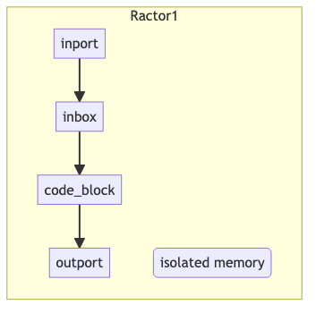
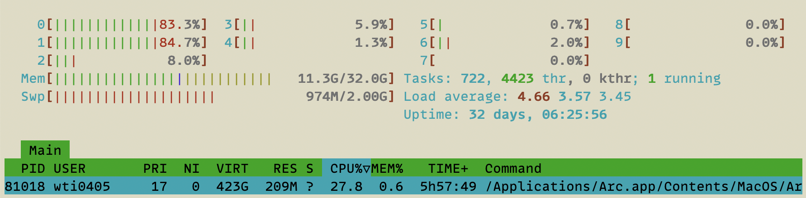
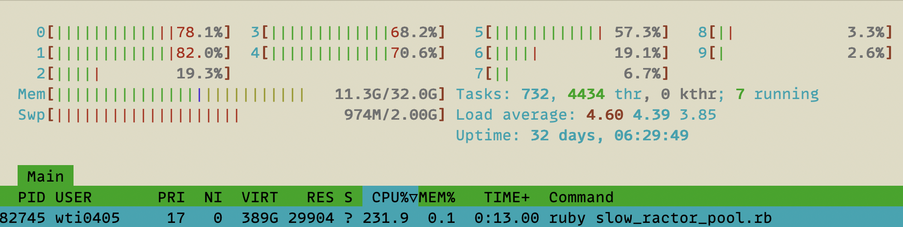
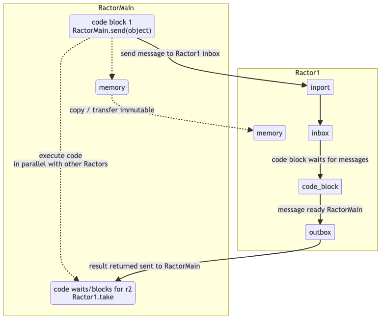
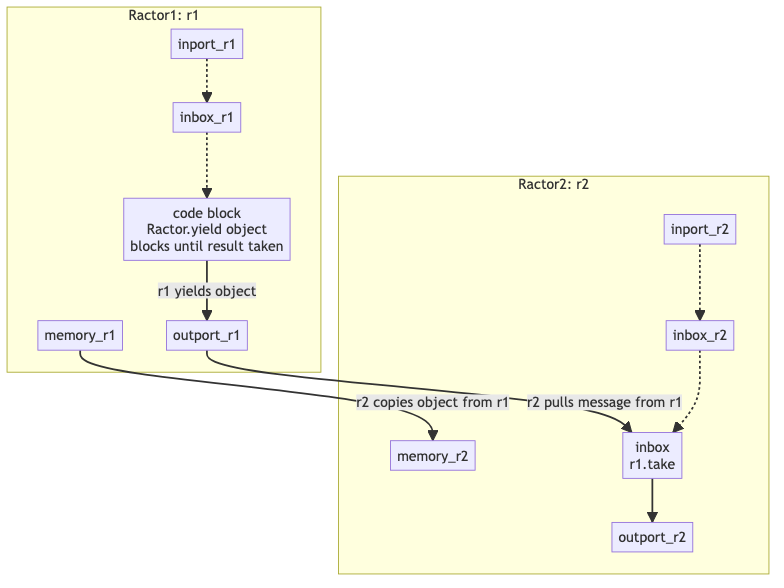
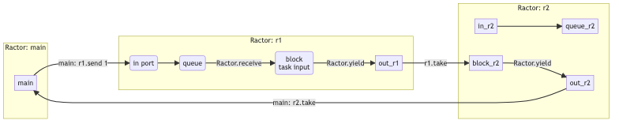
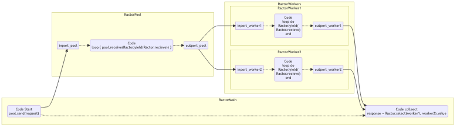

PS - the supervision section needs work - I don't fully understand and have code working as I expect.

## Intro

Ruby has threads, but fundamentally they offer only concurrency and share all objects (which requires a lot of care).  Adding Mutex helps with safety, but you are still limited to concurrency.

Ractors (Ruby Actors) provide object safety and allow full parallel computing.

**NOTE:** Ractors are still considered experimental - as of Ruby 3.2 - so use at your own risk in production environments.

## Ractor Overview

* Components
* Life cycle
* Name (helpful in the context of supervision)
* Messages
* Object / Parallel Safety (objects must be immutable  or otherwise not sharable)

### Components

Ractors have several components



* **An in-coming port (in-port)** - is open while a `Ractor.receive` is waiting (blocking).
* **An in-coming mailbox** - unlimited queue as long as the in-port is open - the mailbox's queue is open as long.
* **locally scoped code blocks** (new & a bit odd - the compiler won't allow variable names to be the same as external variables in the same class / thread - so when you pass it in you must rename it)
* **locally scoped memory** - object are copied here and must be thread / parallel safe (frozen and copied or copied and ownership transferred)
* **An out-going port (out-port)** - is open when a `Ractor.yield` is waiting (blocking)

### Life-Cycle

A Ractor is basically alive as long as a port is open (however inspect seems to only report the status of the incoming port).

While a port is open the Ractor is `blocking` (waiting).  When a message is received in the inbox, and the outgoing port is not blocked, then the Ractor will process the messages as soon as it is scheduled.  When the Ractor has a result, but it has't been `taken` then it can still `recieve` messages, but will not process them until the outgoing message has been picked-up (`taken`).

This is best clarified / demonstrated with code.

The following is an example of a short-lived Ractor that receives its input on initialization (thus the inbox is never opened).  As soon as the Ractor is scheduled it does it's work and returns the answer (the last line of a Ractor upon termination returns a result like other ruby code - which is collected with a `take`)

```ruby
integer = 1
# automatically queues a message in the inbox
r1 = Ractor.new(integer, name: 'r1') do |i|
  puts "Executing #{i} + 2"
  i + 2
end
r1.inspect # => "#<Ractor:#1 r1 (irb):8 terminated>"

# the Ractor already did its work and the in-port was never opened (value was copied on initialization)
r1.send(1)
# `send': The incoming-port is already closed (Ractor::ClosedError)

# The Ractor outport is open, waiting for us to `take` the result
r1.take
# => 3

# after we retrieve the result the outport is closes too
r1.take
# `take': The outgoing-port is already closed (Ractor::ClosedError)

# now the Ractor `r1` is no longer usable / executable and will be garbage collected
```

A Ractor an easily be made to live indefinitely - with a loop.  For this to work we need to make 2 changes - we need to open the incoming port with `Ractor.receive` and to collect the results with `Ractor.yield` (since the Ractor is no longer exiting, we need to do this to open the outgoing port and make the results available before exiting)

```ruby
r1 = Ractor.new(name: 'r1') do
  loop do
    input = Ractor.receive
    result = input + 2
    puts "Executed - result will be: #{result}"
    Ractor.yield(result)
  end
end

r1.inspect
# => #<Ractor:#8 r1 (irb):12 blocking>

r1.send(1)
# Executed - result will be: 3
# => #<Ractor:#8 r1 (irb):41 blocking>

# we can add messages to the incoming queue
r1.send(2) # note this time it doesn't execute yet as we haven't taken the last result

# we fetch our first result and immediately the next message in the queue is executed
r1.take
# Executed - result will be: 4
# => 3

# now we get the last result, but nothing executes (since nothing is in the queue)
r1.take
# => 4

# we see that our Ractor is still waiting (blocking) for something to do
r1.inspect
# => "#<Ractor:#8 r1 (irb):41 blocking>"

# if we try to take now we will block our current thread too (the Ractor is waiting for an input and we are waiting for an answer)!
r1.take
```

Ractors 'die' if they experience an exception

```ruby
integer = 'a'
# automatically queues a message in the inbox
ir1 = Ractor.new(integer) { |i| i + 2 }
#<Thread:0x00000001139c20c0 run> terminated with exception (report_on_exception is true):
# => "#<Ractor:#9 r1 (irb):58 blocking>"

# we can see / capture the error with `cause`
# (helpful for Supervision - automatically restarting dead Ractors)
r1.cause
# `<main>': undefined method `cause' for #<Ractor:#9 r1 (irb):58 terminated> (NoMethodError)

r1.inspect
# => "#<Ractor:#9 r1 (irb):58 terminated>"
```

### Named Ractors

Naming Ractors is optional - but helpful for supervision, so we know which Ractor has died and can restart the appropriate Ractor - Supervision will be explored later.

Here is code showing how to define a name on initialization and retrieve the Ractor's name.

```ruby
r1 = Ractor.new(name: 'r1') do
  loop do
    input = Ractor.receive
    result = input + 2
    puts "Executed - result will be: #{result}"
    Ractor.yield(result)
  end
end
=> #<Ractor:#11 r1 (irb):70 blocking>
r1.name
# => "r1"
```


## Perfomance Comparison: Single-Threaded, Thread-Pool and Parallel Ractor

It is important to note that Ractors are not always better.  In the interest of brevity I will not demonstrate when they are slower, but fundamentally when you are creating lots of objects and when the algorithm is faster than the time it takes to create Ractors and then execute them.

We will use recursion to calculate Fibonacci numbers -  I needed something slow enough to take htop screen shots :)

Using the code: [fibonacci recursion](https://stackoverflow.com/questions/12178642/fibonacci-sequence-in-ruby-recursion)


```ruby
def fibonacci(n)
  ans = recursion(n)
  result = "#{n} - #{ans}"
  puts result
  result
end

def recursion(n)
  n <= 1 ? n : recursion( n - 1 ) + recursion( n - 2 )
end
```

We will individually calculate the Fibonacci numbers from 0 to 39 (too much bigger takes to long with this algorithm).  Using injection to solve fibonacci is so fast that it's not substantially faster in parallel:
```ruby
def fibonacci(n) = (0..n).inject([1,0]) { |(a,b), _| [b, a+b] }[0]
```
and it was so fast that I didn't have time to take htop screen shots.  So I used recursion (on an M1 Mac - your times may vary if you use other technologies or more or fewer thread / ractors).

### Traditional Ruby Single Treaded Code

Here is the text simple test code I put into an `irb` session.

```ruby
def fibonacci(n)
  ans = recursion(n)
  result = "#{n} - #{ans}"
  puts result # its nice to see the results as you go
  result
end

def recursion(n)
  n <= 1 ? n : recursion( n - 1 ) + recursion( n - 2 )
end

rounds = 40
pool_size = 6
results = []

# Single Thread
t1 = Time.now
rounds.times do |i|
  # trigger the calculations and collect our results
  results << fibonacci(i)
end
puts "Single thread - duration #{Time.now - t1}"

pp results
```

* time: **17.414451 seconds**
* results are returned in a sequential order.

We get an output something like:
```
0 - 0
1 - 1
2 - 1
3 - 2
4 - 3
5 - 5
6 - 8
...
Single thread - duration 17.414451
```

### Simple Multi-Threaded Ruby

I decided to use a simple Naive Thread Pool - (this isn't an article about Thread Pools).  The following is the code entered into `irb`.

```ruby
def fibonacci(n)
  ans = recursion(n)
  result = "#{n} - #{ans}"
  puts result
  result
end

def recursion(n)
  n <= 1 ? n : recursion( n - 1 ) + recursion( n - 2 )
end

# ThreadPool- Naive Source: https://rossta.net/blog/a-ruby-antihero-thread-pool.html
class ThreadPoolNaive
  def initialize(size:)
    @pool = []
  end

  def schedule(*args, &block)
    @pool << Thread.new { block.call(args) }
  end

  def shutdown
    @pool.map(&:join)
  end
end

rounds = 40
pool_size = 4
results = []

# Thread Pool
pool = ThreadPoolNaive.new(size: pool_size)
t1 = Time.now
rounds.times do |i|
  pool.schedule {
    results << fibonacci(i)
  }
end
pool.shutdown
puts "Concurrent Threads with #{pool_size} threads - duration #{Time.now - t1}"
pp results
```

Using 4 Threads we see that again time is basically the same as Single Threaded - I believe this has to do with Ruby's 'Global Lock'.

* Time: 17.351042 second
* the results are returned in no particular order (thus if order is important an extra sort step will be needed).

We get an outputs similar to:
```
0 - 0
2 - 1
3 - 2
31 - 1346269
32 - 2178309
6 - 8
7 - 13
...
Concurrent Threads with 4 threads - duration 17.351042
```

### Ruby Parallel Ractor Code

Now let's check the performance in parallel with Ractors.  Here is the code entered into `irb`

Let's open `htop` and see how what our system resources look like:



Once we start our code we see that the system load increases by 4 CPUs - so we are truly running in parallel:




```ruby
def fibonacci(n)
  ans = recursion(n)
  result = "#{n} - #{ans}"
  puts result # its nice to see the results as you go
  result
end

def recursion(n)
  n <= 1 ? n : recursion( n - 1 ) + recursion( n - 2 )
end

rounds = 40
pool_size = 4
results = []

# generate a Ractor that will act as a worker pool
pool = Ractor.new {
  loop { Ractor.yield(Ractor.receive) }
}

# generate Workers that will do the work
workers = (1..pool_size).map do |i|
  Ractor.new(pool) do |input_pipe|
    loop { Ractor.yield(fibonacci(input_pipe.take)) }
  end
end

t1 = Time.now
rounds.times { |i| pool.send(i) }   # send requests
rounds.times {
  answer = Ractor.select(*workers)
  # returns: [#<Ractor:#6 r4 slow_ractor_pool.rb:18 blocking>, "3 - 2"]
  results << answer.last # .last because we only want the result
}
puts "Parallel Ractors - pool size: #{pool_size} - duration #{Time.now - t1}"
pp results
```

* Time: **8 seconds** (considerably faster with 4 Ractors)
* The results are not sequential (so again if order is important, than a sort will be necessary)

The output looks something like:
```
2 - 1
0 - 0
1 - 1
3 - 2
6 - 8
4 - 3
8 - 21
...
Four Parallel Ractors - pool size: 4 - duration 7.912549
```


## Ractor Communication

Ractors have two ways to communicate:
* **push** - traditional `actor` style communication (send -> receive) -- the Ractor receives messages in its message `in-box`
* **pull** - Rendezvous Style - we block on the output and wait for results using `take`

It's important to note that Objects must be transferred (ownership) or copied (Frozen) - they must be thread safe!  This is an important aspect of the design.  with simple objects this is handled automatically, however, when transferring helper classes, etc this this can be important (will be demonstrated later).

Ractor Communications is the basis for the interesting designs that are possible.  Communication is heavily dependent on the opening of incoming and outgoing ports.  Please be sure that section makes sense.

### Push Communication

Push Communication is as it sounds - we are pushing `send`ing data to another Ractor's open incoming port.  The interaction between 2 Ractors (or the Main Ractor / Thread) looks conceptually something like the following:



#### Push Code & Flow

To `recieve` messages in the incoming port and mailbox we must invoke: `Ractor.receive` within our Ractor. Let's see what this looks like in code.


First, we will demonstrate that this 'copies' the object - we will check the passed object's id and see that they differ.

Second, we see that we open the incoming port for push communication with `Ractor.receive`

Third, we see we incoming and outgoing port are only 'open' for one transaction (since we have not placed our Ractor behavior in a loop)

**Note**, new in Ruby 3.2 it seems that the compiler no longer allows internal variable names `object_in` to have the same name as an external variable `object`, I am not sure why this is the case since in theory they are in different namespaces.

```ruby
object = 'Hi'
object.object_id # 25940

r1 = Ractor.new do
  # ruby compiler doesn't allow the same name in a Ractor as an external object!
  object_in = Ractor.receive
  p object_in.object_id # 47640
  object_in # result given to the outbox
end

# we push `send` our message
r1.send(object)
# 47640  # print executes

# given there is no loop the incoming port closes after the first message
r1.send('Hoi')
# `send': The incoming-port is already closed (Ractor::ClosedError)

# collect our result with:
r1.take
# 'Hi'

# again, without a loop Ractors close the outbox when emptied
r1.take
# `take': The outgoing-port is already closed (Ractor::ClosedError)
```

**NOTE:** `take` and `send` are blocking calls so you can easily create deadlock by you calling a `take` in your main Thread/Ractor before `send`ing that Ractor information. You can see this deadlock with the following code and will need to use ctrl-c to end the deadlock.

```ruby
r1 = Ractor.new do
  obj = Ractor.receive # gets sent information
  obj # result available in the outport
end

rt.take # waits for the outbox, but has not input so you will wait forever!
# ctrl-c
```

### Pull Communication (Rendezvous Style)

#### Pull - 'take's objects Safely

This is pulling `take`ing information out of a Ractors outgoing port. Conceptually, this looks something like:



#### Pull communication Flow

We have demonstrated pulling `take`ing information from a Ractor that has already done a calculation and is waiting to terminate in the previous code.

So here I will demonstrate how to open the outgoing port in a running Ractor - usually one within a loop.

This is done with the `Ractor.yield(return_object)` command.  Here is an example without an infinite loop and one where we don't open the incoming port.  We are just queueing 3 results

```ruby
r1 = Ractor.new do
  3.times { |i| Ractor.yield(i) }
end
3.times { p r1.take }
# 0
# 1
# 2
# => 3 # like normal ruby code the last value is returned

# because 3 was the last result will also be returned
r1.take
# => 3

r1.take # now the outbox is empty
# `take': The outgoing-port is already closed (Ractor::ClosedError)
```

A Ractor with a loop puts the last result in the outbox (or another value if it has an explicit return)
```ruby
r1 = Ractor.new do
  3.times { |i| Ractor.yield(i) }
  :r1_done
end
3.times { p r1.take }
# 0
# 1
# 2
# => :r1_done
r1.take
# => :r1_done
```

**NOTES:**
* final results of a Ractor block and placed in the outgoing port via `Ractor.yield` have a queue size of ONE value.  Unlike the incoming port which has a infinite queue.
* once the outgoing port has a value the ractor is 'blocked' waiting for the result to be `take`n.  Thus if we aren't careful we can create deadlock by expecting to take a result in our main thread when the Ractor has no value to offer.
* Once the Ractor has closed its outgoing port (given all its values away) and the incoming port is also closed (not accepting any new inputs), then the Ractor is 'terminated'.  Using closed incoming or outgoing Ractor ports will result in an exception.

## Ractor Usage - Practical Design Fundamentals

The 3 basic design ideas are:

* pools
* pipelines
* exceptions & supervision

With these we can create Robust parallel computing structures.

### Pipeline



```ruby
def increment(n) = n + 1

r1 = Ractor.new do
  loop do
    incoming_r1 = Ractor.receive
    incremented_once = increment(incoming_r1)
    Ractor.yield(incremented_once)
  end
end

r2 = Ractor.new(r1) do |r1|
  loop do
    incoming_r2 = r1.take
    incremented_twice = increment(incoming_r2)
    Ractor.yield(incremented_twice)
  end
end

# Main Thread (Main Ractor)
r1.send(1)
r2.take
# => 3 - since 1 was incremented twice
```

### Pooling (Load Balancing)

Pooling builds upon pipelines.
* First we build a pool (a supervisor - without error handling)
* Then we add workers in a pipeline

To use a pooling we:
* push (`send`) our inputs into the pool (supervisor), which queues up messages in the worker's inboxes
* pull results from workers which have data waiting in the outport to do this we use a new command `Ractor.select(*workers)` instead of `take` which requires defining which Ractor to pull from and blocks.



We need a new command `.select` for this.

```ruby
def fibonacci(n)
  ans = (0..n).inject([1,0]) { |(a,b), _| [b, a+b] }[0]
  result = "#{n} - #{ans}"
  puts result
  result
end

pool = Ractor.new do
  loop do
    input = Ractor.receive
    Ractor.yield(input)
  end
end

# 4 workers
workers = (1..4).map do |i|
  Ractor.new(pool, name: "r#{i}") do |p|
    loop do
      input = p.take # from pool
      output_value = fibonacci(input)
      Ractor.yield(output_value)
    end
  end
end

results = []

# send 8 Requests
10.times { |i| pool.send(i) }
# notice the first 4 values are computed immediately, and then it stops since the outports are full (queue of 1)

# collect our Results
10.times { results << Ractor.select(*workers) }
# now that we collect the results the inboxes will be processed

# notice select returns the Ractor that did the processing and the result
pp results

# collect just the results and sort them since they are processed in any random order
pp results.map { |r| r.last }.sort
```

### Exceptions and Supervision

By understanding Exceptions we can also create supervision - restore crashed Ractors

#### Exceptions Trapping

**On Send**
```ruby
def task(char) = char + '2'

r1 = Ractor.new(name: 'r1') do
  task(Ractor.receive)
end

r1.send('1')
p r1.take # => '12'

# without loop after first usage it closes
begin
  r1.send('2')
rescue Ractor::ClosedError => e
  p e # => #<Ractor::ClosedError: The incoming-port is already closed>
end
```

**On Take** - we throw RemoteError and we can gather a little more info.
```ruby
r1 = Ractor.new(name: 'r1') do
  loop { task(receive) }
end

# if wrong type it closes with an error
begin
  r1.send(1)
  p r1.take
rescue Ractor::RemoteError => e
  p e        #<Ractor::RemoteError: thrown by remote Ractor.>
  p e.cause  #<TypeError: String can't be coerced into Integer>
  p e.ractor #<Ractor:#22 r1 (irb):236 terminated>
end

r1.send('2') # => #<Ractor::ClosedError: The incoming-port is already closed>
```

#### Exception Propagation

If we crash r1 it will propagate the exception to r2

```ruby
def increment1(n) = n + 1
def increment2(n) = n + 2

r1 = Ractor.new(name: 'r1') do
  loop do
    incoming_r1 = Ractor.receive
    incremented_once = increment1(incoming_r1)
    Ractor.yield(incremented_once)
  end
end

r2 = Ractor.new(r1, name: 'r2') do |r1|
  loop do
    incoming_r2 = r1.take
    incremented_twice = increment2(incoming_r2)
    Ractor.yield(incremented_twice)
  end
end

# Main Thread (Main Ractor)
r1.send(1)
r2.take # => 4

r1.send(2)
# if we don't collect (take) our result it gets lost with the propagated crash

r1.send('c')
#<Thread:0x00000001081260c0 run> terminated with exception (report_on_exception is true):

r2.take # <internal:ractor>:698:in `take': thrown by remote Ractor. (Ractor::RemoteError)
```

#### Supervision (Exception Recovery)

HMM needs work! Not yet fully understood.
[Supervise Docs](https://docs.ruby-lang.org/en/3.0/ractor_md.html#label-Supervise)

```ruby
def task(char) = char + '2'

def r1_init = Ractor.new(name: 'r1') { loop { Ractor.yield task(Ractor.receive) } }

r1 = r1_init

# r1 = Ractor.new(name: 'r1') { loop { Ractor.yield task(Ractor.receive) } }

r1.send('1')
r1.take # => '12'

begin
  r1.send(1)
  p r1.take #<Thread:0x0000000103feca28 run> terminated with exception (report_on_exception is true):
rescue Ractor::RemoteError => e
  r1 = r1_init   # => #<Ractor:#6 r1 (irb):27 blocking>
  p 'r1 restored'
end

r1.send('2')
r1.take  # => '22'
```

## Practical Usage

In the comparison toward the beginning we a pipeline with a supervisor and a pool.

### Example Web Server Pool (without supervision)

Source from: https://kirshatrov.com/posts/ractor-web-server-part-two/

NOTE: `Ractor.receive(pipe, move: true)` moves (transfers the ownership of the object) instead of the default copying the object

```ruby
# source: https://kirshatrov.com/posts/ractor-web-server-part-two/

require 'webrick'

def respond(c, req)
  # process request
  path = req.path
  query = req.query
  body = req.body

  # log request
  puts
  puts req.inspect
  puts
  puts "path:"
  puts path.inspect
  puts "query:"
  puts query.inspect
  puts "Body:"
  puts body.inspect
  puts "=" * 150

  # respond to Connection
  c.print "HTTP/1.1 200\r\n"
  c.print "Content-Type: text/html\r\n"
  c.print "\r\n"
  c.print "<h1>Hello #{query['name'] || 'world'}</h1>"
  c.print "<h2>Your path: #{path}</h2>"
  c.print "<br>"
  c.print "<hr>"
  c.print "<br>"
  c.print req.inspect
end

# need to Freeze WEBrick objects that need to be passed - there is a PR to fix this, but not yet merged.
# PR: https://github.com/ruby/webrick/pull/65
Ractor.make_shareable(WEBrick::Config::HTTP)
Ractor.make_shareable(WEBrick::LF)
Ractor.make_shareable(WEBrick::CRLF)
Ractor.make_shareable(WEBrick::HTTPRequest::BODY_CONTAINABLE_METHODS)
Ractor.make_shareable(WEBrick::HTTPStatus::StatusMessage)

pipe = Ractor.new do
  loop do
    Ractor.yield(Ractor.receive, move: true)
  end
end

# Actual Ractor Code
####################
CPU_COUNT = 4
workers = CPU_COUNT.times.map do
  Ractor.new(pipe) do |pipe|
    loop do
      # capture input
      s = pipe.take

      # process input
      req = WEBrick::HTTPRequest.new(WEBrick::Config::HTTP.merge(RequestTimeout: nil))
      req.parse(s)

      respond(s, req)

      s.close
    end
  end
end

listener = Ractor.new(pipe) do |pipe|
  server = TCPServer.new(8080)
  loop do
    conn, _ = server.accept
    pipe.send(conn, move: true)
  end
end

loop do
  Ractor.select(listener, *workers)
end
```


## Resources

* https://www.youtube.com/watch?v=0kM7yFM6Dao

* https://scoutapm.com/blog/ruby-ractor
* https://lbarasti.com/post/ruby_ractor/
* https://www.youtube.com/watch?v=0kM7yFM6Dao
* https://www.youtube.com/watch?v=40t8EPpnujg
* https://www.youtube.com/watch?v=_O3NBm_C3rM
* https://kirshatrov.com/posts/ruby-ractor-web-server/
* https://kirshatrov.com/posts/ractor-web-server-part-two/
* https://blog.kiprosh.com/ruby-3-introduction-to-ractors/
* https://www.fastruby.io/blog/ruby/performance/how-fast-are-ractors.html
* https://dev.to/doctolib/learn-about-ractors-and-build-a-mini-sidekiq-3ba2
* https://blog.appsignal.com/2022/08/24/an-introduction-to-ractors-in-ruby.html
* https://www.dmitry-ishkov.com/2021/07/http-server-in-ruby-3-fibers-ractors.html
* https://andresakata.medium.com/background-job-processing-using-ractor-ruby-3-41c7956d14a0
* https://www.fullstackruby.dev/ruby-3-fundamentals/2021/01/27/ractors-multi-core-parallel-processing-in-ruby-3/

* https://docs.ruby-lang.org/en/master/doc/ractor_md.html
* https://docs.ruby-lang.org/en/3.0.0/Ractor.html
* https://github.com/ruby/ruby/blob/master/doc/ractor.md

## Async

* https://github.com/socketry/async
* https://brunosutic.com/blog/async-ruby
* https://www.youtube.com/watch?v=T8YF8qBoBAA
* https://www.youtube.com/watch?v=pzpH_ND-CQM
* https://www.codeotaku.com/journal/2018-06/asynchronous-ruby/index
* https://socketry.github.io/async/guides/getting-started/index.html
* https://medium.com/double-pointer/concurrency-in-ruby-async-programming-part-1-9db33073baf9
* https://medium.com/double-pointer/concurrency-in-ruby-async-programming-part-2-ff226fb54cfe


# Threads & Thread Pooling

* https://github.com/meh/ruby-thread#pool
* https://www.rubyguides.com/2015/07/ruby-threads/
* https://rossta.net/blog/a-ruby-antihero-thread-pool.html
* https://stackoverflow.com/questions/32593289/ruby-thread-pooling-what-am-i-doing-wrong
