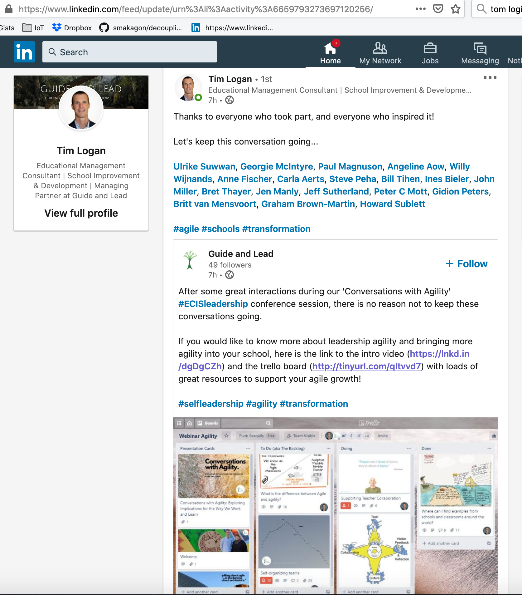

Tim Logan posted an interesting educational agility video of his ECIS Webinar and used materials developed my Paul Magnuson & me.  He posted his slide deck on Trello.

Tim Logan's video Intro into his Educational Agility webinar for ECIS.


In case people don't have a linked-in account:

https://www.linkedin.com/feed/update/urn%3Ali%3Aactivity%3A6659793273697120256/

In case people don't have a trello account:

https://trello.com/b/B5qwkjmE/webinar-agility
