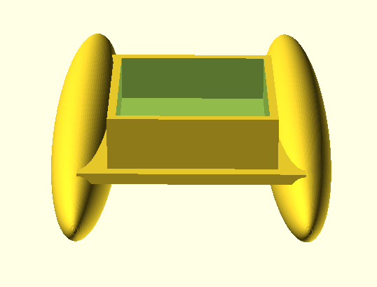
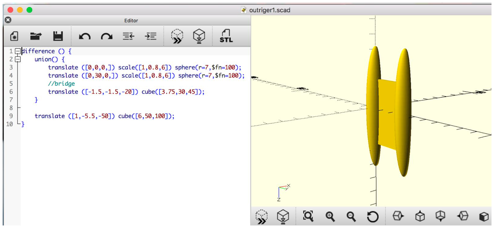
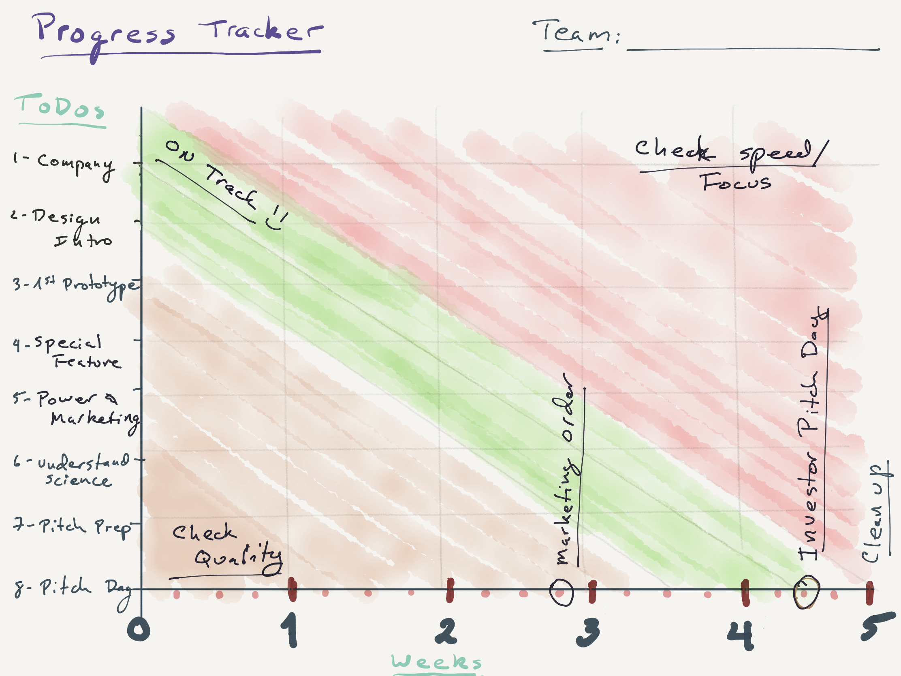
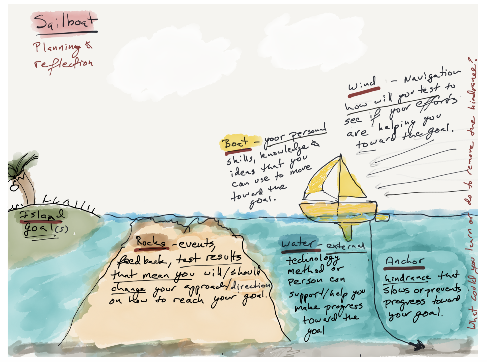

<!-- <iframe allowfullscreen allow="fullscreen" style="border:none;width:100%;height:326px;" src="https://issuu.com/ecischools/docs/globalinsights6"></iframe> -->

Student boat (before 3-D printing)

Student boat (with code)

Student boat (with code)

Student Retrospective Guide

